# ARCHITECTURE

Xyph is an industrial-grade planning compiler organized around a strict Hexagonal (Ports and Adapters) architecture.

## System Shape

Xyph uses a pure domain core isolated from infrastructure through explicit ports. This ensures that the planning logic remains deterministic and testable across CLI, TUI, and Daemon ingress.

## Core Tenets

- **Sovereign Ontology**: Xyph defines the concepts of Intent, Quests, and Scrolls. These are not shadow tickets; they are the primary truth.
- **The Graph is the Plan**: All coordination state is computed from the WARP graph.
- **Genealogy of Intent**: Every Quest must trace back to a sovereign human Intent (Constitution Art. IV).
- **Hexagonal Purity**: Domain services depend only on ports (interfaces), never on infrastructure adapters.

## The Planning Compiler (Pipeline)

Xyph treats the repository as a living worldline. Mutations flow through a governed pipeline:

1. **Ingest**: Capture raw intent or task signals.
2. **Normalize**: Map signals to the Digital Guild ontology.
3. **Rebalance**: Analyze the dependency DAG and frontier.
4. **Emit**: Update the WARP graph and record cryptographic provenance.

## WARP: Structural Worldline Memory

Xyph stores its plan in a **WARP graph**—a CRDT-backed bedrock that lives inside Git.
- **CRDT Merge**: Nodes and edges use OR-Set semantics; properties use Last-Writer-Wins.
- **Deterministic Convergence**: All participants compute the exact same final state.
- **Invisible to Git**: Graph data is stored in Git commits pointing to the empty tree, keeping the codebase clean.

## Shared Work Semantics

Xyph exposes a unified semantic layer across all surfaces. A "Blocker" or "Readiness" judgment is computed once in the domain layer and projected identically to the TUI cockpit and the agent-native CLI.

---
**The goal is to move coordination from a collection of widgets to a professional application foundation for high-output software work.**
