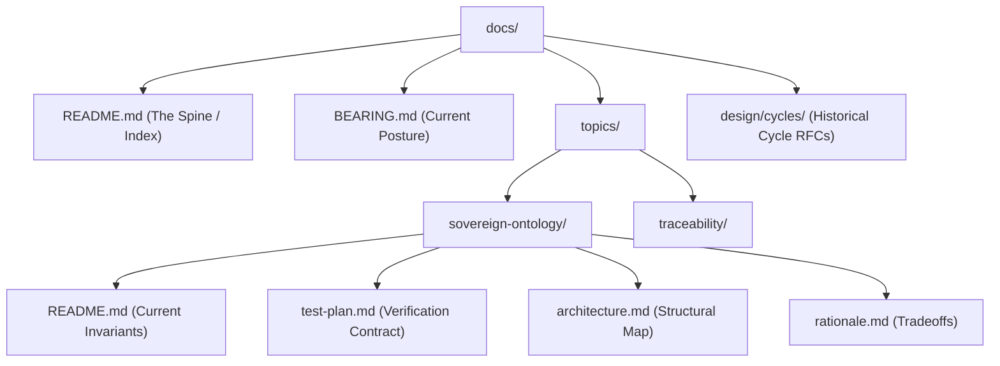

# Contributing to XYPH

We adapt the topic-based contract-graph documentation paradigm to XYPH. This revision ensures that documentation, code, and test verification remain in lockstep as a long-term living corpus, replacing transient files with durable topic boundaries.

---

## 1. Dogfooding & Self-Tracking

XYPH is a self-hosting control plane. We do not maintain project backlogs, tasks, bugs, or milestones in external trackers (such as GitHub Issues or Jira) or parallel markdown lists. **All project coordination truth lives directly inside XYPH's own WARP graph database.**

- **Intents**: Every line of work must trace back to a sovereign `Intent` node (Constitutional Art. IV).
- **Quests**: Backlog tasks and active work items are tracked as `Quest` nodes.
- **Submissions**: The code review and settlement lifecycle is tracked via `Submission` and `Decision` nodes.

The graph is the plan. If a piece of work is not registered in the graph, it does not exist.

---

## 2. The Mental Model: Documentation as a Contract Graph

Documentation is part of the system contract. We separate four distinct kinds of information to maintain a strict boundary between what is true in `HEAD` right now, how we verify it, and how we got here.

```text
current truth -> planned verification -> executable evidence -> historical reasoning
```

| Tier | Artifact | Job | Location |
| :--- | :--- | :--- | :--- |
| **Current Truth** | Topic README | Describe what is true in `HEAD` right now. No future tense. | `docs/topics/<topic>/README.md` |
| **Planned Verification** | Test Plan | Define requirements, test cases, and oracles before coding. | `docs/topics/<topic>/test-plan.md` |
| **Executable Evidence** | Tests & Fixtures | Deterministic vitest checks, schemas, and cryptographic proofs. | `test/` / `test-plan.md` anchors |
| **Historical Reasoning** | Cycle Proposals | Record the RFC-era tradeoffs and architectural cycles. | `design/cycles/` |

> [!IMPORTANT]
> **Living references must not describe future or intended behavior Speculatively.** 
> If a feature is planned but not yet implemented and verified by tests, it belongs in a design doc, test plan, or backlog quest—never in a topic `README.md`.

---

## 3. Topic-Based Directory Structure

Durable concepts that span multiple development cycles live in dedicated topic folders under `docs/topics/<topic>/`. This forms a modular reference manual.



### Reference Map

| Path | Purpose |
| :--- | :--- |
| `docs/README.md` | The documentation spine and topic index. |
| `docs/BEARING.md` | Durable release posture, gravity, and active tensions. |
| `docs/topics/<topic>/README.md` | Invariants, public interfaces, domain constraints, and usage guidelines. |
| `docs/topics/<topic>/test-plan.md` | Requirements, planned cases, verified evidence, fixtures, and known gaps. |
| `docs/topics/<topic>/architecture.md` | Data flow maps, dependency boundaries, and ports. |
| `docs/topics/<topic>/rationale.md` | Tradeoffs made during implementation, and rejected alternatives. |
| `design/cycles/` | Historical proposals (e.g., `0028-snapshot-invariant-violation.md`). |

---

## 4. How to Change Behavior (The Loop)

Every modification to XYPH's behavior must progress through these steps:

1. **Propose**: 
   - Propose the change via a design doc in `design/cycles/<number>-<name>.md`.
   - Register the task in the inbox using the CLI:
     ```bash
     npx tsx xyph-actuator.ts inbox task:<id> --title "My proposed task" --suggested-by human.<name>
     ```
2. **Promote**:
   - Declare the parent intent node if not already present:
     ```bash
     npx tsx xyph-actuator.ts intent intent:<id> --title "Why this work matters" --requested-by human.<name>
     ```
   - Promote the task to the backlog:
     ```bash
     npx tsx xyph-actuator.ts promote task:<id> --intent intent:<id>
     ```
3. **Plan Verification**: Update or create `docs/topics/<topic>/test-plan.md`. Write planned cases with stable IDs, explicit oracles, and target requirement mappings.
4. **Claim**: Volunteer for the Quest to begin implementation:
   ```bash
   npx tsx xyph-actuator.ts claim task:<id>
   ```
5. **Write Failing Test**: Implement the smallest possible failing acceptance test under `test/acceptance/` that matches the planned case.
6. **Code**: Implement the changes in `src/`.
7. **Verify & Update Truth**: Update `docs/topics/<topic>/README.md` to match the newly implemented behavior.
8. **Seal Evidence**: Update the topic's `test-plan.md` to change the case status from `planned` to `implemented`, pointing directly to the test symbols and files.
9. **Submit & Merge**:
   - Submit the quest for review:
     ```bash
     npx tsx xyph-actuator.ts submit task:<id> --description "Completed the implementation"
     ```
   - Once reviewed and approved, merge the submission (which settles the graph and seals the quest):
     ```bash
     npx tsx xyph-actuator.ts merge <submission-id> --rationale "Review checks completed"
     ```

---

## 5. Test Plans as Contracts

Test plans in `docs/topics/<topic>/test-plan.md` are written for humans and checked by tools during verification pipelines.

Each test case must explicitly answer:
- **Case ID**: A stable, unique string (e.g. `CASE_SOVEREIGN_ONTOLOGY_001`).
- **Requirement ID**: The backing business rule or constitutional article (e.g. `REQ_LINEAGE_INTENT`).
- **Oracle**: What defines correct behavior (e.g., return value schema, specific error codes, state convergence hash).
- **Evidence Type**: `vitest-unit`, `vitest-integration`, `acceptance-scenario`, or `static-schema`.
- **Status**: ... planned | implemented | blocked | retired.
- **Evidence Anchor**: The exact test file and function name (e.g. `test/integration/Sovereignty.test.ts#L105`).

---

## 6. Local Quality Gates

Run local verification steps before committing or pushing:

```bash
# Verify compilation
npm run build

# Run formatting and lint checks (no inline overrides allowed)
npm run lint

# Run the local vitest test suite
npm run test:local

# Validate diagram freshness
./scripts/render-diagrams.sh
```

---

## 7. What Not to Do

- **No split truth**: Do not write a second living document for an existing topic. Update the topic folder instead.
- **No speculative READMEs**: Do not describe what you plan to build in the topic `README.md`. It must reflect `HEAD` exactly.
- **No orphan specifications**: Do not hide contract behavior in PR descriptions or GitHub issues. Those disappear from checkable local history.
- **No external backlogs**: Do not track tasks or plans outside of the XYPH actuator. The graph is the plan.

---

## 8. Glossary of Terms for Initiates

| Term | Definition |
| :--- | :--- |
| **WARP Graph** | The decentralized database layer stored as Git commits pointing to the empty tree. It resolves write conflicts deterministically without coordination using CRDT rules. |
| **Intent** | A sovereign goal or requirement declared by a human creator. It acts as the root node of all development lineage. |
| **Quest** | A tracked unit of work (backlog task) representing a single step to satisfy an Intent. |
| **Scroll** | A signed artifact containing the cryptographic proof, metadata, and outcomes of a completed Quest. |
| **Submission** | A package of patches proposing changes to satisfy a Quest, pending peer review. |
| **Decision** | A signed peer review verdict (approve/reject) and accompanying rationale posted on a Submission. |
| **Worldline** | A logical, versioned timeline representing a branch or counterfactual history of the planning graph. |
| **Braiding** | The deterministic process of merging and reconciling diverging worldlines into a single converged state. |
| **Genealogy of Intent** | The verifiable lineage linking every Quest back to a sovereign Intent node, proving the "why" of every commit. |
| **OR-Set** | *Observed-Removed Set*. The conflict-free replicated data type (CRDT) used to track node and edge memberships in the graph without locks. |
| **LWW Register** | *Last-Writer-Wins Register*. The CRDT mechanism used to resolve property updates, ensuring that the latest write converges identically on all nodes. |
