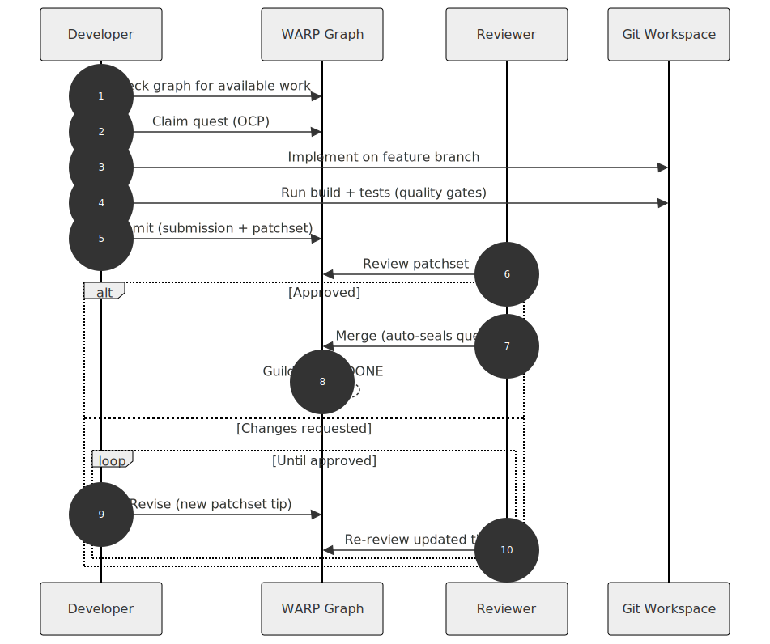

# Contributing to XYPH

## Project Planning

XYPH plans and tracks its own development through the WARP graph. The `xyph-actuator.ts` CLI is the single source of truth for what's been done, what's next, and what's in the backlog.

**Before you start working**, check the graph:

```bash
# What's the current roadmap?
npx tsx xyph-actuator.ts status --view roadmap

# What's in the triage inbox?
npx tsx xyph-actuator.ts status --view inbox

# See every node in the graph
npx tsx xyph-actuator.ts status --view all
```

**When you want to add work**, write it to the graph:

```bash
# Suggest a task for triage
npx tsx xyph-actuator.ts inbox task:MY-001 \
  --title "Proposed feature" --suggested-by human.yourname

# Declare a sovereign Intent (required root for all quests)
npx tsx xyph-actuator.ts intent intent:MY-001 \
  --title "Why this work matters" --requested-by human.yourname

# Promote an inbox task to the backlog
npx tsx xyph-actuator.ts promote task:MY-001 --intent intent:MY-001
```

All planning, prioritization, and progress tracking flows through the actuator. Don't plan outside the system — the graph is the plan.

## Development Workflow

1. **Check the graph** to find work or add new tasks.
2. **Claim a quest** with `xyph-actuator.ts claim <id>`.
3. **Do the work** on a feature branch.
4. **Submit for review** with `xyph-actuator.ts submit <quest-id> --description "..."`.
5. **Get reviewed** — reviewers use `xyph-actuator.ts review <patchset-id> --verdict approve --comment "..."`.
6. **Merge** with `xyph-actuator.ts merge <submission-id> --rationale "..."` (auto-seals quest).

For solo work without review, you can still **seal directly** with `xyph-actuator.ts seal <id> --artifact <hash> --rationale "..."`.



## Quality Gates

Before opening or updating a PR, **always** run:

```bash
npm run build    # Verify TypeScript compilation
npm test         # Run full test suite
```

Never push code that doesn't pass both checks.

- Do not use `--no-verify` to skip git hooks.
- Do not use `eslint-disable` comments to silence lint rules.
- Do not use `@ts-ignore` or `@ts-expect-error` to silence TypeScript.
- If you encounter lint errors, test failures, or warnings — even pre-existing ones — fix them. Leave the codebase better than you found it.

## Diagrams

Documentation diagrams live in `docs/diagrams/` as Mermaid source (`.mmd`) pre-rendered to SVG. Markdown files reference the SVGs directly — no inline Mermaid code fences.

**To add or edit a diagram:**

```bash
# Edit (or create) the Mermaid source
vim docs/diagrams/my-diagram.mmd

# Render all diagrams to SVG (writes .svg + .sha256 sidecar)
./scripts/render-diagrams.sh

# Reference from markdown (path is relative to the .md file)
# From docs/:           
# From docs/canonical/: 
# From project root:    
```

**Why pre-rendered SVGs?** Inline Mermaid depends on the viewer's renderer — GitHub, Obsidian, and VS Code all have different Mermaid versions with different feature support. Pre-rendered SVGs look identical everywhere.

**CI enforces:**
- No inline ` ```mermaid ` blocks in any `.md` file
- Every `.mmd` has a corresponding `.svg` and `.mmd.sha256`
- Source hash freshness — if you edit a `.mmd` without re-rendering, CI fails

The pre-commit hook catches inline mermaid blocks locally. The pre-push hook runs the full freshness check.

## Design Doc Accuracy

XYPH's canonical design documents (`docs/canonical/`) describe the planning compiler pipeline and domain rules. When writing or updating these docs, remember:

**git-warp is a CRDT, not a database.** The substrate has no locks, no transactions, no centralized snapshots, and no rollback. All writes go through `graph.patch()`, which produces a single atomic Git commit. Multiple writers can emit patches concurrently without coordination — convergence is deterministic.

- Use "emit a patch" or "call `graph.patch()`", not "commit a transaction".
- Use "compensating patch" (new forward-only correction via LWW), not "rollback".
- Use "domain validation before `graph.patch()`", not "optimistic concurrency check" or "snapshot precondition".
- Use `graph.traverse.weightedLongestPath()` for critical path, not Dijkstra (which finds shortest paths).
- Never describe userland graph algorithms — reference `graph.traverse.*` primitives.

If a design doc contradicts how git-warp actually works, the doc is wrong — fix it. Always cross-reference against the [git-warp README](https://github.com/git-stunts/git-warp) and ARCHITECTURE.md for ground truth.

## Constitution

Every mutation must obey the [CONSTITUTION.md](docs/canonical/CONSTITUTION.md). Key rules:

- Every quest must trace back to a human-declared `intent:` node (Art. IV).
- No cycles in the dependency graph (Art. II).
- Critical path changes require an ApprovalGate signed by a human (Art. IV.2).

## Command Reference

| Command | Description |
|---------|-------------|
| `status --view <roadmap\|lineage\|all\|inbox\|submissions>` | View the roadmap state |
| `quest <id> --title "..." --campaign <id> --intent <id>` | Initialize a Quest |
| `intent <id> --title "..." --requested-by human.<name>` | Declare a sovereign Intent |
| `claim <id>` | Volunteer for a task (OCP) |
| `submit <quest-id> --description "..."` | Submit quest for review |
| `revise <submission-id> --description "..."` | Push new patchset superseding tip |
| `review <patchset-id> --verdict <v> --comment "..."` | Review: approve, request-changes, comment |
| `merge <submission-id> --rationale "..."` | Merge (git settlement + auto-seal) |
| `close <submission-id> --rationale "..."` | Close submission without merging |
| `seal <id> --artifact <hash> --rationale "..."` | Mark as DONE directly (solo work) |
| `inbox <id> --title "..." --suggested-by <principal>` | Suggest a task for triage |
| `promote <id> --intent <id>` | Promote INBOX to BACKLOG |
| `reject <id> --rationale "..."` | Reject to GRAVEYARD |
| `audit-sovereignty` | Audit quests for missing intent lineage |
| `generate-key` | Generate an Ed25519 Guild Seal keypair |

All commands are run via `npx tsx xyph-actuator.ts <command>`.
