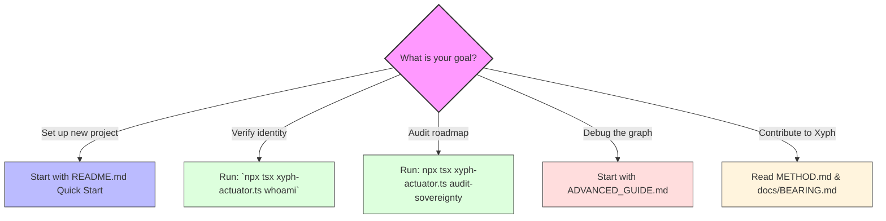

# Guide — Xyph

This is the developer-level operator guide for Xyph. Use it for orientation, the productive-fast path, and to understand how the planning compiler orchestrates your coordination worldline.

For deep-track doctrine, worldline internals, and repository-wide engineering standards, use [ADVANCED_GUIDE.md](./ADVANCED_GUIDE.md).

## Choose Your Lane

### 1. Repository Setup & First Intent

Bootstrap your coordination bedrock and record the first declaration of why work should exist.

- **Run**: `npm install && npx tsx xyph-actuator.ts login human.ada`
- **Read**: [README Quick Start](./README.md#quick-start)

### 2. Fast Ingress (Human & Agent)

Coordinate through the most efficient path for your current context.

- **Human (TUI)**: Open the interactive cockpit via `npm run tui`.
- **Human (CLI)**: Use `xyph-actuator.ts` for direct graph mutations.
- **Agent (JSONL)**: Use the versioned control plane for speculative work.
- **Agent (MCP)**: Join the graph as a native participant (Planned).

### 3. The Digital Guild Lifecycle

Return to your archive through high-fidelity browse or context-aware recall.

- **Intent**: Declare why work should exist.
- **Quest**: Claim and execute a unit of work.
- **Submission**: Submit work for review and revision.
- **Scroll**: Seal completed work with a cryptographic Guild Seal.

## Big Picture: System Orchestration

Xyph is a tiered planning engine designed to move coordination from static lists to executable graphs:

1. **Operating Surfaces**: The CLI, TUI dashboard, and JSONL API are different lenses over the same graph truth. They ensure that coordination is always a shared experience.
2. **Xyph Core (Domain)**: Manages the Digital Guild ontology, dependency DAG analysis, and sovereignty audits. It ensures that every action is lawful and authorized.
3. **WARP (Memory)**: The Structural Worldline Memory that tracks the evolution of your plan and its speculative alternatives without requiring a central server.

## Orientation Checklist

## Rule of Thumb

If you need a comprehensive tool reference, use the [README CLI section](./README.md#cli-reference).

If you need to know "what's true right now," use [docs/BEARING.md](./docs/BEARING.md).

If you are just starting, use the [README.md](./README.md) and the orientation tracks above.

---

**The goal is to move coordination from a collection of widgets to the application's foundation, designed for high-output collaboration.**
