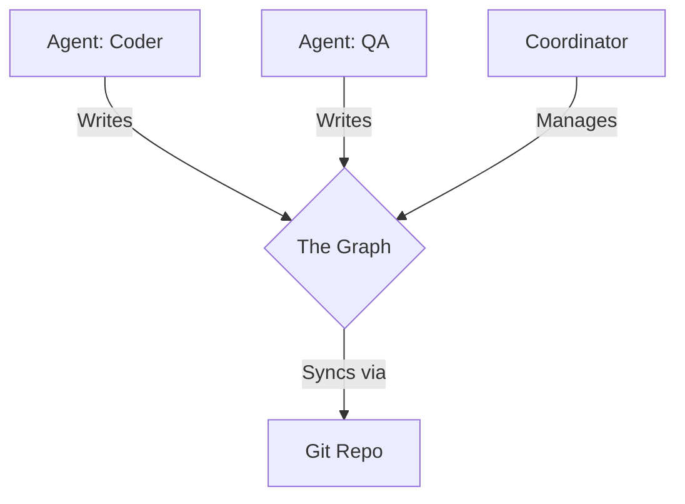

# XYPH 🌿
> **Kubernetes for Autonomous Agents, backed by Git.**

XYPH is a decentralized coordination framework for AI agents. It replaces fragile orchestration scripts with a cryptographically secure knowledge graph where "The Graph is the State."

In XYPH, agents don't talk to each other—they talk to the **Graph**.

## Features

- **🧠 Hive Memory:** If an agent crashes, its state is preserved in the graph.
- **⚡ Async Coordination:** Agents work in parallel, syncing via Git.
- **🛡️ Cryptographic Resume:** Every line of code, every decision is signed by the specific agent identity.
- **🔌 Plug-and-Play:** Spin up a new agent, give it a skill (e.g., "Rust"), point it at the repo, and it starts working.

## Architecture

XYPH runs on **[git-warp](https://github.com/git-stunts/git-warp)**.



## Quick Start

### 1. Initialize the Hive
```bash
# Create a new XYPH repo
mkdir my-project && cd my-project
xyph init --name "SuperApp"
```

### 2. Spawn a Coordinator (The Brain)
The coordinator manages the backlog and cleans up dead agents.
```bash
xyph coordinator start --daemon
```

### 3. Spawn a Worker (The Hands)
Start an agent specialized in TypeScript.
```bash
xyph worker start --id "agent-ts-01" --skill "typescript" --skill "frontend"
```

### 4. Feed the Hive
Humans (or other agents) add tasks to the graph.
```bash
xyph task add "Refactor the Login component" --lang "typescript" --priority high
```

## The Protocol
XYPH uses **Optimistic Claiming**. Agents race to claim tasks. The underlying `git-warp` engine resolves conflicts deterministically via LWW (Last-Writer-Wins) and OR-Sets. You never need to worry about two agents doing the same work.

## Documentation
See the [Canonical Corpus](./docs/canonical) for foundational specifications.

## License
MIT
