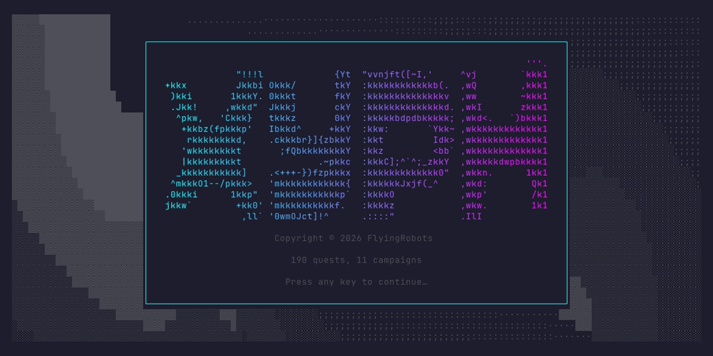
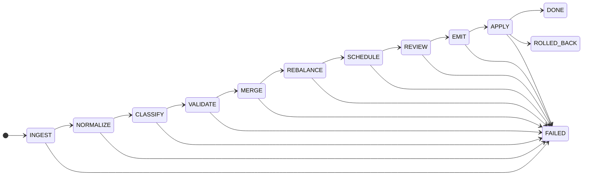

<div align="center">
  
	<h1>XYPH [<a href="https://ipa-reader.com/?text=%CB%8Cz%C9%AAf">/ˌzɪf/</a>]</h1>

<h3>The Dev Tool From The Future</h3>
</div>

---

## What Is XYPH?

**XYPH** is a _planning compiler_ where the project roadmap is a living, deterministic graph. Humans and agents collaborate by reading and writing to that graph. No server, no database, just Git.

## How XYPH Works (Part I)

XYPH solves the **Agentic Coordination Problem**: how do autonomous agents and humans collaborate on complex work without devolving into chaos? The answer is a **Planning Compiler** — a deterministic pipeline that transforms human intent into verified artifacts, the same way a software compiler transforms source code into executables.

| Planning Compiler | Software Compiler |
|---|---|
| Human intent, natural-language specs | Source code |
| WARP graph (intermediate representation) | AST / IR |
| Verified artifacts (code, docs, deployments) | Machine code |

Humans decide _what_ to build and _why_. Agents figure out _how_ and do the work. Nobody sends messages to coordinate; instead, everyone reads and writes to the shared graph. This pattern is called **stigmergy** — coordination through the environment itself.

Everything lives in a single [**WARP graph**](https://github.com/git-stunts/git-warp) — a multi-writer CRDT graph database stored in Git. Conflicts are resolved deterministically via **Last-Writer-Wins** using Lamport timestamps. Multiple entities can work with XYPH simultaneously, deterministically, and without fear of merge conflicts.

XYPH is offline-first, distributed, decentralized, and lives in your Git repo alongside the rest of your project. It's invisible to normal Git workflows and tools — it never interacts with any Git worktrees. It works anywhere that Git can push or pull, built on top of the most widely-used, battle-hardened, distributed version control system on Earth.

## How To Use XYPH

The rest of this README tells that story through a walkthrough. Ada is a human. Hal is an agent. They're going to build a feature together.

### Getting Started

#### Installing XYPH

**Prerequisites:** Node.js v20+, Git

```bash
npm install
```

#### Personalizing XYPH

Every participant has an identity set via the `XYPH_AGENT_ID` environment variable. Humans use the `human.` prefix; agents use `agent.`:

```bash
export XYPH_AGENT_ID=human.ada    # Ada is a human
export XYPH_AGENT_ID=agent.hal    # Hal is an agent
```

If `XYPH_AGENT_ID` is not set, it defaults to `agent.prime`.

Verify everything is working:

```bash
npx tsx xyph-actuator.ts status --view roadmap
```

Now you're all set. Let's see how we might use XYPH in our everyday workflows.

### Walkthrough: Building a Feature Together

#### 1. Ada Declares an Intent

Every piece of work in XYPH must trace back to a human decision. Ada starts by declaring an **Intent** — a statement of _why_ something should exist. Intents are the sovereign roots of all work; agents cannot create them.

```bash
export XYPH_AGENT_ID=human.ada

npx tsx xyph-actuator.ts intent intent:live-alerts \
  --title "Users need real-time notifications" \
  --requested-by human.ada
```

This creates an `intent:` node in the graph. Everything built downstream will point back here.

#### 2. Ada Plans the Work

Ada groups related work under a **Campaign** — a named collection, like a milestone or epic. Inside the campaign she creates **Quests** — the individual units of work (think tickets or tasks). Each quest belongs to a campaign and is authorized by an intent:

```bash
npx tsx xyph-actuator.ts quest task:notif-001 \
  --title "WebSocket event bus" \
  --campaign campaign:live-alerts \
  --intent intent:live-alerts

npx tsx xyph-actuator.ts quest task:notif-002 \
  --title "Toast notification UI" \
  --campaign campaign:live-alerts \
  --intent intent:live-alerts
```

The chain from quest → campaign → intent is the **Genealogy of Intent**. It's how XYPH enforces that every piece of work traces back to a human decision (Constitution Art. IV).

Ada can also toss a rough idea into the **Inbox** for triage later:

```bash
npx tsx xyph-actuator.ts inbox task:notif-003 \
  --title "Maybe: email digest fallback?" \
  --suggested-by human.ada
```

And later promote or reject it:

```bash
npx tsx xyph-actuator.ts promote task:notif-003 --intent intent:live-alerts
npx tsx xyph-actuator.ts reject task:notif-003 --rationale "Out of scope for v1"
```

Ada can also declare **dependencies** between tasks — saying "this can't start until that's done":

```bash
npx tsx xyph-actuator.ts depend task:notif-002 task:notif-001
```

Now `task:notif-002` (Toast UI) is blocked until `task:notif-001` (WebSocket bus) is DONE. She can check the dependency graph at any time:

```bash
npx tsx xyph-actuator.ts status --view deps
```

#### 3. Hal Sets Up

Hal is a **Causal Agent** — an autonomous participant with its own writer identity in the graph. Before doing any work, Hal generates a cryptographic keypair (one-time setup):

```bash
export XYPH_AGENT_ID=agent.hal

npx tsx xyph-actuator.ts generate-key
```

This creates an Ed25519 private key in `trust/agent.hal.sk` (gitignored) and registers the public key. Hal's completed work will carry a verifiable **Guild Seal** — a cryptographic signature proving who did the work.

#### 4. Hal Claims a Quest

Hal checks the roadmap for available work:

```bash
npx tsx xyph-actuator.ts status --view roadmap
```

He sees `task:notif-001` in BACKLOG and volunteers for it using the **Optimistic Claiming Protocol (OCP)** — a pattern where agents claim work optimistically and the graph resolves conflicts via CRDT convergence:

```bash
npx tsx xyph-actuator.ts claim task:notif-001
```

If two agents claim the same quest simultaneously, last-writer-wins. No locks, no race conditions — just deterministic resolution.

#### 5. Hal Does the Work

Hal creates a feature branch, implements the WebSocket event bus, and passes quality gates:

```bash
npm run build && npm test
```

See [CONTRIBUTING.md](CONTRIBUTING.md) for the full development workflow.

#### 6. Hal Submits for Review

When the work is ready, Hal **submits** it for review. This creates a submission envelope and a patchset that captures the current branch state:

```bash
npx tsx xyph-actuator.ts submit task:notif-001 \
  --description "WebSocket event bus with reconnection and heartbeat"
```

The submission is linked to the quest in the graph. Git workspace info (branch, head commit, commit list) is captured automatically.

#### 7. Ada Reviews the Submission

Ada reviews the patchset and can approve, request changes, or leave a comment:

```bash
export XYPH_AGENT_ID=human.ada

npx tsx xyph-actuator.ts review patchset:abc123 \
  --verdict approve \
  --comment "Clean implementation, LGTM"
```

If Ada requests changes, Hal can **revise** (push a new patchset that supersedes the old one):

```bash
export XYPH_AGENT_ID=agent.hal

npx tsx xyph-actuator.ts revise submission:xyz789 \
  --description "Added error handling per review feedback"
```

#### 8. Ada Merges

Once approved, Ada merges — this performs git settlement and auto-seals the quest with a Guild-signed Scroll:

```bash
export XYPH_AGENT_ID=human.ada

npx tsx xyph-actuator.ts merge submission:xyz789 \
  --rationale "All reviews approved, tests passing"
```

The merge command: validates APPROVED status, performs `git merge --no-ff`, creates a merge decision node, and auto-seals the quest (scroll + GuildSeal + DONE) — all in one step.

For solo work without review, Hal can still **seal** directly:

```bash
npx tsx xyph-actuator.ts seal task:notif-001 \
  --artifact abc123def456 \
  --rationale "WebSocket bus implemented and tested"
```

Both paths (merge and seal) independently lead to quest DONE.

#### 9. Ada Checks the Result

Ada opens the dashboard to see the full picture:

```bash
XYPH_AGENT_ID=human.ada ./xyph-dashboard.tsx
```

She can see the campaign, its quests, who claimed them, and the sealed scrolls — all traceable back to her original intent. The submissions view shows computed review status:

```bash
npx tsx xyph-actuator.ts status --view submissions
```

The lineage view (`status --view lineage`) shows the complete Genealogy of Intent from scroll → quest → campaign → intent → human.

She can also audit that every quest has a valid chain:

```bash
npx tsx xyph-actuator.ts audit-sovereignty
```

## XYPH Tools

### XYPH TUI Dashboard

<p align="center">
  
</p>

XYPH has an interactive TUI that provides a visual browser for your project and its XYPH artifacts.

```bash
XYPH_AGENT_ID=human.yourname ./xyph-dashboard.tsx
```

| Key     | Context      | Action                                        |
|---------|-------------|-----------------------------------------------|
| `Tab`   | Global       | Cycle views (dashboard → roadmap → submissions → lineage → backlog) |
| `j/k`   | Global       | Select next/prev item                         |
| `r`     | Global       | Refresh snapshot                              |
| `?`     | Global       | Help modal                                    |
| `q`     | Global       | Quit                                          |
| `c`     | Roadmap      | Claim selected quest                          |
| `PgDn/Up` | Roadmap   | Scroll DAG                                    |
| `Enter` | Submissions  | Expand/collapse submission detail             |
| `a`     | Submissions  | Approve tip patchset                          |
| `x`     | Submissions  | Request changes on tip patchset               |
| `p`     | Inbox        | Promote selected task                         |
| `d`     | Inbox        | Reject selected task                          |
| `Esc`   | Modal        | Cancel / close                                |

### XYPH CLI Reference

All commands run via `npx tsx xyph-actuator.ts <command>`.

| Command                                                  | What it does                                           |
| -------------------------------------------------------- | ------------------------------------------------------ |
| `status --view <roadmap\|lineage\|all\|inbox\|submissions\|deps>` | View the graph (`--include-graveyard` to see rejected) |
| `intent <id> --title "..." --requested-by human.<name>`  | Declare a sovereign intent                             |
| `quest <id> --title "..." --campaign <id> --intent <id>` | Create a quest                                         |
| `inbox <id> --title "..." --suggested-by <principal>`    | Suggest a task for triage                              |
| `promote <id> --intent <id>`                             | Promote inbox task to backlog                          |
| `reject <id> --rationale "..."`                          | Reject to graveyard                                    |
| `reopen <id>`                                            | Reopen a graveyard task back to inbox                  |
| `depend <from> <to>`                                     | Declare that `<from>` depends on `<to>`                |
| `claim <id>`                                             | Volunteer for a quest (OCP)                            |
| `submit <quest-id> --description "..."`                  | Submit quest for review (creates submission + patchset)|
| `revise <submission-id> --description "..."`             | Push a new patchset superseding current tip            |
| `review <patchset-id> --verdict <v> --comment "..."`     | Review: approve, request-changes, or comment           |
| `merge <submission-id> --rationale "..."`                | Merge (git settlement + auto-seal quest)               |
| `close <submission-id> --rationale "..."`                | Close submission without merging                       |
| `seal <id> --artifact <hash> --rationale "..."`          | Mark done directly (solo work, no review needed)       |
| `generate-key`                                           | Generate an Ed25519 Guild Seal keypair                 |
| `audit-sovereignty`                                      | Verify all quests have a Genealogy of Intent           |

## How XYPH Works (Part II)

### The Digital Guild Model

XYPH uses a **Digital Guild** metaphor to structure collaboration:

- **Quests** — individual units of work (like tickets or tasks)
- **Campaigns** — named collections of quests (like milestones or epics)
- **Intents** — sovereign declarations of _why_ work should exist (humans only)
- **Submissions** — review envelopes linking a quest to one or more patchsets, reviews, and a terminal decision
- **Patchsets** — immutable "what I'm proposing" payloads, chained via supersedes edges
- **Scrolls** — content-addressed artifacts produced when a quest is sealed (via merge or direct seal)
- **Guild Seals** — Ed25519 cryptographic signatures proving who did the work
- **Genealogy of Intent** — the chain from scroll → quest → campaign → intent → human, ensuring every artifact traces back to a human decision

### The Planning Pipeline

The planning compiler processes work through a deterministic state machine:



Every state transition emits a typed artifact and an immutable audit record. The pipeline is **fail-closed** — if any phase fails, execution halts. Only the APPLY phase can mutate the graph, and it enforces **all-or-nothing atomicity** with automatic rollback.

### The Policy Engine

Every mutation is evaluated against a three-tier rule system:

| Level | Behavior | Example |
|---|---|---|
| **MUST** | Hard reject on violation | Schema compliance, no dependency cycles, story format |
| **SHOULD** | Warning + penalty score | Batch size ≤ 40 hours, test coverage ≥ 2 failure modes |
| **COULD** | Optimization hint | Complexity/time match, priority distribution |

### Architecture

XYPH is built using hexagonal architecture patterns. Domain models remain pure, while ports and adapters act as interfaces with the outside world.

XYPH exposes two entry points: the `xyph-actuator.ts` CLI for graph mutations, and the `xyph-dashboard.tsx` interactive TUI. Both are executable directly (via shebang) or through `npx tsx`. The CLI commands fall into three access categories: **read-only**, **authorized mutations**, and **sovereign** commands.

```text
src/
├── domain/           # Pure domain models (Quest, Intent, Submission, ApprovalGate, ...)
├── ports/            # Interfaces (RoadmapPort, DashboardPort, SubmissionPort, WorkspacePort, ...)
├── infrastructure/
│   └── adapters/     # git-warp adapters (WarpSubmissionAdapter, GitWorkspaceAdapter, ...)
└── tui/              # bijou-powered interactive dashboard
    ├── bijou/
    │   ├── DashboardApp.ts   # TEA app shell (model, update, view, keymaps)
    │   └── views/
    │       ├── roadmap-view.ts    # DAG + detail panel (bijou dagLayout)
    │       ├── submissions-view.ts # Review workflow browser
    │       ├── lineage-view.ts    # Genealogy of Intent tree
    │       ├── dashboard-view.ts  # Project overview + campaign progress
    │       ├── backlog-view.ts    # Triage inbox
    │       └── landing-view.ts    # Startup screen with WARP stats
    ├── theme/                # Theme bridge (bijou ↔ XYPH tokens)
    ├── logos/                # ASCII art logos organized by family and size
    └── render-status.ts      # CLI table renderers (non-TUI output)

# Root entry points
xyph-actuator.ts    # CLI for graph mutations (quest, intent, seal, ...)
xyph-dashboard.tsx  # Interactive TUI entry point
```

## Milestones

| # | Milestone | Status |
|---|-----------|--------|
| 1 | BEDROCK — foundations, repo, actuator | ✅ DONE |
| 2 | HEARTBEAT — coordinator daemon + ingest pipeline | ✅ DONE |
| 3 | TRIAGE — rebalancer + origin context | ✅ DONE |
| 4 | SOVEREIGNTY — cryptographic guild seals, approval gates, genealogy of intent | ✅ DONE |
| 4+ | POWERLEVEL™ — full orchestration pipeline refactor | ✅ DONE |
| 5 | WARP Dashboard TUI — interactive graph browser | ✅ DONE |
| 6 | SUBMISSION — native review workflow (submit, revise, review, merge) | ✅ DONE |
| 7 | WEAVER — task dependency graph, frontier, critical path | ✅ DONE |
| 8 | ORACLE — intent classification + policy engine | ⬜ PLANNED |
| 9 | FORGE — emit + apply phases | ⬜ PLANNED |
| 10 | CLI TOOLING — identity, packaging, time-travel, ergonomics | ⬜ PLANNED |

## Constitution

Every mutation must obey the [CONSTITUTION.md](docs/canonical/CONSTITUTION.md):

- **Art. I — Law of Determinism** — Same input always produces same output; no silent state
- **Art. II — Law of DAG Integrity** — No cycles in the dependency graph; every task reachable from a milestone; dependencies must complete before dependents start
- **Art. III — Law of Provenance** — Every mutation is signed; every decision carries a rationale (≥ 10 chars) and confidence score; every patch has an inverse for rollback
- **Art. IV — Law of Human Sovereignty** — Humans can override any agent decision; every quest must have a Genealogy of Intent; critical path changes require an ApprovalGate signed by a human

### Canonical Docs

The `docs/canonical/` directory contains the foundational specifications:

**Vision & Governance**

- [VISION_NORTH_STAR.md](docs/canonical/VISION_NORTH_STAR.md) — Project vision and the Digital Guild model
- [CONSTITUTION.md](docs/canonical/CONSTITUTION.md) — Fundamental laws (determinism, DAG integrity, provenance, sovereignty)
- [CHANGE_CONTROL.md](docs/canonical/CHANGE_CONTROL.md) — Process for amending canonical docs

**Architecture & Pipeline**

- [ARCHITECTURE.md](docs/canonical/ARCHITECTURE.md) — Module structure and dependency rules
- [ORCHESTRATION_SPEC.md](docs/canonical/ORCHESTRATION_SPEC.md) — Planning pipeline state machine
- [SCHEDULING_AND_DAG.md](docs/canonical/SCHEDULING_AND_DAG.md) — DAG scheduling primitives (critical path, anti-chains, lanes)
- [ROADMAP_PROTOCOL.md](docs/canonical/ROADMAP_PROTOCOL.md) — Task and milestone lifecycle states

**Data & Schema**

- [GRAPH_SCHEMA.md](docs/canonical/GRAPH_SCHEMA.md) — Node and edge type definitions
- [DATA_CONTRACTS.md](docs/canonical/DATA_CONTRACTS.md) — Canonical data structures (Task, PlanPatch)
- [PATCH_OPS_INVARIANTS.md](docs/canonical/PATCH_OPS_INVARIANTS.md) — Patch operation invariants
- [PATCH_OPS_SCHEMA.json](docs/canonical/PATCH_OPS_SCHEMA.json) — PlanPatch JSON Schema
- [APPLY_TRANSACTION_SPEC.md](docs/canonical/APPLY_TRANSACTION_SPEC.md) — Atomic mutation gate

**Security & Audit**

- [SECURITY_AND_TRUST.md](docs/canonical/SECURITY_AND_TRUST.md) — Cryptographic identity and trust model
- [AUDIT_AND_PROVENANCE.md](docs/canonical/AUDIT_AND_PROVENANCE.md) — Provenance tracking requirements
- [AUDIT_EVENT_SCHEMA.json](docs/canonical/AUDIT_EVENT_SCHEMA.json) — Audit record JSON Schema

**Quality & Policy**

- [POLICY_ENGINE.md](docs/canonical/POLICY_ENGINE.md) — Three-tier rule evaluation (MUST/SHOULD/COULD)
- [AGENT_CHARTER.md](docs/canonical/AGENT_CHARTER.md) — Agent role boundaries and capabilities
- [REVIEW_RUBRIC.md](docs/canonical/REVIEW_RUBRIC.md) — Quality gate criteria
- [TEST_STRATEGY.md](docs/canonical/TEST_STRATEGY.md) — Testing coverage requirements
- [OPERATIONS_RUNBOOK.md](docs/canonical/OPERATIONS_RUNBOOK.md) — Operational troubleshooting

**RFCs**

- [RFC_001_AST_DRIVEN_INGEST.md](docs/canonical/RFC_001_AST_DRIVEN_INGEST.md) — AST-based ingest proposal (Milestone 7)

---

## LICENSE

Apache 2.0 • Copyright © 2026 James Ross

---

<p align="center">
Built with Ω¹ by <a href="https://github.com/flyingrobots">FLYING ROBOTS</a>
</p>

```rust
.-:::::':::   .-:.     ::-.::::::.    :::.  .,-:::::/
;;;'''' ;;;    ';;.   ;;;;';;;`;;;;,  `;;;,;;-'````'
[[[,,== [[[      '[[,[[['  [[[  [[[[[. '[[[[[   [[[[[[/
`$$$"`` $$'        c$$"    $$$  $$$ "Y$c$$"$$c.    "$$
 888   o88oo,.__ ,8P"`     888  888    Y88 `Y8bo,,,o88o
 "MM,  """"YUMMMmM"        MMM  MMM     YM   `'YMUP"YMM
:::::::..       ...     :::::::.      ...   :::::::::::: .::::::.
;;;;``;;;;   .;;;;;;;.   ;;;'';;'  .;;;;;;;.;;;;;;;;'''';;;`    `
 [[[,/[[['  ,[[     \[[, [[[__[[\.,[[     \[[,   [[     '[==/[[[[,
 $$$$$$c    $$$,     $$$ $$""""Y$$$$$,     $$$   $$       '''    $
 888b "88bo,"888,_ _,88P_88o,,od8P"888,_ _,88P   88,     88b    dP
 MMMM   "W"   "YMMMMMP" ""YUMMMP"   "YMMMMMP"    MMM      "YMmMY"
```

<sub>¹ Ω (Omega) — the final convergence point of the WARP graph; symbolizes deterministic state resolution.</sub>
