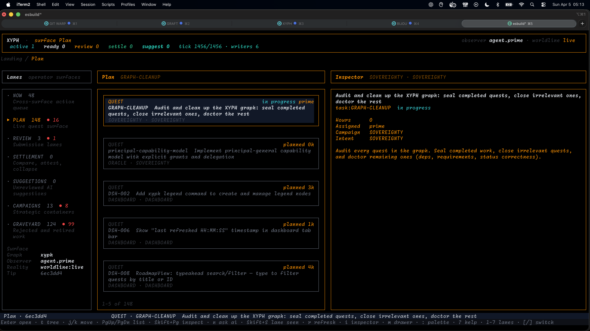

# Xyph

A planning compiler and coordination foundation for humans and agents. Xyph replaces scattered tickets and chat threads with a single, deterministic WARP graph that tracks the genealogy of intent from "why" to "shipped."

Xyph is designed for the high-output team that demands geometric lawfulness in their coordination. It scales from solo offline-first planning to multi-agent orchestrated execution with cryptographic settlement.


## Why Xyph?

Unlike traditional trackers that store status, Xyph computes reality from a shared, immutable history.

- **The Graph _is_ the Plan**: Coordination happens through **stigmergy**—participants modify the graph, and others observe the changes. The environment *is* the communication medium.
- **Causal Sovereignty**: Every unit of work (Quest) must trace back to an authoritative declaration (Intent). AI agents cannot "hallucinate" work; they must be authorized by the genealogy of intent.
- **Deterministic Convergence**: Built on [WARP (Structural Worldline Memory)](https://github.com/git-stunts/git-warp), Xyph ensures that all writers compute the same final state, even after weeks of offline work.
- **Cryptographic Settlement**: Completed work is sealed with Ed25519 Guild Seals. Trust is mathematical, not administrative.

## Quick Start

### 1. Local Setup

Install dependencies and initialize your first project.

```bash
npm install
npx tsx xyph-actuator.ts login human.ada
```

### 2. Fast Coordination

Declare an intent and create a quest.

```bash
# Declare why work should exist
npx tsx xyph-actuator.ts intent intent:setup \
  --title "Repository needs industrial-grade docs" \
  --requested-by human.ada

# Create a unit of work
npx tsx xyph-actuator.ts quest task:docs-001 \
  --title "Overhaul root README and signposts" \
  --intent intent:setup
```

### 3. TUI Cockpit

Open the Bijou-powered interactive dashboard to navigate the roadmap.

```bash
npm run tui
```



## Documentation

- **[Guide](./GUIDE.md)**: Orientation, the fast path, and Digital Guild nouns.
- **[Advanced Guide](./ADVANCED_GUIDE.md)**: Deep dives into worldlines, braiding, and settlement.
- **[Architecture](./ARCHITECTURE.md)**: The authoritative structural reference (Hexagonal, Ports, WARP).
- **[Vision](./docs/VISION.md)**: Core tenets and the stigmergic mission.
- **[Method](./design/METHOD.md)**: Repo work doctrine and the cycle loop.

---

Built with geometric lawfulness by [FLYING ROBOTS](https://github.com/flyingrobots)
