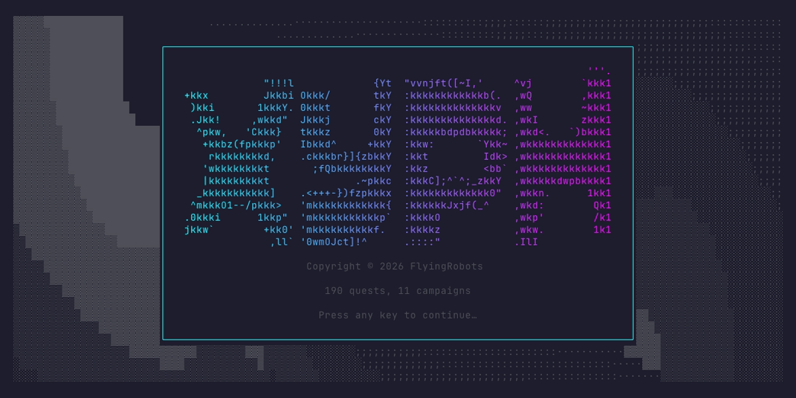
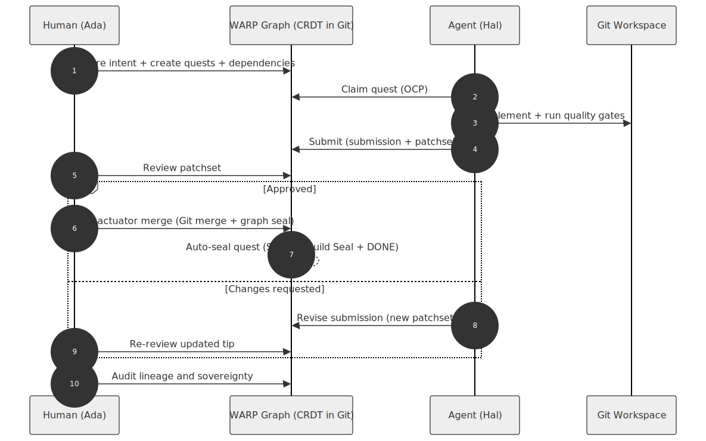

<div align="center">
  
  <h1>XYPH [<a href="https://ipa-reader.com/?text=%CB%8Cz%C9%AAf">/ˌzɪf/</a>]</h1>
  <h3>Reificatory Engine</h3>
  <p><em>Xyph it done.</em></p>
</div>

---

## What Is XYPH?

**XYPH _xyphs_ intent into reality.**  
An offline-first, decentralized, deterministic **planning compiler + collaboration engine** for humans and agents.

**No server. No database. Just Git.**  
Instead of hand-orchestrating workflows, you compile intent into a living graph, execute it to completion, and settle outcomes with receipts.

**XYPH's ontology is sovereign.**  
XYPH defines the public concepts of observation, worldlines, comparison, collapse, and lawful transformation. [git-warp](https://github.com/git-stunts/git-warp) provides the versioned graph-state substrate. Alfred-derived components may be used internally for resilience, transport, audit, auth, or control-plane plumbing, but they are not part of XYPH's public ontology, API vocabulary, or type system. XYPH is not Alfred with extra steps.

### xyph (verb)
To compile intent into an executable plan, run it to completion, and settle the result into history with verifiable receipts.

## How XYPH Works (Part I)

XYPH solves the **Agentic Coordination Problem**: how do autonomous agents and humans collaborate on complex work without devolving into chaos? The answer is a **Planning Compiler** — a deterministic pipeline that transforms human intent into verified artifacts, the same way a software compiler transforms source code into executables.

| Planning Compiler | Software Compiler |
|---|---|
| Human intent, natural-language specs | Source code |
| WARP graph (intermediate representation) | AST / IR |
| Verified artifacts (code, docs, deployments) | Machine code |

Humans decide _what_ to build and _why_. Agents figure out _how_ and do the work. Nobody sends messages to coordinate; instead, everyone reads and writes to the shared graph. This pattern is called **stigmergy** — coordination through the environment itself.

Everything lives in a single [**WARP graph**](https://github.com/git-stunts/git-warp) — a multi-writer CRDT graph database stored in Git. Conflicts are resolved deterministically via **Last-Writer-Wins** using Lamport timestamps. Multiple entities can work with XYPH simultaneously, deterministically, and without fear of merge conflicts.

XYPH is offline-first, distributed, decentralized, and defaults to living in
your current Git repo alongside the rest of your project. It can also target a
different Git repo via bootstrap config when you want a sidecar operational
graph. It is invisible to normal Git workflows and tools — it never interacts
with any Git worktrees. It works anywhere that Git can push or pull, built on
top of the most widely-used, battle-hardened, distributed version control
system on Earth.

## How To Use XYPH

The rest of this README tells that story through a walkthrough. Ada is a human. Hal is an agent. They're going to build a feature together.

### Getting Started

#### Installing XYPH

**Prerequisites:** Node.js v20+, Git

```bash
npm install
```

#### Personalizing XYPH

Every participant has an identity set via the `XYPH_AGENT_ID` environment variable. Humans use the `human.` prefix; agents use `agent.`:

```bash
export XYPH_AGENT_ID=human.ada    # Ada is a human
export XYPH_AGENT_ID=agent.hal    # Hal is an agent
```

If `XYPH_AGENT_ID` is not set, it defaults to `agent.prime`.

#### Selecting The Runtime Graph

XYPH resolves its runtime graph before it can read any graph-backed config, so
graph selection is a bootstrap concern rather than a `config:xyph` node
concern.

Bootstrap precedence is:

- local `.xyph.json`
- user config `~/.xyph/config`
- defaults: current Git repo + graph name `xyph`

Example local config:

```json
{
  "graph": {
    "name": "xyph-review"
  }
}
```

Example sidecar-style user config:

```json
{
  "identity": "human.ada",
  "graph": {
    "repoPath": "/Users/ada/git/xyph-dev",
    "name": "xyph"
  }
}
```

If the target repo already contains multiple git-warp graphs, or only a single
non-default graph, XYPH now fails loudly until `graph.name` is set explicitly.
It will not guess and silently mint a second graph. If `repoPath` points at a
different repo, `graph.name` is also required explicitly; XYPH will not inspect
git-warp ref namespaces outside the current working repo.

Verify everything is working:

```bash
npx tsx xyph-actuator.ts status --view roadmap
```

Automation note: commands that support `--json` now emit **JSONL**. Consumers
should read stdout line by line; commands may emit non-terminal `start` /
`progress` records before the final success or error envelope. Commands with
no progress still emit a valid one-record JSONL stream.

#### Canonical Machine Interface

For agents and automation, XYPH is moving toward a single machine-facing control
plane:

```bash
printf '%s\n' \
  '{"v":1,"id":"req-1","cmd":"observe","args":{"projection":"graph.summary"}}' \
  | node ./xyph.ts api
```

`xyph api` speaks versioned JSONL request/response envelopes. The current
imperative CLI remains available, but it is increasingly treated as a set of
human-friendly compatibility projections over the same graph-backed domain
services rather than the canonical machine protocol.

Load-bearing rule: **Observer profiles do not grant authority by existing.**
Authority is resolved from the acting principal, the observer profile, the
policy pack, and the observation/worldline coordinate in play.

### Why Worldlines Exist

**The graph is still the plan.**  
`worldline:live` is the shared, stigmergic coordination surface that humans and
agents should react to by default.

A derived worldline is **not** a second-class draft or a Git branch with a new
name. It is a **candidate continuation of the plan**: a pinned observation plus
an overlay patch log stored in git-warp as a working set.

That matters because changing the live plan is not a private act. In XYPH, the
shared graph is the environment everyone reacts to. If an agent lands a
half-formed structural rewrite directly in `worldline:live`, other agents and
humans may immediately re-route work, generate diagnostics against it, or
respond to it as if it were settled truth.

Worldlines exist to preserve **signal hygiene** in that shared environment.

#### Default Rule

Use `worldline:live` for:

- ordinary execution
- truthful progress/status updates
- routine evidence attachment
- normal collaborative work

Use a derived worldline when the work is:

- speculative
- structurally disruptive
- multi-step and only coherent as a set
- high-blast-radius
- explicitly counterfactual
- intended for review before it becomes shared truth

#### Concrete Use Cases

**1. Structural replanning**

An agent wants to split one quest into five quests, redistribute dependencies,
and change ownership. That should not hit the live graph one mutation at a
time, because the intermediate states would send misleading stigmergic signals.

```bash
printf '%s\n' \
  '{"v":1,"id":"fork-1","cmd":"fork_worldline","args":{"newWorldlineId":"worldline:plan-rewrite","scope":"campaign restructure"}}' \
  | node ./xyph.ts api
```

The agent can then use `worldline:plan-rewrite` for `history`, `diff`,
`apply`, and `observe(conflicts)` without perturbing `worldline:live`.

**2. High-blast-radius what-if execution**

A human or agent wants to know what happens if a submission lineage is rejected,
tasks are reopened, and a dependency corridor is rewritten. That is not just a
comment or proposal. It is an executable alternative graph state.

**3. Multi-step speculative execution**

Some changes only make sense as a bundle:

- create new nodes
- retarget dependencies
- change statuses
- attach evidence
- rewrite criteria

If those land incrementally in the live graph, the plan is briefly incoherent.
A worldline gives that bundle a coherent execution surface.

**4. Review lanes**

A reviewer can inspect a candidate future instead of a prose suggestion. That
lets XYPH answer a stronger question than “what is proposed?”:

> what would the plan look like if this path were taken?

**5. Offline continuation**

Because git-warp is offline-first, an agent can continue from a pinned
observation while disconnected or asynchronous, record overlay patches in a
working set, and settle those changes later without pretending they were always
the shared truth.

**6. Braided execution**

Some futures are not “pick one branch later.” They are “keep one completed
support line present while another line continues.”

That operation is best described as a **braid**:

- one worldline advances to produce an effect
- that effect is kept co-present as a frozen support line
- another worldline continues on top of the same shared base

Example: one line keeps a gate button depressed while another line advances
through the newly opened path. This is not ordinary merge, and it is not Git
rebase. It is a way of making two causally meaningful continuations visible at
once.

#### Why Comments and Proposals Are Not Enough

Comments and proposals are good for discussion and recommendation. They are not
enough for:

- executable alternate state
- coherent speculative multi-step mutation
- local causal continuation from a past observation
- time-travel workflows that continue instead of merely inspect

A proposal says **what should happen**.  
A worldline says **here is the graph if this path is taken**.

That is the practical XYPH use case.

The composition verb in XYPH’s ontology is **`braid_worldlines`**.
Terms like “rebase,” “superpose,” or “compose” may still appear informally in
discussion, but `braid` is the canonical name for keeping multiple
worldline-derived effects in play at once.

#### Current Slice

Canonical derived worldlines are currently honest on this substrate surface:

- `fork_worldline`
- `braid_worldlines`
- `observe(graph.summary)`
- `observe(worldline.summary)`
- `observe(entity.detail)`
- `history`
- `diff`
- `apply`
- `observe(conflicts)`
- `compare_worldlines`
- `collapse_worldline`

Observation coordinates across these derived-worldline reads now report the
working-set-local frontier digest and explicit substrate backing details:

- the backing working-set ID
- overlay head / patch count / writability
- pinned braid support worldline IDs when the selected worldline is braided

`compare_worldlines` now provides the first honest comparison preview backed by
published git-warp coordinate comparison facts. It supports:

- derived vs live
- derived vs derived
- explicit `at` / `againstAt` selectors
- optional `targetId` focus diffs

The result is a typed XYPH `comparison-artifact` preview with per-side
observation coordinates and substrate-backed divergence facts. It is
intentionally comparison-only and does **not** perform collapse or settlement.
Its substrate block now carries two published git-warp facts:

- the XYPH operationally scoped comparison fact used for freshness and
  settlement preview
- the raw whole-graph comparison fact kept for audit and provenance

That split lets `compare_worldlines persist:true` record a durable
`comparison-artifact:*` node on `worldline:live` without invalidating its own
operational freshness token.

Persisted governance artifacts are now legible through
`observe(entity.detail)`. Inspecting a durable `comparison-artifact:*` or
`collapse-proposal:*` now returns computed XYPH governance detail including
freshness, attestation summary, supersession lineage, and settlement/execution
state instead of leaving operators to reverse-engineer that status from raw
properties.

`collapse_worldline` now provides the first governed settlement runway in XYPH
language, still backed by published git-warp substrate facts. In the current
slice it:

- requires the effective worldline to be a canonical derived worldline
- requires a fresh `comparisonArtifactDigest` from `compare_worldlines`
- currently settles into `worldline:live` only
- defaults to preview mode, but accepts `dryRun: false` for live execution
- uses the same mutation kernel as `apply` for both preview and execution
- requires approving `attestationIds` over a persisted `comparison-artifact:*`
  when live execution would make substantive changes
- now lowers committed content-clearing transfer ops through git-warp’s
  published clear-content patch primitives instead of treating them as
  preview-only
- returns a typed `collapse-proposal` with per-side observations, substrate
  transfer facts, sanitized transfer ops, and either a mutation side-effect
  preview or a live execution result
- carries git-warp’s exported comparison and transfer facts in the substrate
  block for later XYPH recording or attestation work
- accepts optional `persist: true` to record the current collapse artifact as a
  durable `collapse-proposal:*` node on `worldline:live`
- uses approving attestations over the persisted `comparison-artifact:*` as the
  current execution gate; attesting a `collapse-proposal:*` remains valid
  governance context but is not the execution gate in this slice

Repeated persisted compare/collapse artifacts in the same governance lane now
form explicit supersession lineage. XYPH records stable per-lane series keys
and `supersedes` edges so later `observe(entity.detail)` reads can tell whether
an artifact is current, stale, or already superseded by a newer governance
snapshot.

`braid_worldlines` is now implemented as a thin mapping onto git-warp’s
published braid substrate for canonical derived worldlines. It:

- targets the effective derived worldline
- requires one or more `supportWorldlineIds`
- accepts optional `readOnly`
- returns XYPH-first braid/worldline metadata plus substrate backing IDs
- changes co-present visibility without pretending merge, rebase, or collapse

Core materialized projections now follow that braid-visible substrate truth
when the braided target worldline is selected. That parity now extends across
`history`, `diff`, `apply`, and `observe(conflicts)` for canonical derived
worldlines too, and `observe(conflicts)` adds an explicit warning when braided
overlays compete on singleton LWW properties in a way that can self-erase
co-presence in the projection.

Compatibility projections such as `observe(slice.local)`, `observe(context)`,
`observe(briefing)`, `observe(next)`, `observe(submissions)`,
`observe(diagnostics)`, and `observe(prescriptions)` are still catching up.
They remain live-service-backed compatibility views rather than full
derived-worldline truth.

`query` is now implemented as a hidden admin governance surface. The current
slice is deliberately narrow and artifact-centric:

- `view: "governance.worklist"` returns the live governance queues for fresh or
  stale comparisons and pending, approved, stale, or executed collapse
  proposals
- `view: "governance.series"` returns the chronology of one durable
  `comparison-artifact:*` or `collapse-proposal:*` lane using the recorded
  `artifact_series_key` and `supersedes` edges

This is not a generic graph query language yet. It is the first operator-facing
governance read model built on top of XYPH’s persisted artifacts.

`explain` now understands persisted governance artifacts too. When you point it
at a durable `comparison-artifact:*`, `collapse-proposal:*`, or `attestation:*`
node, it returns stable reason codes plus suggested next commands for common
operator questions such as:

- why a comparison artifact is stale or superseded
- why a collapse proposal is blocked, approved, stale, executed, or no-op
- why attesting a `collapse-proposal:*` does not itself satisfy the live
  execution gate
- which comparison artifact still needs approval before live collapse can run

#### Agent Usage

- Stay on `worldline:live` for ordinary low-blast-radius work that should land
  directly on the shared stigmergic surface.
- `fork_worldline` when you need a coherent speculative continuation, a review
  lane, an offline continuation from a pinned observation, or a structural
  replanning path that should not pollute live truth yet.
- `braid_worldlines` when one continuation needs another continuation’s effects
  to stay co-present without pretending merge or rebase semantics.
- `compare_worldlines` before governance or settlement decisions; it is the
  factual preview surface, not the decision itself.
- add `persist: true` to `compare_worldlines` when the factual preview should
  become a durable `comparison-artifact:*` governance record on live truth.
- `collapse_worldline` when you want either a candidate settlement runway
  preview or a governed live collapse. The current live flow is:
  `compare_worldlines persist:true` -> `attest` the returned
  `comparison-artifact:*` -> `collapse_worldline dryRun:false
  attestationIds:[...]`.
- add `persist: true` to `collapse_worldline` when the current preview or
  execution artifact should become a durable `collapse-proposal:*` record on
  `worldline:live`.
- Hand off explicit `worldlineId` values between humans and agents. Do not pass
  substrate working-set IDs as the public coordination handle.

For the broader technical framing of XYPH as a WARP-native application, see
[XYPH As A WARP App](docs/XYPH_AS_A_WARP_APP.md).

Now you're all set. Let's see how we might use XYPH in our everyday workflows.

### Walkthrough: Building a Feature Together

#### Walkthrough at a Glance



#### 1. Ada Declares an Intent

Every piece of work in XYPH must trace back to a human decision. Ada starts by declaring an **Intent** — a statement of _why_ something should exist. Intents are the sovereign roots of all work; agents cannot create them.

```bash
export XYPH_AGENT_ID=human.ada

npx tsx xyph-actuator.ts intent intent:live-alerts \
  --title "Users need real-time notifications" \
  --requested-by human.ada
```

This creates an `intent:` node in the graph. Everything built downstream will point back here.

#### 2. Ada Plans the Work

Ada groups related work under a **Campaign** — a named collection, like a milestone or epic. Inside the campaign she creates **Quests** — the individual units of work (think tickets or tasks). Each quest belongs to a campaign and is authorized by an intent:

```bash
npx tsx xyph-actuator.ts quest task:notif-001 \
  --title "WebSocket event bus" \
  --campaign campaign:live-alerts \
  --intent intent:live-alerts

npx tsx xyph-actuator.ts quest task:notif-002 \
  --title "Toast notification UI" \
  --campaign campaign:live-alerts \
  --intent intent:live-alerts
```

The chain from quest → campaign → intent is the **Genealogy of Intent**. It's how XYPH enforces that every piece of work traces back to a human decision (Constitution Art. IV).

Ada can also toss a rough idea into the **Inbox** for triage later:

```bash
npx tsx xyph-actuator.ts inbox task:notif-003 \
  --title "Maybe: email digest fallback?" \
  --suggested-by human.ada
```

And later promote or reject it:

```bash
npx tsx xyph-actuator.ts promote task:notif-003 --intent intent:live-alerts
npx tsx xyph-actuator.ts reject task:notif-003 --rationale "Out of scope for v1"
```

Ada can also declare **dependencies** between tasks — saying "this can't start until that's done":

```bash
npx tsx xyph-actuator.ts depend task:notif-002 task:notif-001
```

Now `task:notif-002` (Toast UI) is blocked until `task:notif-001` (WebSocket bus) is DONE. She can check the dependency graph at any time:

```bash
npx tsx xyph-actuator.ts status --view deps
```

#### 3. Hal Sets Up

Hal is a **Causal Agent** — an autonomous participant with its own writer identity in the graph. Before doing any work, Hal generates a cryptographic keypair (one-time setup):

```bash
export XYPH_AGENT_ID=agent.hal

npx tsx xyph-actuator.ts generate-key
```

This creates an Ed25519 private key in `~/.xyph/trust/agent.hal.sk` by default and registers the public key in `~/.xyph/trust/keyring.json`. Set `XYPH_TRUST_DIR` if you want those files in a different machine-local location, such as a vault checkout. Hal's agent identity remains `agent.hal` (`XYPH_AGENT_ID`), but his Guild Seal signing `keyId` is a spec-compliant `did:key:z6Mk...` derived from his public key. His completed work will carry a verifiable **Guild Seal** — a cryptographic signature proving who did the work.

See [Guild Seals: Cryptographic Identity and Signing](docs/GUILD_SEALS.md) for the full deep-dive on key generation, DID encoding, signing, verification, and keyring migration.

#### 4. Hal Claims a Quest

Hal checks the roadmap for available work:

```bash
npx tsx xyph-actuator.ts status --view roadmap
```

He sees `task:notif-001` in BACKLOG and volunteers for it using the **Optimistic Claiming Protocol (OCP)** — a pattern where agents claim work optimistically and the graph resolves conflicts via CRDT convergence:

```bash
npx tsx xyph-actuator.ts claim task:notif-001
```

If two agents claim the same quest simultaneously, last-writer-wins. No locks, no race conditions — just deterministic resolution.

#### 5. Hal Does the Work

Hal creates a feature branch, implements the WebSocket event bus, and passes quality gates:

```bash
npm run build && npm test
```

See [CONTRIBUTING.md](CONTRIBUTING.md) for the full development workflow.

#### 6. Hal Submits for Review

When the work is ready, Hal **submits** it for review. This creates a submission envelope and a patchset that captures the current branch state:

```bash
npx tsx xyph-actuator.ts submit task:notif-001 \
  --description "WebSocket event bus with reconnection and heartbeat"
```

The submission is linked to the quest in the graph. Git workspace info (branch, head commit, commit list) is captured automatically.

#### 7. Ada Reviews the Submission

Ada reviews the patchset and can approve, request changes, or leave a comment:

```bash
export XYPH_AGENT_ID=human.ada

npx tsx xyph-actuator.ts review patchset:abc123 \
  --verdict approve \
  --comment "Clean implementation, LGTM"
```

If Ada requests changes, Hal can **revise** (push a new patchset that supersedes the old one):

```bash
export XYPH_AGENT_ID=agent.hal

npx tsx xyph-actuator.ts revise submission:xyz789 \
  --description "Added error handling per review feedback"
```

#### 8. Ada Merges

Once approved, Ada merges — this performs git settlement and auto-seals the quest with a Guild-signed Scroll:

```bash
export XYPH_AGENT_ID=human.ada

npx tsx xyph-actuator.ts merge submission:xyz789 \
  --rationale "All reviews approved, tests passing"
```

The merge command: validates APPROVED status, performs `git merge --no-ff`, creates a merge decision node, and auto-seals the quest (scroll + GuildSeal + DONE) — all in one step.

For solo work without review, Hal can still **seal** directly:

```bash
npx tsx xyph-actuator.ts seal task:notif-001 \
  --artifact abc123def456 \
  --rationale "WebSocket bus implemented and tested"
```

Both paths (merge and seal) independently lead to quest DONE.

#### 9. Ada Checks the Result

Ada opens the dashboard to see the full picture:

```bash
XYPH_AGENT_ID=human.ada ./xyph-dashboard.ts
```

She can see the campaign, its quests, who claimed them, and the sealed scrolls — all traceable back to her original intent. The submissions view shows computed review status:

```bash
npx tsx xyph-actuator.ts status --view submissions
```

The lineage view (`status --view lineage`) shows the complete Genealogy of Intent from scroll → quest → campaign → intent → human.

She can also audit that every quest has a valid chain:

```bash
npx tsx xyph-actuator.ts audit-sovereignty
```

## XYPH Tools

### XYPH TUI Cockpit

<p align="center">
  
</p>

The animated asset above still shows the previous dashboard shell. A refreshed
cockpit demo capture is still pending.

XYPH has an interactive BIJOU-powered TUI that provides a visual browser for
your project and its XYPH artifacts. The current shell runs on BIJOU `3.1.0`
and now treats the cockpit as the XYPH landing page instead of forcing every
surface into one eternal inspector layout. The landing shell centers on six
lanes:

- `Now` for cross-surface action
- `Plan` for the live quest surface
- `Review` for submissions
- `Settlement` for compare/attest/collapse artifacts
- `Campaigns` for strategic containers
- `Graveyard` for rejected and retired work

The current product and experience source of truth for this human surface now
lives in [`design/README.md`](design/README.md). The README section below is
the quick operator overview, not the full design contract.

The left rail keeps those lanes visible, the center worklist stays scannable as
a contained-list-style queue, and the right inspector keeps the currently
selected record legible without dropping to raw JSON first. Press `Enter` on a
selected quest, submission, or governance record to drill into a dedicated item
page with a breadcrumb under the hero (`Landing / Plan / Q1`,
`Landing / Review / REV-1`, `Landing / Graveyard / G1`, and so on), then use
`Esc` or `Backspace` to return to the landing surface. Quest pages now expose
their own action strip, so drill-in is no longer just a read surface: you can
comment directly from the page, reopen graveyarded quests, and keep
claim/promote/reject/review actions visible in the place where full context
actually lives. `Review` items now open a dedicated review page too, with
lifecycle/progress, shared blocker and missing-evidence judgments, next lawful
actions, review/decision history, and page-local comment / approve /
request-changes actions for the current tip patchset. `Settlement` artifacts
now open their own governance page too, so compare / attestation / collapse
records are no longer forced through quest pages or the landing inspector when
you need their real progress, blockers, missing evidence, and next lawful
actions. The cockpit is fully keyboard-driven, but it now also supports mouse
clicks for lane/row selection and wheel scrolling in the main panes. `Plan`,
`Campaigns`, `Graveyard`, and the `Now` activity stream use observer-local
freshness markers from `~/.xyph/dashboard-state.json`, while `Review` and
`Settlement` now keep a persistent action-needed badge until the underlying
submission or governance artifact is actually resolved.

```bash
XYPH_AGENT_ID=human.yourname ./xyph-dashboard.ts
```

| Key | Context | Action |
|---|---|---|
| `1`-`6` | Global | Jump to Now / Plan / Review / Settlement / Campaigns / Graveyard |
| `[` / `]` | Global | Cycle lanes backward / forward |
| `j` / `k` | Cockpit | Select next / previous row |
| `g` / `G` | Cockpit | Jump to first / last row |
| `Enter` | Landing page | Open the selected quest / review / governance page |
| `Esc` / `Backspace` | Item page | Return to the landing page |
| `;` | Quest page | Comment on the open quest |
| `;` | Review page | Comment on the open submission |
| `;` | Governance page | Comment on the open governance artifact |
| `v` | Now lane | Toggle between the action queue and recent activity |
| `t` | Quest selection | Open the quest tree / lineage modal |
| `r` | Global | Refresh snapshot |
| `i` | Global | Toggle the inspector pane |
| `m` | Global | Toggle the "My Stuff" drawer |
| `Shift+S` | Fresh lane | Mark the current lane seen |
| Mouse click | Cockpit | Click lane rail entries and worklist rows |
| Mouse wheel | Cockpit | Scroll the worklist, inspector, quest tree, and drawer |
| `:` / `/` | Global | Open the command palette |
| `?` | Global | Open the contextual help modal |
| `q` | Global | Quit |
| `c` | Contextual | Claim selected READY quest |
| `p` | Contextual | Promote selected BACKLOG quest |
| `D` | Contextual | Reject selected BACKLOG quest |
| `o` | Contextual | Reopen selected GRAVEYARD quest |
| `a` | Contextual / Review page | Approve selected submission or current tip patchset |
| `x` | Contextual / Review page | Request changes on selected submission or current tip patchset |
| `PgDn` / `PgUp` | Landing / page | Page the worklist or the open item page |
| `Shift+PgDn` / `Shift+PgUp` | Cockpit | Scroll the inspector |
| `Esc` | Modal | Cancel / close |

### XYPH CLI Reference

All commands run via `npx tsx xyph-actuator.ts <command>`.

| Command                                                  | What it does                                           |
| -------------------------------------------------------- | ------------------------------------------------------ |
| `status --view <roadmap\|lineage\|all\|inbox\|submissions\|deps>` | View the graph (`--include-graveyard` to see rejected) |
| `intent <id> --title "..." --requested-by human.<name>`  | Declare a sovereign intent                             |
| `quest <id> --title "..." --campaign <id> --intent <id>` | Create a quest                                         |
| `inbox <id> --title "..." --suggested-by <principal>`    | Suggest a task for triage                              |
| `promote <id> --intent <id>`                             | Promote inbox task to backlog                          |
| `reject <id> --rationale "..."`                          | Reject to graveyard                                    |
| `reopen <id>`                                            | Reopen a graveyard task back to inbox                  |
| `depend <from> <to>`                                     | Declare dependency (same-family: tasks↔tasks or campaigns↔milestones) |
| `claim <id>`                                             | Volunteer for a quest (OCP)                            |
| `submit <quest-id> --description "..."`                  | Submit quest for review (creates submission + patchset)|
| `revise <submission-id> --description "..."`             | Push a new patchset superseding current tip            |
| `review <patchset-id> --verdict <v> --comment "..."`     | Review: approve, request-changes, or comment           |
| `merge <submission-id> --rationale "..."`                | Merge (git settlement + auto-seal quest)               |
| `close <submission-id> --rationale "..."`                | Close submission without merging                       |
| `seal <id> --artifact <hash> --rationale "..."`          | Mark done directly (solo work, no review needed)       |
| `generate-key`                                           | Generate an Ed25519 Guild Seal keypair                 |
| `audit-sovereignty`                                      | Verify all quests have a Genealogy of Intent           |

### Agent-native CLI

XYPH also exposes an agent-native CLI compatibility layer for cold-start
orientation, target work packets, and policy-bounded execution. The canonical
contract for this surface lives in
[docs/canonical/AGENT_PROTOCOL.md](docs/canonical/AGENT_PROTOCOL.md).

The current runtime already supports a shared semantic vocabulary across
`briefing`, `next`, `context`, and `act`, so agents do not have to reconstruct
blockers and next steps from command-local prose. That packet now includes
fields such as:

- `requirements`
- `acceptanceCriteria`
- `evidenceSummary`
- `blockingReasons`
- `missingEvidence`
- `nextLawfulActions`
- `claimability`
- `expectedActor`
- `attentionState`

Current highlights:

- `xyph briefing --json` now includes a `governanceQueue` alongside quest and
  submission intake, so agent cold-start sees governance attention work too.
- `xyph next --json` can now surface governance-oriented follow-up candidates,
  including human-bound attestation or collapse progression work, instead of
  treating governance as inspect-only intake.
- `xyph context --json <id>` now emits typed work packets not only for
  `task:*`, but also for `submission:*`, `patchset:*`,
  `comparison-artifact:*`, `collapse-proposal:*`, and `attestation:*` targets,
  including recommendation requests when governance follow-up or missing
  evidence needs explicit routing.
- `xyph act --json` now carries shared submission semantics on `review` /
  `merge` refusal, dry-run, success, and partial-failure outcomes when XYPH can
  derive them truthfully, and now rejects governance-only actions like
  `attest` / `collapse_preview` / `collapse_live` with explicit
  `human-only-action` envelopes instead of vague unsupported-action failures.

Design rule: agents do not need an explicit queued "ask AI" request in order
to notice and publish a worthwhile suggestion. Request-driven AI jobs are one
auditable intake path; spontaneous agent-originated suggestions are also valid,
as long as XYPH records them as visible advisory artifacts instead of silently
mutating graph truth.

## How XYPH Works (Part II)

### The Digital Guild Model

XYPH uses a **Digital Guild** metaphor to structure collaboration:

- **Quests** — individual units of work (like tickets or tasks)
- **Campaigns** — named collections of quests (like milestones or epics)
- **Intents** — sovereign declarations of _why_ work should exist (humans only)
- **Submissions** — review envelopes linking a quest to one or more patchsets, reviews, and a terminal decision
- **Patchsets** — immutable "what I'm proposing" payloads, chained via supersedes edges
- **Scrolls** — content-addressed artifacts produced when a quest is sealed (via merge or direct seal)
- **Guild Seals** — Ed25519 cryptographic signatures proving who did the work
- **Genealogy of Intent** — the chain from scroll → quest → campaign → intent → human, ensuring every artifact traces back to a human decision

### The Planning Pipeline

The planning compiler processes work through a deterministic state machine:



Every state transition emits a typed artifact and an immutable audit record. The pipeline is **fail-closed** — if any phase fails, execution halts. Only the APPLY phase can mutate the graph, and each `graph.patch()` call is atomic — either the entire patch commits as a single Git object, or nothing is written.

### The Policy Engine

Every mutation is evaluated against a three-tier rule system:

| Level | Behavior | Example |
|---|---|---|
| **MUST** | Hard reject on violation | Schema compliance, no dependency cycles, story format |
| **SHOULD** | Warning + penalty score | Batch size ≤ 40 hours, test coverage ≥ 2 failure modes |
| **COULD** | Optimization hint | Complexity/time match, priority distribution |

### Architecture

XYPH is built using hexagonal architecture patterns. Domain models remain pure, while ports and adapters act as interfaces with the outside world.

XYPH exposes two entry points: the `xyph-actuator.ts` CLI for graph mutations, and the `xyph-dashboard.ts` interactive TUI. Both are executable directly (via shebang) or through `npx tsx`. The CLI commands fall into three access categories: **read-only**, **authorized mutations**, and **sovereign** commands.

```text
src/
├── domain/           # Pure domain models (Quest, Intent, Submission, ApprovalGate, ...)
├── ports/            # Interfaces (RoadmapPort, DashboardPort, SubmissionPort, WorkspacePort, ...)
├── infrastructure/
│   └── adapters/     # git-warp adapters (WarpSubmissionAdapter, GitWorkspaceAdapter, ...)
└── tui/              # bijou v3.1-powered XYPH cockpit
    ├── bijou/
    │   ├── DashboardApp.ts   # TEA cockpit shell (lanes, actions, overlays)
    │   ├── cockpit.ts        # Lane/item derivation from graph snapshots
    │   └── views/
    │       ├── cockpit-view.ts    # Lane rail + worklist + inspector renderer
    │       ├── my-stuff-drawer.ts # Personal activity / quest drawer
    │       └── landing-view.ts    # Startup screen with WARP stats
    ├── theme/                # Theme bridge (bijou ↔ XYPH tokens)
    ├── logos/                # ASCII art logos organized by family and size
    └── render-status.ts      # CLI table renderers (non-TUI output)

# Root entry points
xyph-actuator.ts    # CLI for graph mutations (quest, intent, seal, ...)
xyph-dashboard.ts  # Interactive TUI entry point
```

## Milestones

| # | Milestone | Status |
|---|-----------|--------|
| 1 | BEDROCK — foundations, repo, actuator | ✅ DONE |
| 2 | HEARTBEAT — coordinator daemon + ingest pipeline | ✅ DONE |
| 3 | TRIAGE — rebalancer + origin context | ✅ DONE |
| 4 | SOVEREIGNTY — cryptographic guild seals, approval gates, genealogy of intent | ✅ DONE |
| 4+ | POWERLEVEL™ — full orchestration pipeline refactor | ✅ DONE |
| 5 | WARP Dashboard TUI — interactive graph browser | ✅ DONE |
| 6 | SUBMISSION — native review workflow (submit, revise, review, merge) | ✅ DONE |
| 7 | WEAVER — task dependency graph, frontier, critical path | ✅ DONE |
| 8 | ORACLE — intent classification + policy engine | ⬜ PLANNED |
| 9 | FORGE — emit + apply phases | ⬜ PLANNED |
| 10 | CLI TOOLING — identity, packaging, time-travel, ergonomics | 🔧 IN PROGRESS |
| 11 | TRACEABILITY — stories, requirements, acceptance criteria, evidence | ⬜ PLANNED |
| 12 | AGENT PROTOCOL — agent-native CLI and policy-bounded action kernel | ⬜ PLANNED |
| — | ECOSYSTEM — MCP server, Web UI, IDE integration | ⬜ PLANNED |

Milestone descriptions and inter-milestone dependencies are modeled in the WARP graph. Query via: `npx tsx xyph-actuator.ts status --view deps`

## Constitution

Every mutation must obey the [CONSTITUTION.md](docs/canonical/CONSTITUTION.md):

- **Art. I — Law of Determinism** — Same input always produces same output; no silent state
- **Art. II — Law of DAG Integrity** — No cycles in the dependency graph; every task reachable from a milestone; dependencies must complete before dependents start
- **Art. III — Law of Provenance** — Every mutation is signed; every decision carries a rationale (≥ 10 chars) and confidence score; corrections are made via compensating patches (LWW overrides), not transactional rollback
- **Art. IV — Law of Human Sovereignty** — Humans can override any agent decision; every quest must have a Genealogy of Intent; critical path changes require an ApprovalGate signed by a human

### Canonical Docs

The `docs/canonical/` directory contains the foundational specifications:

**Vision & Governance**

- [VISION_NORTH_STAR.md](docs/canonical/VISION_NORTH_STAR.md) — Project vision and the Digital Guild model
- [CONSTITUTION.md](docs/canonical/CONSTITUTION.md) — Fundamental laws (determinism, DAG integrity, provenance, sovereignty)
- [CHANGE_CONTROL.md](docs/canonical/CHANGE_CONTROL.md) — Process for amending canonical docs

**Architecture & Pipeline**

- [ARCHITECTURE.md](docs/canonical/ARCHITECTURE.md) — Module structure and dependency rules
- [AGENT_PROTOCOL.md](docs/canonical/AGENT_PROTOCOL.md) — Agent-native CLI and action-kernel contract
- [ORCHESTRATION_SPEC.md](docs/canonical/ORCHESTRATION_SPEC.md) — Planning pipeline state machine
- [SCHEDULING_AND_DAG.md](docs/canonical/SCHEDULING_AND_DAG.md) — DAG scheduling primitives (critical path, anti-chains, lanes)
- [ROADMAP_PROTOCOL.md](docs/canonical/ROADMAP_PROTOCOL.md) — Task and milestone lifecycle states

**Data & Schema**

- [GRAPH_SCHEMA.md](docs/canonical/GRAPH_SCHEMA.md) — Node and edge type definitions
- [DATA_CONTRACTS.md](docs/canonical/DATA_CONTRACTS.md) — Canonical data structures (Task, PlanPatch)
- [PATCH_OPS_INVARIANTS.md](docs/canonical/PATCH_OPS_INVARIANTS.md) — Patch operation invariants
- [PATCH_OPS_SCHEMA.json](docs/canonical/PATCH_OPS_SCHEMA.json) — PlanPatch JSON Schema
- [APPLY_TRANSACTION_SPEC.md](docs/canonical/APPLY_TRANSACTION_SPEC.md) — Graph mutation gate (APPLY phase)

**Security & Audit**

- [GUILD_SEALS.md](docs/GUILD_SEALS.md) — Guild Seal system: Ed25519 key generation, DID key encoding, signing, verification, keyring versioning, and migration pipeline
- [SECURITY_AND_TRUST.md](docs/canonical/SECURITY_AND_TRUST.md) — Cryptographic identity and trust model
- [AUDIT_AND_PROVENANCE.md](docs/canonical/AUDIT_AND_PROVENANCE.md) — Provenance tracking requirements
- [AUDIT_EVENT_SCHEMA.json](docs/canonical/AUDIT_EVENT_SCHEMA.json) — Audit record JSON Schema

**Quality & Policy**

- [POLICY_ENGINE.md](docs/canonical/POLICY_ENGINE.md) — Three-tier rule evaluation (MUST/SHOULD/COULD)
- [AGENT_CHARTER.md](docs/canonical/AGENT_CHARTER.md) — Agent role boundaries and capabilities
- [REVIEW_RUBRIC.md](docs/canonical/REVIEW_RUBRIC.md) — Quality gate criteria
- [TEST_STRATEGY.md](docs/canonical/TEST_STRATEGY.md) — Testing coverage requirements
- [OPERATIONS_RUNBOOK.md](docs/canonical/OPERATIONS_RUNBOOK.md) — Operational troubleshooting

**RFCs**

- [RFC_001_AST_DRIVEN_INGEST.md](docs/canonical/RFC_001_AST_DRIVEN_INGEST.md) — AST-based ingest proposal (Milestone 7)

---

## LICENSE

Apache 2.0 • Copyright © 2026 James Ross

---

<p align="center">
Built with Ω¹ by <a href="https://github.com/flyingrobots">FLYING ROBOTS</a>
</p>

```rust
.-:::::':::   .-:.     ::-.::::::.    :::.  .,-:::::/
;;;'''' ;;;    ';;.   ;;;;';;;`;;;;,  `;;;,;;-'````'
[[[,,== [[[      '[[,[[['  [[[  [[[[[. '[[[[[   [[[[[[/
`$$$"`` $$'        c$$"    $$$  $$$ "Y$c$$"$$c.    "$$
 888   o88oo,.__ ,8P"`     888  888    Y88 `Y8bo,,,o88o
 "MM,  """"YUMMMmM"        MMM  MMM     YM   `'YMUP"YMM
:::::::..       ...     :::::::.      ...   :::::::::::: .::::::.
;;;;``;;;;   .;;;;;;;.   ;;;'';;'  .;;;;;;;.;;;;;;;;'''';;;`    `
 [[[,/[[['  ,[[     \[[, [[[__[[\.,[[     \[[,   [[     '[==/[[[[,
 $$$$$$c    $$$,     $$$ $$""""Y$$$$$,     $$$   $$       '''    $
 888b "88bo,"888,_ _,88P_88o,,od8P"888,_ _,88P   88,     88b    dP
 MMMM   "W"   "YMMMMMP" ""YUMMMP"   "YMMMMMP"    MMM      "YMmMY"
```

<sub>¹ Ω (Omega) — the final convergence point of the WARP graph; symbolizes deterministic state resolution.</sub>
