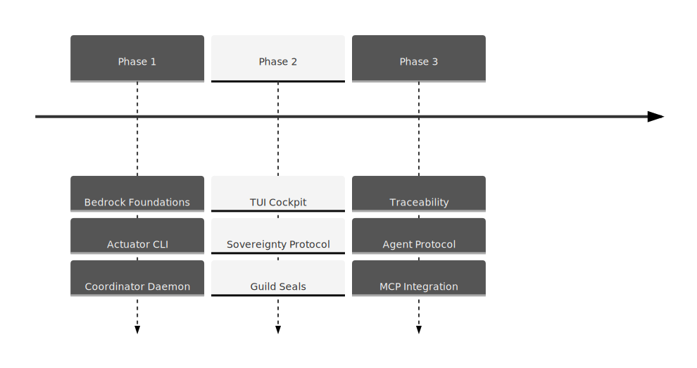

# BEARING

Current direction and active tensions. Historical ship data is in `CHANGELOG.md`.

## Active Gravity

### 1. Traceability & Evidence
- Implementing the "Weaver" phase: task dependency graphs, frontiers, and critical path analysis.
- Modeling stories, requirements, acceptance criteria, and evidence as native graph nodes.
- Auto-detecting test-to-requirement links through the scanning pipeline.

### 2. Agentic Bedrock
- Hardening the agent-native CLI (`briefing`, `next`, `context`, `act`).
- Implementation of the versioned JSONL control plane for speculative worldline management.
- Integration of the MCP (Model Context Protocol) server for native agent participation.

### 3. Governance Maturity
- Refinement of the Sovereignty Audit to verify the complete Genealogy of Intent.
- Formalization of the "Oracle" phase: intent classification and policy engine enforcement.

## Tensions

- **Schema Rigidity**: Adjusting to the evolving Digital Guild vocabulary while maintaining backward compatibility for existing WARP patches.
- **TUI Density**: Balancing information richness in the Bijou cockpit with the "trapdoor" capture doctrine.
- **Speculative Complexity**: Managing the cognitive load of derived worldlines and braiding operations for agents.
- **Environment Parity**: Ensuring bit-identical behavior between the standalone CLI actuator and the JSONL API.

## Next Target

With **Edict Wasm Target Lowering and Optic-Pure Intent Admission** fully landed, the immediate focus is the **CLI Optic Mutation Kernel Migration** (`bad-code/cli-legacy-imperative-mutation-leak.md`)—deprecating legacy imperative `graph.patch` mutations across `src/cli/commands/*.ts` in favor of pure `IntentDescriptor` admission through `OpticDomainActionService` to guarantee complete domain encapsulation.
