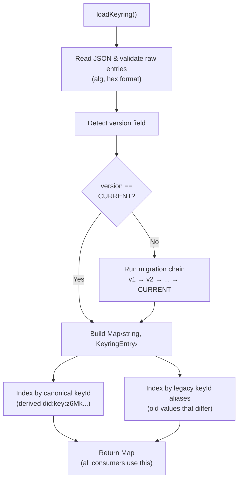

# Guild Seals: Cryptographic Identity and Signing

Guild Seals are XYPH's cryptographic identity and signing system. Every agent
gets an Ed25519 keypair. When an agent completes a quest, the resulting artifact
(a **Scroll**) is signed with the agent's private key, producing a **Guild
Seal** — a verifiable proof of authorship that lives in the WARP graph forever.

This document covers the full system: key generation, identity encoding,
signing, verification, keyring management, and the versioned migration pipeline
that keeps it all backward-compatible.

---

## Table of Contents

- [Overview](#overview)
- [Key Generation](#key-generation)
- [DID Key Identifiers](#did-key-identifiers)
- [Signing](#signing)
- [Verification](#verification)
- [The Keyring](#the-keyring)
  - [Keyring Schema (v2)](#keyring-schema-v2)
  - [Keyring Fields](#keyring-fields)
- [Keyring Versioning and Migration](#keyring-versioning-and-migration)
  - [Migration Pipeline](#migration-pipeline)
  - [v1 → v2 Migration](#v1--v2-migration)
  - [Legacy Alias Resolution](#legacy-alias-resolution)
  - [Adding Future Migrations](#adding-future-migrations)
- [Trust Directory Layout](#trust-directory-layout)
- [Security Considerations](#security-considerations)
- [Code Map](#code-map)
- [FAQ](#faq)

---

## Overview

```
                     ┌──────────────┐
                     │  generate-key │
                     └──────┬───────┘
                            │
            ┌───────────────┼───────────────┐
            ▼               ▼               ▼
   trust/<agent>.sk    keyring.json    did:key:z6Mk...
   (private key)       (public key)    (agent identity)
            │                               │
            │         ┌─────────┐           │
            └────────►│  sign() ├───────────┘
                      └────┬────┘
                           ▼
                      ┌──────────┐
                      │ GuildSeal │──► WARP graph
                      └──────────┘
                           │
                      ┌────┴────┐
                      │ verify()│◄── keyring.json
                      └─────────┘
```

The flow:

1. **Generate** — `generate-key` creates an Ed25519 keypair. The private key
   goes to `trust/<agentId>.sk` (gitignored). The public key is registered in
   `trust/keyring.json`.

2. **Identify** — The agent's identity is a [W3C DID Key][did-key-spec]:
   `did:key:z6Mk...`, derived deterministically from the public key bytes.

3. **Sign** — When sealing a quest, `sign()` reads the private key, derives
   the public key, canonicalizes the payload, hashes it with BLAKE3, and
   produces an Ed25519 signature. The resulting `GuildSeal` includes the
   `did:key` identifier.

4. **Verify** — `verify()` loads the keyring, looks up the seal's `keyId` in
   the Map (which includes legacy aliases), and checks the Ed25519 signature
   against the registered public key.

[did-key-spec]: https://w3c-ccg.github.io/did-method-key/

---

## Key Generation

```bash
export XYPH_AGENT_ID=agent.hal
npx tsx xyph-actuator.ts generate-key
```

This calls `GuildSealService.generateKeypair(agentId)`, which:

1. Generates 32 cryptographically random bytes (via `crypto.randomBytes`).
2. Derives the Ed25519 public key using `@noble/ed25519`.
3. Writes the private key hex to `trust/<agentId>.sk` with mode `0600`
   (owner-only read/write). Uses `O_EXCL` to prevent overwriting an existing
   key.
4. Derives the `did:key:z6Mk...` identifier from the public key.
5. Appends the entry to `trust/keyring.json` with the canonical `keyId`,
   `publicKeyHex`, `alg`, and `agentId` fields.

If the keyring write fails, the private key file is rolled back (deleted) to
prevent orphaned state.

Key generation is a **one-time operation** per agent. The keypair persists
across sessions.

---

## DID Key Identifiers

Agent identities use the [W3C DID Key Method][did-key-spec]:

```
did:key:z6MkhaXgBZDvotDkL5257faiztiGiC2QtKLGpbnnEGta2doK
        ─┬─ ─────────────────────┬──────────────────────────
         │                       │
    multibase prefix        base58btc(0xed01 + publicKeyBytes)
    (z = base58btc)
```

The encoding pipeline:

```
Ed25519 public key (32 bytes)
    │
    ▼
Prepend multicodec prefix: 0xed, 0x01 (Ed25519-pub varint)
    │
    ▼
Encode as base58btc (Bitcoin alphabet: 123456789ABCDEFGH...)
    │
    ▼
Prepend 'z' (multibase identifier for base58btc)
    │
    ▼
Prepend 'did:key:'
    │
    ▼
did:key:z6Mk...
```

**All Ed25519 `did:key` values start with `z6Mk`** because the multicodec
prefix `0xed01` always base58-encodes to `6Mk` as its leading characters. This
is a useful visual indicator that you're looking at an Ed25519 key.

The encoding is deterministic: the same public key always produces the same
`did:key`. Different keys always produce different `did:key` values.

### Implementation

- `encodeBase58btc(bytes)` — pure base58btc encoder (`src/validation/crypto.ts`)
- `publicKeyToDidKey(publicKeyHex)` — full pipeline from hex pubkey to `did:key:z6Mk...`

---

## Signing

When an agent seals a quest (via `seal` or `merge`), `GuildSealService.sign()`
produces a `GuildSeal`:

```typescript
interface GuildSeal {
  alg: 'ed25519';          // Algorithm identifier
  keyId: string;            // did:key:z6Mk... of the signer
  payloadDigest: string;    // blake3:<hex> of the canonical payload
  sig: string;              // 128 hex chars (64-byte Ed25519 signature)
  sealedAt: number;         // Unix timestamp
}
```

### Signing Process

1. **Canonicalize** — The scroll payload (`artifactHash`, `questId`,
   `rationale`, `sealedBy`, `sealedAt`) is serialized into deterministic
   canonical JSON: keys sorted lexicographically, no whitespace, arrays
   preserved in order.

2. **Digest** — The canonical string is hashed with BLAKE3 and prefixed:
   `blake3:<hex>`.

3. **Sign** — The canonical string (not the digest) is signed with Ed25519
   using the agent's private key.

4. **Derive keyId** — The public key is derived from the private key at sign
   time, ensuring the seal's `keyId` always corresponds to the actual signing
   key. This prevents mismatches if the keyring has stale entries.

### Why sign the canonical string, not the digest?

The digest is included in the seal for quick integrity checks (compare hashes
without re-canonicalizing). But the signature covers the full canonical payload
so that verification doesn't depend on trusting the digest field — it can be
independently recomputed.

---

## Verification

`GuildSealService.verify(seal, scroll)` checks:

1. **Digest match** — Re-canonicalize the scroll payload, re-hash with BLAKE3,
   and compare to `seal.payloadDigest`. If they differ, the payload was
   tampered with.

2. **Key lookup** — Load the keyring and look up `seal.keyId`. Thanks to
   [legacy alias resolution](#legacy-alias-resolution), this works for both
   old-format and new-format keyIds.

3. **Signature check** — Verify the Ed25519 signature against the canonical
   payload using the looked-up public key.

All three checks must pass. If the keyring is missing or malformed, verification
fails gracefully (returns `false`, does not throw).

### Patch Validation

The same keyring lookup is used by `validatePatchOps` (invariant #12) to verify
signatures on PlanPatch documents. The `keyringCache` in `validatePatchOps.ts`
stores the `Map` returned by `loadKeyring()`, so alias resolution works
transparently for patch validation too.

---

## The Keyring

The keyring is a JSON file at `trust/keyring.json` that maps key identifiers to
Ed25519 public keys. It is the single source of trust for signature
verification.

### Keyring Schema (v2)

```json
{
  "version": "v2",
  "keys": [
    {
      "keyId": "did:key:z6MkhaXgBZDvotDkL5257faiztiGiC2QtKLGpbnnEGta2doK",
      "alg": "ed25519",
      "publicKeyHex": "03dee5df0ac6c7e82d002ae6c8e525017647ff12f7a11c897c32c7732d9bb992",
      "agentId": "agent.hal"
    }
  ]
}
```

### Keyring Fields

| Field | Required | Description |
|-------|----------|-------------|
| `version` | Yes | Schema version string (`"v1"`, `"v2"`, ...) |
| `keys` | Yes | Array of key entries |
| `keys[].keyId` | Yes | Canonical `did:key:z6Mk...` identifier (v2: derived from public key) |
| `keys[].alg` | Yes | Algorithm identifier. Currently only `"ed25519"` is supported |
| `keys[].publicKeyHex` | Yes | 32-byte Ed25519 public key as 64 lowercase hex chars |
| `keys[].agentId` | No | The agent identity this key belongs to (e.g., `"agent.hal"`) |
| `keys[].legacyKeyIds` | No | Previous `keyId` values that should alias to this entry (migration artifact) |

---

## Keyring Versioning and Migration

The keyring format is versioned. `loadKeyring()` transparently migrates older
formats on read — the on-disk file is never mutated during reads, only during
explicit writes (`generateKeypair()`).

### Migration Pipeline



The migration pipeline is defined in `src/validation/crypto.ts`:

```typescript
const KEYRING_MIGRATIONS: readonly KeyringMigration[] = [
  { from: "v1", to: "v2", migrate: migrateV1ToV2 },
  // Future: { from: "v2", to: "v3", migrate: migrateV2ToV3 },
];
```

Migrations run sequentially. If the version doesn't match any migration's
`from` field and hasn't reached `CURRENT_KEYRING_VERSION`, `loadKeyring()`
throws an error (fail-closed).

### v1 → v2 Migration

Version 1 keyrings used placeholder `keyId` values that were not derived from
the public key:

```json
{
  "version": "v1",
  "keys": [
    {
      "keyId": "did:key:agent.james",
      "alg": "ed25519",
      "publicKeyHex": "03dee5..."
    }
  ]
}
```

The `migrateV1ToV2` function:

1. **Derives the canonical `keyId`** from `publicKeyHex` using
   `publicKeyToDidKey()`.
2. **Recovers `agentId`** — If the entry has an explicit `agentId` field, that
   wins. Otherwise, if the old `keyId` matches the pattern
   `did:key:<something>` where `<something>` doesn't start with `z6Mk`, the
   suffix is extracted as the `agentId`.
3. **Tracks legacy aliases** — If the old `keyId` differs from the derived one,
   it's stored in `legacyKeyIds` for alias resolution.

After migration, the v1 entry above becomes:

```json
{
  "keyId": "did:key:z6MkhaXgBZDvotDkL5257faiztiGiC2QtKLGpbnnEGta2doK",
  "alg": "ed25519",
  "publicKeyHex": "03dee5...",
  "agentId": "agent.james",
  "legacyKeyIds": ["did:key:agent.james"]
}
```

### Legacy Alias Resolution

The in-memory Map returned by `loadKeyring()` is indexed by **both** the
canonical `keyId` and any `legacyKeyIds`:

```
Map {
  "did:key:z6Mk..."        → entry,   // canonical (derived)
  "did:key:agent.james"    → entry,   // legacy alias → same object
}
```

This is critical because **old patches in the WARP graph have legacy keyIds
baked into their signatures permanently**. Those signatures can never be
rewritten. The alias Map ensures that both old patches (signed with placeholder
keyIds) and new seals (signed with derived keyIds) resolve to the same public
key entry.

Every consumer of `loadKeyring()` — `verify()`, `keyIdForAgent()`,
`validatePatchOps` — gets this backward compatibility for free.

### Adding Future Migrations

To add a new keyring version (e.g., adding key expiration in v3):

1. Define the migration function:

   ```typescript
   function migrateV2ToV3(json: KeyringJson): KeyringJson {
     const keys = json.keys.map((k) => ({
       ...k,
       validUntil: k["validUntil"] ?? null, // new field with default
     }));
     return { version: "v3", keys };
   }
   ```

2. Append to the migration registry:

   ```typescript
   const KEYRING_MIGRATIONS: readonly KeyringMigration[] = [
     { from: "v1", to: "v2", migrate: migrateV1ToV2 },
     { from: "v2", to: "v3", migrate: migrateV2ToV3 },
   ];
   ```

3. Update the constant:

   ```typescript
   export const CURRENT_KEYRING_VERSION = "v3";
   ```

The pipeline runs `v1 → v2 → v3` automatically. Old v1 keyrings still work.

---

## Trust Directory Layout

```
trust/
├── keyring.json        # Public key registry (committed to Git)
├── agent.hal.sk        # Hal's Ed25519 private key (gitignored)
├── agent.james.sk      # James's Ed25519 private key (gitignored)
└── ...
```

- **`keyring.json`** is committed. It contains only public keys and is safe to
  share.
- **`*.sk` files** are gitignored. They contain 64-character hex-encoded
  Ed25519 private keys. File permissions are set to `0600` (owner-only).

---

## Security Considerations

| Concern | Mitigation |
|---------|------------|
| **Private key storage** | Stored as hex in `trust/<agent>.sk` with `0600` permissions. Gitignored. For production, consider hardware tokens or OS keychains via `@git-stunts/vault`. |
| **Key material in memory** | Node.js strings are immutable and cannot be zeroed after use. Private key hex stays in memory until garbage collected. Acknowledged limitation (L-19). |
| **Algorithm agility** | Only `ed25519` is supported. The `alg` field exists for future algorithm upgrades. `loadKeyring()` rejects entries with unsupported algorithms. |
| **Canonical JSON stability** | The `canonicalize()` function produces deterministic output: sorted keys, no whitespace, preserved array order. Any change would break existing signatures. |
| **Keyring tampering** | If someone modifies `keyring.json` to swap a public key, they can forge seals for that agent. The keyring should be reviewed in code review like any other trust artifact. |
| **Legacy alias collisions** | If two entries have overlapping legacy keyIds, first-write-wins in the Map. This is unlikely in practice and logged via `legacyKeyIds`. |

---

## Code Map

| File | Role |
|------|------|
| `src/validation/crypto.ts` | Core crypto primitives: base58btc, did:key encoding, canonicalization, BLAKE3, Ed25519 verify, keyring loading + migration pipeline |
| `src/domain/services/GuildSealService.ts` | High-level service: `generateKeypair()`, `sign()`, `verify()`, `keyIdForAgent()` |
| `src/validation/signPatchFixture.ts` | Test utility: sign PlanPatch documents with a given private key |
| `src/validation/validatePatchOps.ts` | Patch validation: invariant #12 uses keyring for signature verification |
| `test/unit/multibase.test.ts` | Tests: base58btc encoding, did:key derivation, migration pipeline, legacy round-trip |
| `test/unit/GuildSealService.test.ts` | Tests: keypair generation, sign/verify, tamper detection |

---

## FAQ

**Q: What happens if I lose my private key?**
A: Generate a new keypair with `generate-key`. The old key entry stays in the
keyring (old seals remain verifiable), and the new entry is added alongside it.

**Q: Can two agents share a keypair?**
A: Technically yes, but it defeats the purpose. Each agent should have its own
keypair so that seals are attributable to a specific agent.

**Q: Do I need to manually migrate my keyring?**
A: No. `loadKeyring()` migrates transparently on read. Your `keyring.json` file
is left as-is on disk. New keypairs generated with `generate-key` are written in
the current schema version.

**Q: What if I edit keyring.json by hand and set the wrong version?**
A: If the version doesn't match any known migration path, `loadKeyring()` will
throw an error. Fix the version field to match the actual schema.

**Q: Why base58btc and not base64?**
A: The [DID Key specification][did-key-spec] requires multibase encoding.
Base58btc (Bitcoin alphabet) is the canonical encoding for `did:key`, identified
by the `z` prefix. It avoids ambiguous characters (`0/O`, `l/I`) which makes
identifiers safer to copy/paste.
