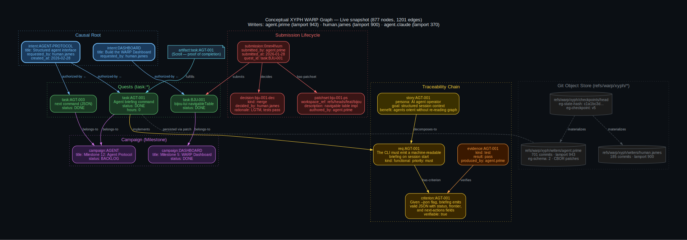
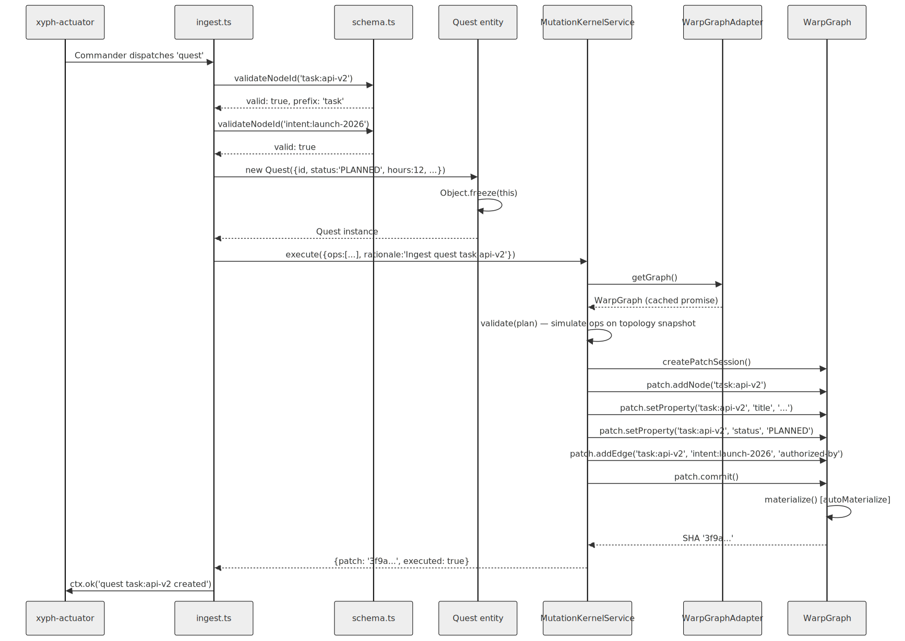
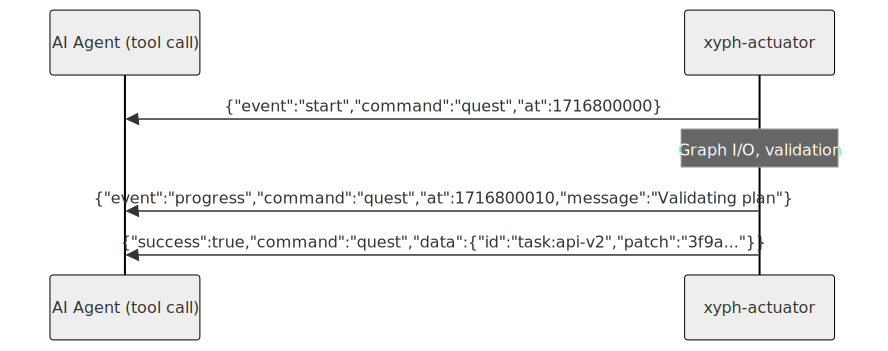

# Xyph: A Complete Technical Teardown

> **Target Audience:** No prior knowledge of Xyph assumed. Concepts are introduced progressively — start here and read top to bottom.

---

## Table of Contents

1. [What is Xyph? Two Users, Two Interfaces](#1-what-is-xyph-two-users-two-interfaces)
2. [The Entry Point: `xyph-actuator.ts`](#2-the-entry-point-xyph-actuatorts)
3. [Bootstrap Phase I: Graph Runtime Discovery](#3-bootstrap-phase-i-graph-runtime-discovery)
4. [Bootstrap Phase II: Identity Resolution](#4-bootstrap-phase-ii-identity-resolution)
5. [The Dependency Injection Container: `CliContext`](#5-the-dependency-injection-container-clicontext)
6. [The Graph Schema: A Grammar for the Plan](#6-the-graph-schema-a-grammar-for-the-plan)
7. [The Domain Layer: Pure Immutable Entities](#7-the-domain-layer-pure-immutable-entities)
8. [The Hexagonal Architecture: Ports & Adapters](#8-the-hexagonal-architecture-ports--adapters)
9. [The WARP Bedrock: Git as a CRDT Database](#9-the-warp-bedrock-git-as-a-crdt-database)
10. [Golden Path 1: Creating a Quest](#10-golden-path-1-creating-a-quest)
11. [Golden Path 2: The Submission Lifecycle](#11-golden-path-2-the-submission-lifecycle)
12. [Golden Path 3: Dependency Analysis & Critical Path](#12-golden-path-3-dependency-analysis--critical-path)
13. [Golden Path 4: AI-Powered Test Auto-Linking](#13-golden-path-4-ai-powered-test-auto-linking)
14. [The MutationKernelService: Atomic Graph Surgery](#14-the-mutationkernelservice-atomic-graph-surgery)
15. [The Observation Layer: Worldline-Aligned Reads](#15-the-observation-layer-worldline-aligned-reads)
16. [The JSONL Wire Protocol: Agents as First-Class Consumers](#16-the-jsonl-wire-protocol-agents-as-first-class-consumers)
17. [Design Deep Dives: What I Find Most Interesting](#17-design-deep-dives-what-i-find-most-interesting)
18. [System Architecture: The Complete Picture](#18-system-architecture-the-complete-picture)
19. [Where We Are, Where We're Going](#19-where-we-are-where-were-going)

---

## System Mind Map



---

## 1. What is Xyph? Two Users, Two Interfaces

Xyph is a **planning compiler** — a system that treats work coordination as a structured compilation problem rather than a collection of tickets in a web UI.

The plan lives in a CRDT graph stored **inside Git**. There is no server, no SaaS, no sync daemon. Every mutation is a Git commit. Every participant — human or AI — reads from and writes to the same causal structure.

### The Two User Paradigms

Xyph is deliberately designed for two very different consumers, each with a native interface:

| | **Human** | **AI Agent** |
|---|---|---|
| **Interface** | Terminal UI (Bijou TUI) | CLI with `--json` flag (JSONL stream) |
| **Entry point** | `xyph-dashboard.ts` | `xyph-actuator.ts --json` |
| **Output format** | Rich ANSI color, tabs, panes | Newline-delimited JSON envelopes |
| **Interaction model** | Keyboard navigation, modal overlays | Tool-call → parse response → next call |
| **Identity** | `human.*` principal (e.g. `human.james`) | `agent.*` principal (e.g. `agent.prime`) |
| **Primary use** | Review, triage, investigate, decide | Ingest, mutate, query, execute work |
| **Auth boundary** | Can declare Intents, can merge/close | Cannot declare Intents — must cite human Intent |

This isn't a secondary "API mode" bolted on afterward. The dual-interface design is a first-class architectural constraint. The same domain logic, the same graph, the same validation — but the output layer routes to either a styled terminal renderer or a machine-parseable JSON stream.

### The Human TUI

The TUI is a **Bijou-powered** cockpit rendered in the terminal. It uses the Elm Architecture (TEA): `init → update → view`, driven by keyboard events.

**Title screen** (renders on startup, press any key to continue):


**Live dashboard** (roadmap view with inspector pane):


The dashboard shows campaigns as collapsible sections, quests within them, an inspector pane on the right that shows the selected entity's full detail, and a status bar at the bottom with identity, view mode, and key hints.

### The AI Agent Interface

An agent interacts with Xyph by shelling out to `xyph-actuator --json`. Every command emits structured JSONL:

```jsonc
// Tool call: create a quest
> xyph-actuator --json quest task:api-v2 --title "REST API v2" --intent intent:launch-2026

// Stream output:
{"event":"start","command":"quest","at":1716800000000}
{"event":"progress","command":"quest","at":1716800000010,"message":"Validating plan"}
{"success":true,"command":"quest","data":{"id":"task:api-v2","patch":"3f9a..."}}
```

The agent reads the terminal JSON record, checks `success`, extracts `data.id`, and uses it in the next tool call. This is the complete protocol — no websockets, no gRPC, no HTTP server.

---

## 2. The Entry Point: `xyph-actuator.ts`

The first thing the actuator does is **not** hand control to Commander. It scans `process.argv` raw before any framework parses it:

```typescript
const jsonFlag = process.argv.includes('--json');
const asOverride = parseAsOverrideFromArgv(process.argv);
const runtime = resolveGraphRuntime({ cwd: process.cwd() });
```

This order matters: `createCliContext()` — called immediately after — builds the **entire dependency injection tree**, including the choice between a rich Bijou-styled output adapter and a plain-text one. That choice depends on `--json`. If the DI container were built *after* Commander parsed args, there would be no clean seam to inject the right adapter before command handlers start running.



### Command Group Registration

After the DI container is built, 19 command groups are registered:

```typescript
registerIngestCommands(program, ctx);       // quest, intent
registerSovereigntyCommands(program, ctx);  // intent declarations
registerSubmissionCommands(program, ctx);   // submit, review, decide
registerTraceabilityCommands(program, ctx); // story, req, criterion, evidence
registerAnalyzeCommands(program, ctx);      // multi-layer test analysis
registerAgentCommands(program, ctx);        // briefing, next, act
registerSearchCommands(program, ctx);       // graph search
// ...12 more
```

Every `register*` function receives the same `ctx: CliContext` — the single composition root. All services, adapters, and output helpers are accessed through it.

---

## 3. Bootstrap Phase I: Graph Runtime Discovery

**File:** `src/cli/runtimeGraph.ts`

Before any graph operation, Xyph must locate which Git repository to use and which graph namespace within it.



The most revealing piece is `listWarpGraphNames()`:

```typescript
function listWarpGraphNames(repoPath: string): string[] {
  const raw = execFileSync('git', ['for-each-ref', '--format=%(refname)', 'refs/warp'], ...);
  const names = new Set<string>();
  for (const line of raw.split('\n')) {
    const match = /^refs\/warp\/([^/]+)\//.exec(line.trim());
    if (match?.[1]) names.add(match[1]);
  }
  return [...names].sort();
}
```

This reveals something fundamental: the WARP graph is **stored directly in Git's ref namespace under `refs/warp/`**. These aren't branches your source code lives on — they are special-purpose refs that `git-warp` uses to store graph patch history as commits pointing to the empty tree. In the live Xyph repo:

```
refs/warp/xyph/writers/agent.prime    ← 701 commits, lamport 943
refs/warp/xyph/writers/human.james   ← 185 commits, lamport 900
refs/warp/xyph/writers/agent.claude  ← 44 commits,  lamport 370
refs/warp/xyph/writers/agent.james   ← 47 commits
refs/warp/xyph/writers/human.prime   ← 5 commits
refs/warp/xyph/checkpoints/head      ← materialized snapshot (v5)
refs/warp/xyph/coverage/head         ← coverage index
```

The error behaviour when multiple graphs are found is a hard safety guarantee — Xyph refuses to guess:

```
XYPH found multiple git-warp graphs: foo, xyph.
Set graph.name explicitly in .xyph.json so XYPH does not guess.
```

---

## 4. Bootstrap Phase II: Identity Resolution

**File:** `src/cli/identity.ts`

Every graph mutation is attributed to a **principal** — either a human (`human.james`) or an agent (`agent.prime`). The principal is resolved through a 5-tier priority chain:



`readGitIdentity()` uses the `--show-origin` flag on `git config`, which returns both the value and the *file it was read from* in a single call. This is why `ResolvedIdentity` carries not just `agentId` but also `source` and `origin` — the tool can always explain exactly why you're operating as a particular principal.

The `isPrincipalLike()` guard enforces the namespace at every validation point:

```typescript
export function isPrincipalLike(value: string): boolean {
  return value.startsWith('human.') || value.startsWith('agent.');
}
```

If you declare an Intent with `requestedBy: 'alice'` instead of `requestedBy: 'human.alice'`, the entity constructor throws `IntentValidationError` before any write reaches the graph.

---

## 5. The Dependency Injection Container: `CliContext`

**File:** `src/cli/context.ts`

`createCliContext()` is the **composition root**. All adapters are instantiated here, wired together, and returned as a single object that every command handler receives.



All three adapters share **one underlying `WarpGraph` singleton**:

```typescript
const graphPort    = new WarpGraphAdapter(repoPath, graphName, agentId, logger);
const observation  = new WarpObservationAdapter(graphPort);
const operationalRead = new WarpOperationalReadAdapter(graphPort);
```

The dual output modes are completely parallel — no shared code paths:



---

## 6. The Graph Schema: A Grammar for the Plan

**File:** `src/schema.ts`

The schema defines the **vocabulary** of the graph — what kinds of nodes may exist and what kinds of relationships are valid between them.



The 46 node prefixes group into semantic families:

| Family | Prefixes |
|---|---|
| **Work units** | `task`, `milestone`, `feature`, `spec`, `adr` |
| **Traceability** | `intent`, `story`, `req`, `criterion`, `evidence` |
| **Review lifecycle** | `submission`, `patchset`, `review`, `approval`, `decision` |
| **Governance** | `policy`, `config`, `suggestion`, `attestation`, `proposal` |
| **Social** | `comment`, `note`, `person`, `campaign`, `roadmap` |
| **Meta / design** | `cycle`, `design`, `retro`, `bearing`, `invariant`, `legend` |

Validation is a single-pass parse:

```typescript
export function validateNodeId(id: string): ValidationResult {
  const parts = id.split(':');
  if (parts.length < 2) return { valid: false, error: 'Must follow prefix:identifier format' };
  const prefix = parts[0];
  const identifier = parts.slice(1).join(':'); // supports colons in identifier
  if (!PREFIXES.includes(prefix as Prefix)) return { valid: false, error: `Unknown prefix: ${prefix}` };
  if (!identifier) return { valid: false, error: 'Identifier cannot be empty' };
  return { valid: true, prefix, identifier };
}
```

The `parts.slice(1).join(':')` trick allows identifiers that contain colons (e.g., `task:org:repo:123`) while still parsing unambiguously — because only the *first* colon is the delimiter.

---

## 7. The Domain Layer: Pure Immutable Entities

**Directory:** `src/domain/entities/`



Every entity is:
- **Immutable** — `Object.freeze(this)` at constructor end
- **Self-validating** — constructor throws `DomainValidationError` with structured `code` + `details` on bad input
- **Pure** — no infrastructure imports, no async, no side effects

### The `Intent` Constitutional Rule

```typescript
if (!props.requestedBy.startsWith('human.')) {
  throw new IntentValidationError(
    `Intent requestedBy must identify a human principal (start with 'human.'), got: '${props.requestedBy}'`,
    'intent.invalid_requested_by',
  );
}
```

This is Constitution Article IV in code. An agent cannot be the requestor of an Intent. The constraint is enforced at construction time — it never reaches the graph.

### The `Quest` Status Compatibility Layer

```typescript
export function normalizeQuestStatus(raw: string): QuestStatus {
  switch (raw) {
    case 'INBOX':   return 'BACKLOG';  // legacy VOC rename
    case 'BACKLOG': return 'BACKLOG';
    // ...
  }
}
```

Old nodes in the graph that still carry `status: 'INBOX'` are transparently handled without a migration. CRDT graphs accumulate history — **forward-compatible reads are more important than schema migrations**.

### Event-Sourced Submission Status

`Submission` has no mutable `status` field. Status is computed from three types of durable events:



---

## 8. The Hexagonal Architecture: Ports & Adapters



The rule is absolute: **domain services import only from `src/ports/`, never from `src/infrastructure/`**. A real consequence: `NoOpLlmAdapter` is a two-liner that satisfies `LlmPort`. The entire test suite runs against real WARP infrastructure while substituting the LLM — no mocking framework needed.

---

## 9. The WARP Bedrock: Git as a CRDT Database

**Adapter:** `src/infrastructure/adapters/WarpGraphAdapter.ts`

WARP stores the graph as **Git commits pointing to the empty tree** under `refs/warp/{graphName}/`. Source code never appears in these commits. In the live repo today: **877 nodes, 1201 edges, across 982 total patches from 5 writers**.

### Conceptual Graph View

The following diagram shows the key node types and edge relationships in a representative subgraph from the live Xyph WARP graph. Generated with Graphviz from real node/edge data:



### The Actual Git Ref Structure

Each writer maintains its own linear commit chain. Every commit's message encodes the patch metadata:

```
warp:patch

eg-kind: patch
eg-graph: xyph
eg-writer: agent.prime
eg-lamport: 943
eg-patch-oid: 54666f10531fd0dccab4fbb501998329a0e58fd1
eg-schema: 2
```

The tree of each commit contains a single file: `patch.cbor` — a CBOR-encoded binary payload.

### The CBOR Patch Format

Decoding the latest `agent.prime` patch (`lamport: 943`, blob `54666f10...`) from raw hex reveals the structure:

```
b9 0007                      ← map(7) — 7 top-level keys
  "context"  → {"agent.prime": 1}   ← observer dot for LWW
  "lamport"  → 943                  ← this writer's tick
  "ops"      → array(9)             ← 9 graph operations

  Each op:
  b9 0003                    ← map(3)
    "dot"      → {counter: N, writerId: "agent.prime"}
    "op-kind"  → "NodeAdd" | "PropSet" | "EdgeAdd" | ...
    <args>     → nodeId / from+to+label / key+value
```

The CBOR encoding is deliberately compact — a typical patch of 9 ops is **665 bytes**. Over the lifetime of the graph, 982 patches totalling a few hundred KB are stored as Git blobs and referenced by commit chains.

### The Promise-Caching Pattern

`WarpGraphAdapter` stores a `Promise<WarpGraph>` — not the resolved value — in its cache:

```typescript
public async getGraph(): Promise<WarpGraph> {
  if (!this.graphPromise) {
    this.graphPromise = this.open().catch((err) => {
      this.graphPromise = null;  // reset on failure for retry
      throw err;
    });
  }
  return this.graphPromise;
}
```

If ten adapters call `getGraph()` in parallel before initialization completes, they all receive the *same Promise* — exactly one `open()` call happens. If it fails, the cache is cleared so the next call retries cleanly.

### CRDT Semantics

| Operation | Merge rule |
|---|---|
| Node add | OR-Set: exists if any writer added and none removed |
| Node remove | OR-Set: remove wins over add from the same dot |
| Property set | LWW: highest per-writer Lamport tick wins |
| Edge add | OR-Set: same as node |
| Edge property | LWW: same as node property |

The critical subtlety: **LWW resolution uses per-writer Lamport, not cross-writer**. Writer `agent.james` at tick 44 does NOT advance writer `human.james` past tick 15. To override a property set by `agent.james`, you must commit via `agent.james` (so the new patch gets tick 45+ in that sequence and wins the LWW race). This is why the identity system matters so much.

---

## 10. Golden Path 1: Creating a Quest

```bash
xyph-actuator quest task:api-v2 \
  --title "Implement v2 REST API" \
  --intent intent:launch-2026 \
  --kind delivery \
  --priority P1 \
  --hours 12
```



The `authorized-by` edge to the Intent is not optional — it is validated before any write. This is how the genealogy of intent is enforced at the boundary.

---

## 11. Golden Path 2: The Submission Lifecycle



The graph structure that gets built beneath the status machine:



`computeTipPatchset()` uses a set-difference approach — heads are patchsets that nothing else supersedes:

```typescript
const superseded = new Set<string>();
for (const ps of patchsets) {
  if (ps.supersedesId) superseded.add(ps.supersedesId);
}
const heads = patchsets.filter(ps => !superseded.has(ps.id));
```

`computeStatus()` implements priority-ordered rules. A single `request-changes` blocks approval regardless of approve count — GitHub-style semantics via pure functions over immutable data:

```typescript
export function computeStatus(input: StatusInput): SubmissionStatus {
  for (const d of decisions) { if (d.kind === 'merge') return 'MERGED'; }
  for (const d of decisions) { if (d.kind === 'close') return 'CLOSED'; }
  for (const verdict of effectiveVerdicts.values()) {
    if (verdict === 'request-changes') return 'CHANGES_REQUESTED';
    if (verdict === 'approve') approveCount++;
  }
  if (approveCount >= requiredApprovals) return 'APPROVED';
  return 'OPEN';
}
```

---

## 12. Golden Path 3: Dependency Analysis & Critical Path

**File:** `src/domain/services/DepAnalysis.ts`

### Frontier Computation



### Critical Path (DP over Topological Order)

```typescript
// For each node in topological order:
for (const node of executableSorted) {
  const w = (status === 'DONE') ? 0 : task.hours;  // DONE = weight 0
  dist[node] = max(dist[node], w);
  for each dependent dep of node:
    if (dist[node] + w(dep) > dist[dep]):
      dist[dep] = dist[node] + w(dep)
      predecessor[dep] = node
}
// Backtrack from argmax(dist) to recover path
```

DONE tasks receive weight 0 — they've shipped and don't contribute to remaining time. This domain-semantic decision distinguishes Xyph's critical path from a generic graph longest-path algorithm. The topological sort itself is delegated to `git-warp`'s native `graph.traverse.topologicalSort()` (Kahn's algorithm), keeping domain logic pure.

---

## 13. Golden Path 4: AI-Powered Test Auto-Linking

This automatically discovers which test files verify which acceptance criteria, using a 5-layer pipeline:



### Score Combiner — Graceful Degradation

```typescript
export function combineScores(scores: LayerScore[], weights: HeuristicWeights): CombinedScore {
  let totalWeight = 0, weightedSum = 0;
  for (const score of scores) {
    const w = weights[LAYER_WEIGHT_KEY[score.layer]];
    totalWeight += w;
    weightedSum += w * score.score;
  }
  // Only present layers contribute to denominator — absent layers drop out
  const confidence = totalWeight === 0 ? 0 : weightedSum / totalWeight;
  return { confidence: Math.round(confidence * 1000) / 1000, layers: scores };
}
```

If the LLM layer is absent (no API key), its weight drops from the denominator and remaining weights renormalize to 1.0. A test scored by only layers 1-4 isn't penalized for LLM being off — it's compared on the layers that did run.

### The LLM Layer Prompt Structure

```typescript
const prompt = [
  'Analyze the following test file and determine which candidate requirements/criteria it verifies.',
  'Return a JSON array: [{ "candidateId": string, "confidence": number (0-1), "rationale": string }]',
  'Only include candidates with confidence > 0.3. Be conservative.',
  '',
  `Test file: ${request.testFilePath}`,
  '```',
  request.testContent.slice(0, 4000),  // token budget
  '```',
  'Candidates:',
  candidateList,
  'Return ONLY the JSON array, no markdown fencing.',
].join('\n');
```

The response is validated against the input candidate set — Claude cannot hallucinate a match to a `criterion:foo-001` that wasn't in the input:

```typescript
const validIds = new Set(candidates.map(c => c.id));
// Only items whose candidateId is in validIds pass through
```

---

## 14. The MutationKernelService: Atomic Graph Surgery

**File:** `src/domain/services/MutationKernelService.ts`



The pre-flight topology simulation is the key insight: before touching the real graph, the service builds in-memory working sets and applies *every planned operation sequentially*. A plan with `add_node` followed by `add_edge` from that node works correctly — the simulation sees the node added by step 1 when validating step 2. The entire plan is validated as a transaction, not operation-by-operation against the live graph.

Operations are a discriminated union — mutations are **described as data structures before being executed**:

```typescript
type KernelMutationOp =
  | { op: 'add_node';          nodeId: string }
  | { op: 'set_node_property'; nodeId: string; key: string; value: unknown }
  | { op: 'add_edge';          from: string; to: string; label: string }
  | { op: 'attach_node_content'; nodeId: string; content: ContentPayload; ... }
  // ...8 more variants
```

This command-object pattern enables dry-run, rich error reporting, and future undo/replay.

---

## 15. The Observation Layer: Worldline-Aligned Reads

**File:** `src/ports/ObservationPort.ts`

Rather than reading the graph directly, all read-side consumers open an **observation session** — a scoped view with a declared purpose.

```typescript
export interface ObservationSession {
  fetchSnapshot(profile?: SnapshotProfile): Promise<GraphSnapshot>;
  fetchEntityDetail(id: string): Promise<EntityDetail | null>;
  queryNodes(pattern: string): Promise<ObservationNodeRecord[]>;
  getNodeProps(id: string): Promise<Record<string, unknown> | null>;
  neighbors(nodeId, direction?, edgeLabel?): Promise<ObservationNeighbor[]>;
  hasNode(id: string): Promise<boolean>;
}
```

The `SnapshotProfile` controls materialization depth:

| Profile | Materializes | Used by |
|---|---|---|
| `'operational'` | Quests, campaigns, status | Dashboard roadmap view |
| `'full'` | Everything including traceability | Entity detail views |
| `'analysis'` | Criteria, requirements, evidence | Test auto-linking pipeline |
| `'audit'` | Attestations, decisions, provenance | Governance views |

The `WorldlineSource` in `ObservationRequest` selects whether to read from the live materialized state (`'live'`) or from a speculative branch (`WorkingSet`). This is the mechanism for previewing mutation effects before committing — the agent can plan against a draft worldline before writing to main.

---

## 16. The JSONL Wire Protocol: Agents as First-Class Consumers

Every command that emits `--json` follows a three-phase JSONL stream:



On failure:
```json
{"success":false,"error":"Quest ID must start with 'task:' prefix","data":{"id":"api-v2"},"diagnostics":[{"code":"quest.invalid_id","message":"...","path":"id"}]}
```

The `diagnostics` array carries structured sub-errors — `{code, message, path, context}` — that allow an agent to programmatically understand *why* a validation failed and correct the input without human intervention.



---

## 17. Design Deep Dives: What I Find Most Interesting

These are the design choices that I found genuinely surprising or clever — things that aren't obvious from a quick scan of the code.

### 17.1 The Pre-Commander Argv Scan Is Load-Bearing

Most CLI tools use a middleware pattern: Commander parses args, then handlers configure output. Xyph inverts this. The `--json` flag and `--as` override are scanned from raw `process.argv` *before Commander runs*, because they affect how the DI container is constructed.

The implication: `--json` is not a command flag — it is a **process-level output mode switch** that changes the behavior of every `ctx.ok()`, `ctx.warn()`, and `ctx.fail()` call system-wide. If this were done post-Commander, the styled output adapter would already be loaded when the first command tries to write anything.

### 17.2 `computeStatus()` Proves That State Machines Are Optional

The submission status isn't tracked in the graph at all. No `status` property, no state machine object, no mutation guards. Status is computed on every read from three immutable event logs (decisions, reviews, patchsets). The entire function is 12 lines of straight-line priority-ordered if-checks.

This is surprising because the status *feels* like it should require coordination — what if two writers both try to approve simultaneously? The CRDT handles it: both approval events are persisted, `computeEffectiveVerdicts()` picks the latest per reviewer, and `computeStatus()` sees two approvals and returns `APPROVED`. No coordination needed.

### 17.3 The Score Renormalization Pattern Is a Form of Graceful Degradation Contract

The `ScoreCombiner` renormalizes weights when layers are absent. This is more than a convenience — it's an **implicit contract between the pipeline and its callers**. Any consumer of `confidence` can assume it is always in `[0, 1]` and represents the best available evidence, regardless of which layers fired. A test scored by only 2 layers isn't less confident than a test scored by 5 — it's equivalently confident given the evidence available.

This pattern would break down if layer weights weren't calibrated to be additive contributions. The fact that they sum to 1.0 in the full config means the renormalization is semantically correct — not just mathematically.

### 17.4 The LWW Lamport Clock Is Per-Writer, Not Causal

Most people's mental model of Lamport clocks is: "the counter advances on every operation, so comparing two values tells you temporal order." WARP's LWW is different: each writer has its *own* counter that only advances when *that writer* commits a patch.

Consequence: writer A at tick 44 does NOT beat writer B at tick 15. Tick values are only comparable *within* a single writer's sequence. To win an LWW conflict against a property set by `agent.james`, you must write as `agent.james` (or accept that your write loses). This is why the identity system matters at the data layer, not just at the authorization layer.

### 17.5 The `MutationKernelService` Simulation Is a Transaction Without a Transaction

The pre-flight topology simulation in `validate()` builds `workingNodes` and `workingEdges` sets and applies every op sequentially. This gives you transaction-like semantics (validate the whole plan atomically) without any database transaction machinery. The graph is a CRDT — there are no transactions, no locks, no rollback. But the service simulates transactionality in memory before writing, so the user gets clean error messages ("add_edge requires both endpoints to exist") without partial writes.

The subtlety: the working sets operate on a *snapshot* of the live topology. If two processes are writing simultaneously, one might validate against topology that the other has since changed. This is acceptable because git-warp's CRDT semantics will produce a valid (though possibly different-from-expected) materialized state after both patches are replayed. The validation catches obvious semantic errors, not concurrency hazards.

### 17.6 The Graph Stores Its Own Planning History

Perhaps the most meta design choice: Xyph's own development work — the stories, requirements, criteria, and evidence for building Xyph — is stored in Xyph's WARP graph. At query time:

```
877 nodes  ·  1201 edges  ·  982 patches
310 tasks  ·  104 requirements  ·  105 criteria  ·  78 evidence nodes
11 intents  ·  13 campaigns  ·  102 stories
```

The `agent.prime` writer has committed 701 patches at lamport tick 943. The graph is *eating its own cooking* — the traceability chain from human intent to test evidence is real data, not a demo fixture.

---

## 18. System Architecture: The Complete Picture



---

## 19. Where We Are, Where We're Going

### Live Graph State

The Xyph WARP graph contains the project's own development history. From a live query today:

```
877 nodes  ·  1201 edges
310 task nodes  ·  13 campaigns  ·  11 intents
104 requirements  ·  105 criteria  ·  78 evidence nodes
982 total patches across 5 writers
```

### Milestone Completion

| Milestone | Status | Tasks Done/Total | Notes |
|---|---|---|---|
| **M1: Bedrock** | ✅ DONE | 4/4 | Docs, repo, actuator, WARP graph |
| **M2: Heartbeat** | ✅ DONE | 4/4 | Core graph read/write loop |
| **M3: Triage** | ✅ DONE | 5/5 | Quest intake pipeline |
| **M4: Sovereignty** | ✅ DONE | 5/5 | Intent + cryptographic Guild Seals |
| **M5: Dashboard** | ✅ DONE | ~25 complete | Bijou TUI cockpit |
| **M6: Submission** | ✅ DONE | 1/1 | Review lifecycle |
| **M7: Weaver** | ✅ DONE | 6/7 | Dependency DAG, frontier, critical path |
| **M11 Phase 1-2** | ✅ DONE | TRC-001..008 | Story/Req/Criterion/Evidence entities + CLI |
| **M11 Phase 4** | ✅ DONE | ALK-001..010 | 5-layer AI test auto-linking |
| **M10: CLI Tooling** | 🔄 IN PROGRESS | 25/64 (39%) | Identity, wizards, search, ergonomics |
| **M11 Phase 3** | 📋 PLANNED | TRC-009..013 | Computed status, intelligence |
| **M12: Agent Protocol** | 📋 BACKLOG | 6/19 started | Briefing, next, act, MCP server |
| **M8: Oracle** | 📋 BACKLOG | 0/5 | Intent classification, policy engine |
| **M9: Forge** | 📋 BACKLOG | 0/4 | Build system integration |
| **Ecosystem** | 📋 BACKLOG | 0/6 | External integrations |



### Overall Project Completion Estimate

| Layer | Completion | Notes |
|---|---|---|
| **Domain model** | ~85% | Entities + services well-formed; agent action surface thin |
| **Graph schema** | ~90% | 46 prefixes, 33 edge types; governance vocabulary still evolving |
| **CLI surface** | ~55% | 19 command groups exist; M10 hardening ongoing |
| **TUI cockpit** | ~60% | Roadmap, lineage, triage views done; agent dashboard, graveyard planned |
| **Agent native interface** | ~35% | Briefing + next exist; act, handoff, MCP server pending |
| **Traceability** | ~70% | Ph1-2 + Ph4 done; Ph3 computed intelligence pending |
| **Governance / policy** | ~25% | Policy entity exists; Oracle phase (enforcement) not started |
| **Cryptographic settlement** | ~65% | Guild Seals v3 done; attestation chain, Forge integration pending |

**Rough overall: ~55-60% complete** toward a production-ready system.

### Active Gravity (from BEARING.md)

1. **Requirements Traceability** — closing the loop from acceptance criteria to cryptographic evidence that proves "Done"
2. **Agentic Bedrock** — hardening `briefing`, `next`, `context`, `act` and implementing the versioned JSONL control plane for speculative worldline management
3. **Governance Maturity** — the Oracle phase: intent classification and policy engine enforcement

### Key Tensions

- **Schema Rigidity**: The vocabulary is stabilizing but still evolving — backward-compatible reads are more important than clean schemas
- **TUI Density**: The Bijou cockpit is powerful but information-dense; the interaction model is still being refined
- **Environment Parity**: Ensuring bit-identical behavior between the CLI actuator and the JSONL API surface — the same domain logic must produce the same results regardless of which surface invoked it
- **Speculative Complexity**: Managing the cognitive load of derived worldlines and braiding operations for agents is an unsolved UX problem

### The North Star

The project is building toward a state where:

1. A human declares an Intent in the TUI
2. Agents autonomously decompose it into Quests, implement them, and submit work
3. The graph proves completion: every Quest traces to an Intent, every criterion has evidence, every evidence node is signed
4. A human reviews and merges — or rejects with rationale that enters the permanent record

That loop — human intent → autonomous execution → cryptographic proof → human settlement — is the core thesis. The infrastructure to close it is ~60% in place.

---

*Generated from source: `/Users/james/git/xyph` — live graph query: 2026-05-27*
*Graph stats: 877 nodes · 1201 edges · 5 writers · agent.prime lamport 943*
