# VISION

Xyph is an industrial-grade planning compiler for humans and agents where the graph is the plan and coordination is stigmergic.

## Core Tenets

### 1. The Graph is the Plan
Xyph does not describe work in static documents; it computes work from a living, executable graph. Status is not "updated"—it is proven by the presence of evidence nodes and causal edges.

### 2. Causal Sovereignty
Every unit of work must trace its ancestry back to a sovereign human Intent. This genealogy ensures that agentic work remains purposeful and authorized, preventing cognitive sprawl and hallucinated tasks.

### 3. Stigmergic Coordination
Participants—human and agent—coordinate by modifying the shared environment. Like ants leaving pheromone trails, the graph serves as the communication medium, eliminating the overhead of meetings and status reports.

### 4. Deterministic Convergence
Built on WARP (Structural Worldline Memory), Xyph ensures that every participant computes the same final state given the same history. Offline-first work is a first-class citizen; reality merges automatically when writers sync.

### 5. Mathematical Settlement
Trust is not granted; it is verified. Completed work is sealed with cryptographic signatures (Guild Seals) and emitted as immutable artifacts (Scrolls). Settlement is a final, auditable event in the graph.

---
**The goal is to move coordination from a collection of disconnected tools to a professional application foundation for high-output collaboration.**
