# ARCHITECTURE

## Sovereign Boundary

**XYPH's ontology is sovereign.** XYPH defines the public concepts of
observation, worldlines, comparison, collapse, and lawful transformation.
git-warp provides the versioned graph-state substrate. Alfred-derived
components may be used internally for resilience, transport, audit, auth, or
control-plane plumbing, but they are not part of XYPH's public ontology, API
vocabulary, or type system.

Load-bearing rule: **Observer profiles do not grant authority by existing.**
Observer profiles shape perception. Effective capability is resolved from the
principal, observer profile, policy pack, observation/worldline coordinate, and
the active command family.

## Hexagonal Architecture (Ports & Adapters)

```
  Driving Adapters              Domain Core               Driven Adapters
 ┌──────────────┐        ┌───────────────────┐        ┌──────────────────┐
 │ xyph-actuator│───────▶│  domain/entities  │        │ WarpGraphAdapter │
 │  (CLI)       │        │  domain/services  │◀──────▶│ WarpIntakeAdapter│
 ├──────────────┤        │  domain/models    │  ports  │ WarpSubmission..│
 │xyph-dashboard│───────▶│                   │◀──────▶│ WarpRoadmap...  │
 │  (TUI/TEA)   │        └───────────────────┘        │ GitWorkspace... │
 ├──────────────┤                                     └──────────────────┘
 │ coordinator  │
 │  (daemon)    │
 └──────────────┘
```



## Bootstrap Graph Selection

XYPH resolves its runtime graph from bootstrap config outside the graph. That
boundary is load-bearing: the control plane must know which Git repo and which
git-warp graph to open before it can read any in-graph config such as
`config:xyph`.

Current precedence:

- local `.xyph.json`
- user config `~/.xyph/config`
- defaults: current Git repo + graph name `xyph`

The bootstrap file shape is:

```json
{
  "graph": {
    "repoPath": "/abs/or/relative/path",
    "name": "xyph"
  }
}
```

`repoPath` is optional. `name` is optional only when the target repo is the
current working repo and it either has no warp graphs yet, or already has
exactly one graph named `xyph`. If the target repo contains multiple graphs, or
only a single non-default graph, XYPH now fails loudly until `graph.name` is
explicit. If `repoPath` points at a different repo, `graph.name` is always
required; XYPH will not inspect git-warp ref namespaces outside the current
working repo. Silent guessing here would create or select the wrong graph and
violate the “graph is the plan” rule.

This is intentionally separate from the layered app config resolved by
`ConfigAdapter`. Graph bootstrap is an out-of-band runtime concern. In-graph
config remains appropriate only after the runtime graph is already selected and
opened.

### Layers

- **`src/domain/entities/`** — Core business objects: `Quest`, `Intent`, `Submission`, `ApprovalGate`, `Orchestration`.
- **`src/domain/services/`** — Domain logic: `CoordinatorService`, `SubmissionService`, `IntakeService`, `DepAnalysis`, `GuildSealService`, `SovereigntyService`, `IngestService`, `NormalizeService`, `RebalanceService`, the agent-kernel services defined by `AGENT_PROTOCOL.md`, and the sovereign control-plane services such as `ControlPlaneService`, `CapabilityResolverService`, `MutationKernelService`, `RecordService`, and `ExplainService`.
- **`src/domain/models/`** — View models and protocol models, including dashboard snapshots and versioned control-plane JSONL envelopes.
- **`src/ports/`** — Boundary interfaces: `GraphPort`, `RoadmapPort`, `IntakePort`, `SubmissionPort`, `WorkspacePort`, `ControlPlanePort`.
- **`src/infrastructure/adapters/`** — Concrete implementations backed by git-warp and git: `WarpGraphAdapter`, `WarpIntakeAdapter`, `WarpSubmissionAdapter`, `WarpRoadmapAdapter`, `GitWorkspaceAdapter`.
- **`src/infrastructure/GraphContext.ts`** — Shared gateway to the WARP graph. Replaces the old dashboard adapter with `graph.query()` for typed node fetching, frontier-based cache invalidation, and typed dashboard projections including persisted governance artifacts for compare/collapse/attestation work.
- **`src/tui/`** — TUI (bijou-tui v3.1): a XYPH landing cockpit plus drill-in item pages, built around one lane rail, one scannable worklist, one preview inspector, breadcrumbed item pages, theme presets, and `StylePort`-based styling. The current shell projects `Now`, `Plan`, `Review`, `Settlement`, `Campaigns`, and `Graveyard` lanes over the same graph-backed snapshot truth. Product and page-design truth for this surface lives in [`docs/XYPH_PRODUCT_DESIGN.md`](../XYPH_PRODUCT_DESIGN.md); this architecture doc describes the implementation boundary, not the full UX contract.
- **`src/validation/`** — Cross-cutting concerns: cryptographic utilities, invariant enforcement.

## Shared Work And Governance Semantics

XYPH should expose one shared semantic layer across the human cockpit, drill-in
pages, and agent-native CLI.

The load-bearing distinction is:

- **explicit graph truth** such as quests, submissions, requirements,
  criteria, evidence, comments, suggestions, comparison artifacts,
  attestations, and collapse proposals
- **derived XYPH judgments** such as readiness, missing evidence,
  blocking reasons, expected actor, next lawful actions, claimability, and
  attention state

This architecture matters because those derived judgments should not be
recomputed ad hoc in every adapter or UI surface. They belong in shared domain
services and shared projection models so:

- a review page and a settlement page can explain the same blocker the same way
- `briefing`, `next`, `context`, and `act` can use the same machine-readable
  names as the human pages
- suggestion queues and future live feeds can route through the same lawful
  action model instead of inventing a second workflow layer

The first concrete implementation of this rule now exists:

- the TUI `Settlement` lane opens a dedicated governance page for
  `comparison-artifact:*`, `collapse-proposal:*`, and `attestation:*`
- `xyph context` now emits a shared semantic packet for quest targets instead of
  leaving blocker/evidence/next-action reasoning trapped inside human-only
  presentation layers

The product-design source of truth for these primitives lives in
[`docs/XYPH_PRODUCT_DESIGN.md`](../XYPH_PRODUCT_DESIGN.md). This architecture
document records the implementation boundary: explicit graph truth plus shared
derived judgments, not per-surface reinvention.

## Canonical Control Plane

The long-term machine-facing interface is `xyph api`, a versioned JSONL control
plane. The canonical command vocabulary is moving toward:

- `observe`
- `explain`
- `history`
- `diff`
- `fork_worldline`
- `braid_worldlines`
- `compare_worldlines`
- `attest`
- `collapse_worldline`
- `apply`
- `propose`
- `comment`

Current foundation slice:

- implemented now: `observe`
- implemented now: `explain`
- implemented now: `history`
- implemented now: `diff`
- implemented now: `fork_worldline`
- implemented now: `braid_worldlines`
- implemented now: `compare_worldlines`
- implemented now: `collapse_worldline`
- implemented now: `apply`
- implemented now: `comment`
- implemented now: `propose`
- implemented now: `attest`
- implemented now (hidden admin): `query`
- reserved, hidden admin/debug concept: `rewind_worldline`

Current `observe` projections include a substrate-backed `conflicts` view that
delegates directly to `git-warp`'s published `analyzeConflicts()` API. This is
an intentional boundary: git-warp owns conflict facts, and XYPH exposes them as
observer-facing read data without inventing parallel conflict provenance in its
own domain layer. In the current slice, that projection is tip-only but is now
worldline-aware for canonical derived worldlines: XYPH lowers those reads to
the backing git-warp working-set tip rather than pretending the live frontier
is the only reality.

Current `fork_worldline` behavior is likewise substrate-thin. XYPH now maps the
command onto git-warp working-set creation, preserving XYPH worldline IDs in
the public control plane while recording a separate substrate backing ID for the
working set. In this slice, forking is limited to `worldline:live` plus an
optional tick ceiling that lowers to git-warp's current-frontier Lamport-ceiled
working-set coordinate. Arbitrary historical frontier selection and
derived-from-derived worldline forking remain future substrate work.

That substrate mapping is now materially useful rather than purely declarative.
For canonical derived worldlines backed by git-warp working sets, XYPH routes:

- `observe(graph.summary)` / `observe(worldline.summary)` /
  `observe(entity.detail)` through isolated working-set-aware read graphs, with
  observation coordinates pinned to the working set's visible frontier and
  explicit backing metadata for the selected working set / braid
- `history` through `patchesForWorkingSet(...)`
- `diff` through working-set-local materialization plus working-set provenance
- `apply` through the same mutation kernel as live writes, lowered into
  `patchWorkingSet(...)`
- `observe(conflicts)` through git-warp's working-set-aware conflict analyzer,
  with explicit warnings when braided overlays compete on singleton LWW
  properties in a way that can self-erase co-presence

This keeps the reducer and conflict rules worldline-blind while letting the
visible patch universe vary by worldline. Compatibility projections such as
`briefing`, `context`, `next`, `submissions`, `diagnostics`, and
`prescriptions` still read from the live or isolated graph services until
git-warp exposes the right substrate query surfaces for broader working-set
parity.

`compare_worldlines` now uses that same boundary honestly. XYPH opens an
isolated read graph and delegates to git-warp's published coordinate
comparison surface, then returns a typed XYPH `comparison-artifact` preview
with:

- left/right worldline metadata in XYPH terms
- per-side observation coordinates
- substrate divergence facts carried explicitly instead of re-derived in XYPH
- the published git-warp scoped comparison-fact export carried through in the
  substrate block as the operational freshness truth
- the published git-warp whole-graph comparison-fact export carried through
  alongside it for audit and provenance

That keeps comparison factual while separating two jobs that were previously
conflated:

- raw substrate truth over the whole visible graph
- XYPH operational freshness truth over a scoped visible graph that excludes
  governance-only node families

With that split in place, `compare_worldlines persist:true` can now record a
durable `comparison-artifact:*` node on `worldline:live` without invalidating
its own operational freshness token.

Persisted governance artifacts now become first-class readable entities too.
`observe(entity.detail)` over a durable `comparison-artifact:*` or
`collapse-proposal:*` computes XYPH-owned governance detail on read:

- freshness against the current operational comparison baseline
- attestation summary
- supersession lineage via stable series keys plus `supersedes` edges
- settlement/execution state for downstream collapse review

`braid_worldlines` is now the thin control-plane mapping for that composition
step. XYPH keeps the public API in worldline terms while delegating the actual
visible-patch-universe math to git-warp’s published braid substrate. Current
behavior:

- targets the effective canonical derived worldline
- pins one or more canonical derived support worldlines as read-only overlays
- accepts optional `readOnly` to freeze the target overlay too
- returns XYPH-first braid metadata plus the substrate backing IDs

That matters because the operation is not ordinary merge or rebase; it changes
the visible patch universe without pretending one line replaced the other.
Because the core materialized projections already lower through working-set
truth, selecting a braided target worldline now exposes those co-present
effects on that surface across `observe(graph.summary)`,
`observe(worldline.summary)`, `observe(entity.detail)`, `history`, `diff`,
`apply`, and `observe(conflicts)`. Compatibility projections remain future
work, but the canonical derived-worldline control-plane slice is now
explicitly braid-aware on the published substrate boundary.

`collapse_worldline` now uses that same substrate boundary for the first
governed settlement runway. XYPH:

- requires a fresh XYPH `comparison-artifact` digest from `compare_worldlines`
- recomputes the current operationally scoped substrate comparison to detect
  drift
- asks git-warp for a substrate-factual transfer plan from the source
  worldline’s visible state into the target coordinate
- lowers that plan through the same mutation kernel used by `apply`
- defaults to preview mode, but now accepts `dryRun: false` for live
  execution against `worldline:live`
- requires approving attestations over the persisted
  `comparison-artifact:*` when the live execution path would make substantive
  changes
- now lowers committed content-clearing transfer ops through git-warp’s
  published clear-content patch helpers instead of treating them as a special
  collapse-only gap
- carries the published git-warp comparison and transfer-fact exports through
  to the substrate block instead of inventing a second XYPH-side substrate
  wrapper
- may record the resulting preview or execution artifact as a durable
  `collapse-proposal:*` node on `worldline:live` when `persist: true` is
  requested
- keeps the execution gate bound to the durable `comparison-artifact:*`, not
  to the `collapse-proposal:*`, so governance approval attaches to the factual
  comparison baseline rather than to whichever optional proposal record was
  emitted

Because the execution actually mutates `worldline:live`, an executed
`collapse-proposal:*` normally becomes stale immediately after settlement.
That is intentional: execution is terminal state, not a promise that the
proposal still describes the current live-vs-source delta.

That keeps settlement planning factual at the substrate boundary while
preserving XYPH ownership of governance meaning, attestation policy, and
execution semantics.

`query` now starts to expose that governance meaning directly. The first slice
is intentionally narrow and admin-only:

- `governance.worklist` summarizes actionable comparison/collapse artifacts
- `governance.series` shows the history of one governance lane through
  `artifact_series_key` plus `supersedes` lineage

This is not a generic graph query surface yet. It is the first operator-facing
read model built specifically around XYPH’s governance artifacts.

`explain` now layers operator diagnosis over that same artifact truth. Pointing
`explain` at a durable `comparison-artifact:*`, `collapse-proposal:*`, or
`attestation:*` returns stable reason codes and next-command suggestions rather
than making operators reverse-engineer lifecycle state from raw props.

That matters most for the execution gate distinction: XYPH now explains
directly that attesting a `collapse-proposal:*` is governance commentary on the
proposal, while live execution remains gated by approving attestations on the
bound `comparison-artifact:*`.

Existing commands such as `briefing`, `next`, `context`, `submit`, `review`,
and `merge` still exist, but they should be understood as compatibility
projections or wrappers over graph-backed domain services, not the canonical
ontology of the redesign.

## Authority Model

XYPH separates three runtime concerns:

- **Principal**: who is acting
- **Observer profile**: how graph reality is projected
- **Effective capability grant**: what that principal may do, using that
  observer, at that coordinate, under that policy pack

Observer profiles do not contain direct command permissions. They carry
perception defaults such as basis, aperture, diagnostic scope, and comparison
policy defaults. Capability is computed at execution time.

## One Mutation Kernel

`apply` is the canonical mutation path for graph-native transforms. It exposes a
small allowlisted primitive-op vocabulary over git-warp patch sessions:

- `add_node`
- `remove_node`
- `set_node_property`
- `add_edge`
- `remove_edge`
- `set_edge_property`
- `attach_node_content`
- `attach_edge_content`
- `clear_node_content`
- `clear_edge_content`

`collapse_worldline` is not allowed to become a special-case mutation engine.
The current slice now enforces that in preview mode: collapse transfer plans are
lowered through the same mutation, audit, and capability pipeline as `apply`
and dry-run against the mutation kernel before XYPH returns a
`collapse-proposal`.

`collapse_worldline` uses that same allowlist for both preview and live
execution, including explicit `clear_*_content` transfer ops lowered through
published git-warp patch primitives rather than through a special collapse
engine.

## Shared Graph Architecture

One `WarpGraph` instance per process, managed by `GraphPort` / `WarpGraphAdapter`:

```
                     GraphPort (singleton)
                           │
              ┌────────────┼────────────┐
              ▼            ▼            ▼
        IntakeAdapter  SubmissionAdapter  GraphContext
              │            │            │
              └────────────┴────────────┘
                    graph.patch(...)
```

- All adapters receive `GraphPort` via DI and share the same underlying `WarpGraph`.
- Writes via `graph.patch()` are immediately visible to reads (`autoMaterialize: true`).
- `GraphContext` builds snapshots by querying the graph, with frontier-key caching to skip re-materialization when nothing changed.
- `invalidateCache()` clears only `GraphContext`'s own state — never resets the shared graph.

For historical sovereign-control-plane reads, the graph port may also provide an
isolated read graph. Those reads materialize against an explicit ceiling tick so
historical observation does not mutate or reposition the live frontier.

## Data Flow

### Write Path (CLI → Graph)
```
xyph-actuator command → adapter.method() → graph.patch(p => { ... }) → WARP graph
```

### Read Path (Graph → TUI)
```
GraphContext.fetchSnapshot()
  → syncCoverage() (discover external writes)
  → frontier key check (cache hit? return cached)
  → materialize() → query() → build snapshot (quests + submissions + governance artifacts) → cache
```

### Historical Read Path (Control Plane → Isolated Graph)
```
xyph api observe/history/diff with at={tick}
  → GraphPort.openIsolatedGraph()
  → syncCoverage()
  → materialize({ ceiling })
  → GraphContext over isolated graph
  → build observation + result
```

### Submission Lifecycle
```
submit → patchset → review → revise → approve → merge/close
                                                    │
                                            auto-seal quest DONE
```

### Agent-Native Lifecycle
```
briefing → next → context → act → handoff
                     │
                     └→ submit/review/seal/merge (when the same gates pass)
```

- `show` remains general entity inspection.
- `context` is the action-oriented work packet.
- `act` wraps routine mutations but must still reuse readiness, submission,
  sovereignty, and settlement gates.
- Future TUI, web, and machine-control surfaces should call the same
  graph-backed services rather than inventing parallel mutation paths.

## Key Services

| Service | Responsibility |
|---------|---------------|
| `CoordinatorService` | Orchestration pipeline: ingest → normalize → rebalance → emit |
| `SubmissionService` | PR-like workflow validation (submit, revise, review, merge, close) |
| `IntakeService` | INBOX → BACKLOG promotion with sovereignty checks |
| `DepAnalysis` | Frontier detection, critical path DP over dependency DAG |
| `GuildSealService` | Ed25519 signing for Project Scrolls |
| `SovereigntyService` | Genealogy of Intent audit (Constitution Art. IV) |
| `AgentBriefingService` | Session-start orientation document for agents |
| `AgentRecommender` | Ranked next-action candidates for agent work |
| `AgentActionValidator` / `AgentActionService` | Policy-bounded action kernel over routine CLI mutations |

## Graph Node Types

| Type | Prefix | Description |
|------|--------|-------------|
| `task` | `task:` | Quest — unit of work |
| `intent` | `intent:` | Sovereign human Intent — causal root |
| `campaign` | `campaign:` / `milestone:` | Grouping container |
| `scroll` | `artifact:` | Completion artifact with Guild Seal |
| `submission` | `submission:` | PR-like review submission |
| `patchset` | `patchset:` | Revision within a submission |
| `review` | `review:` | Verdict on a patchset |
| `decision` | `decision:` | Merge/close terminal action |
| `approval` | `approval:` | Approval gate (critical path changes) |

## Dependency Law

- Domain services depend only on ports (interfaces), never on adapters.
- Adapters depend on ports + infrastructure libraries (git-warp, git).
- TUI components depend on domain models, never on adapters directly.
- `GraphContext` is the only component that bridges infrastructure and presentation.

## Boundary Rules

- All mutations go through `graph.patch()` — no raw patch sessions.
- Every Quest must trace lineage to a sovereign human Intent (Constitution Art. IV).
- LLMs can propose transformations but cannot commit mutations without agent identity.
- Storage adapters are replaceable; port contracts are not.
- Observer profiles do not grant authority by existing.
- Alfred-derived components may sit behind ports and adapters, but Alfred nouns
  are not part of XYPH's public ontology.
