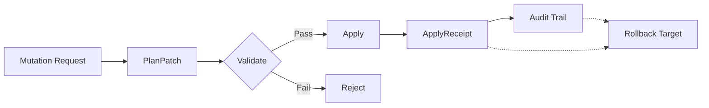

# AUDIT AND PROVENANCE

## Required Fields
- operationId
- actor (human|agent)
- phase
- inputDigest
- outputDigest
- beforeSnapshotRef
- afterSnapshotRef
- rationale
- confidence
- timestamp

## Diff Standard
All plan-changing operations MUST include structured before/after diffs.

## Rollback
Every accepted PlanPatch MUST reference inverse operations or snapshot rollback target.

## Audit Chain

