# AUDIT AND PROVENANCE

## Required Audit Fields
- operationId
- actor (human|agent) — maps to git-warp `writerId`
- phase — which pipeline stage produced the mutation
- inputDigest — BLAKE3 hash of input artifact
- outputDigest — Git commit SHA from `graph.patch()` (on success)
- rationale
- confidence
- timestamp

## Provenance

Every graph mutation is permanently recorded as an immutable Git commit in the writer's patch chain. Use `graph.patchesFor(nodeId)` to trace which patches touched any entity.

## Diff Standard

All plan-changing operations MUST include structured before/after diffs in the audit record. The diff captures the domain-level intent (what changed and why), not the raw git-warp operations.

## Correction Model

git-warp patches are immutable — there is no rollback or undo. To correct an error:

1. Emit a **new compensating patch** via `graph.patch()` that overrides properties via LWW, re-adds removed nodes/edges, or removes incorrectly added ones.
2. Record the correction in the audit trail with a rationale linking back to the original patch SHA.
3. Both the original and corrective patches remain in the graph's permanent history.

## Audit Chain

