# CONSTITUTION OF THE PLANNING COMPILER
**Version:** 1.1.0
**Enforcement:** HARD REJECT

## ARTICLE I: THE LAW OF DETERMINISM
1.1. **Idempotency:** Given the same Input State ($S_0$) and Policy Set ($P$), the system MUST produce the exact same Plan Artifact ($A$).
1.2. **No Silent State:** All decision variables must be explicit in the input or configuration. Hidden "temperature" or random seeds are forbidden in the write path.

## ARTICLE II: THE LAW OF DAG INTEGRITY
2.1. **Acyclicity:** The Task Graph must be a Directed Acyclic Graph. Any write that introduces a cycle ($A \to B \to A$) is malformed and MUST be rejected before patch emission. Use `graph.traverse.isReachable()` for pre-check.
2.2. **Sovereignty Lineage:** Every Quest promoted beyond BACKLOG must trace lineage to a sovereign human Intent via an `authorized-by` edge (see Art. IV). Campaign membership (`belongs-to` edge) is encouraged but not mandatory for all lifecycle stages.
2.3. **Causality:** A Task cannot start until all its `depends-on` dependencies are in a terminal state (DONE).

## ARTICLE III: THE LAW OF PROVENANCE
3.1. **Attributed Mutations:** Every state change is attributed to a `writerId` (agent or human identity). Guild Seal signing (Ed25519) is applied to completion artifacts (Scrolls); regular graph mutations are attributed by writerId on the WARP patch.
3.2. **Rationale Requirement:** Every mutation (add/move/delete) MUST include a `rationale` string of >10 characters explaining the "Why."
3.3. **Correctability:** git-warp patches are immutable, append-only Git commits. To correct an error, emit a **new compensating patch** that overrides properties via LWW or re-adds/removes nodes and edges. There is no transactional rollback — only forward corrections.

## ARTICLE IV: THE LAW OF HUMAN SOVEREIGNTY
4.1. **The Kill Switch:** A human Approver can override ANY agent decision.
4.2. **Approval Gates:** Any patch that alters the `Critical Path` or increases `Total Scope` by >5% requires explicit human sign-off.

