# GRAPH SCHEMA
**Version:** 2.2.0
**Status:** AUTHORITATIVE

## 1. Node ID Grammar

Every node ID MUST follow the `prefix:identifier` format.
- **Prefix:** Lowercase string from the allowed taxonomy (Section 2).
- **Identifier:** Case-preserving alphanumeric string (dashes and underscores allowed).

Example: `task:BDK-001`, `campaign:BEDROCK`, `submission:abc123`

## 2. Prefix Taxonomy

### Active Prefixes (used by actuator and graph queries)

| Prefix | Node Type | Purpose | Example |
|--------|-----------|---------|---------|
| `task` | Quest | Granular unit of work. | `task:BDK-001` |
| `campaign` | Campaign | High-level milestone or epoch. | `campaign:BEDROCK` |
| `milestone` | Campaign | Alias for campaign (legacy). | `milestone:M1` |
| `intent` | Intent | Sovereign human declaration of purpose. | `intent:SOVEREIGNTY` |
| `spec` | Spec | Graph-native design/spec document. | `spec:ready-gate` |
| `adr` | ADR | Graph-native architecture decision record. | `adr:0007` |
| `note` | Note | Graph-native working note or quest memo. | `note:quest-brief` |
| `comment` | Comment | Append-only discussion event. | `comment:019xyz` |
| `proposal` | Proposal | Non-authoritative candidate transform or plan. | `proposal:019xyz` |
| `attestation` | Attestation | Append-only approval/rejection/certification record. | `attestation:019xyz` |
| `artifact` | Scroll | Sealed output of completed quest. | `artifact:task:BDK-001` |
| `approval` | ApprovalGate | Formal human approval requirement. | `approval:cp-001` |
| `submission` | Submission | Review lifecycle envelope. | `submission:abc123` |
| `patchset` | Patchset | Immutable proposed change snapshot. | `patchset:def456` |
| `review` | Review | Per-reviewer verdict on a patchset. | `review:ghi789` |
| `decision` | Decision | Terminal merge or close event. | `decision:jkl012` |

### Reserved Prefixes (in schema, not actively used by actuator)

| Prefix | Purpose |
|--------|---------|
| `roadmap` | Root container. |
| `feature` | Groups of related tasks. |
| `crate` | Reusable module. |
| `issue` | Bug or defect. |
| `concept` | Abstract idea. |
| `person` | Human participant. |
| `tool` | External tool reference. |
| `event` | Calendar or milestone event. |
| `metric` | Measured value. |

## 3. Edge Types

### Active Edge Types

| Edge Label | From → To | Meaning |
|------------|-----------|---------|
| `belongs-to` | task → campaign/milestone | Quest is part of a campaign. |
| `authorized-by` | task → intent | Quest traces to human intent (sovereignty). |
| `depends-on` | task → task | Source cannot start until target is DONE. |
| `documents` | spec/adr/note → target | Graph-native document records durable context for a node. |
| `comments-on` | comment → target | Append-only discussion attached to a node. |
| `replies-to` | comment → comment | Comment-thread reply chain. |
| `proposes` | proposal → subject | Proposal is about the subject node. |
| `targets` | proposal → target | Optional secondary target of a proposal. |
| `attests` | attestation → target | Attestation records a decision over a target artifact. |
| `fulfills` | artifact → task | Scroll is the sealed output of a quest. |
| `submits` | submission → task | Submission proposes work for a quest. |
| `has-patchset` | patchset → submission | Patchset belongs to a submission. |
| `supersedes` | patchset → patchset | New patchset replaces old one. |
| `reviews` | review → patchset | Review evaluates a patchset. |
| `decides` | decision → submission | Terminal decision resolves a submission. |
| `approves` | approval → (target) | Approval gate grants permission. |

### Reserved Edge Types (in schema, not actively queried)

| Edge Label | Meaning |
|------------|---------|
| `implements` | Code fulfills a requirement. |
| `augments` | Extends or enhances another node. |
| `relates-to` | General association. |
| `blocks` | Forward dependency (inverse of depends-on). |
| `consumed-by` | Resource consumption. |
| `documents` | Documentation link (use graph-native content blobs by default). |

## 4. Node Property Contracts

All properties use **snake_case** in the WARP graph. Timestamps are Unix epoch numbers.

**Design rule:** queryable metadata belongs in node/edge properties. Substantial bodies belong in graph-native content blobs attached with `attachContent()` / `attachEdgeContent()`.

### Quest (`task:*`)

| Property | Type | Set By | Notes |
|----------|------|--------|-------|
| `type` | `'task'` | quest command | Required. |
| `title` | string | quest command | ≥5 chars. |
| `status` | QuestStatus | lifecycle | See valid values below. |
| `hours` | number | quest command | ≥0, default 0. |
| `priority` | string | intake/shape/ingest | `P0` through `P5`. Defaults to `P3`. |
| `description` | string | intake/quest command | Optional durable summary/body preview. |
| `task_kind` | string | intake/quest command | `delivery`, `spike`, `maintenance`, or `ops`. Defaults to `delivery`. |
| `assigned_to` | string | claim command | Principal ID (e.g., `agent.hal`). |
| `claimed_at` | number | claim command | Timestamp. |
| `ready_by` | string | ready command | Principal who moved the quest into READY. |
| `ready_at` | number | ready command | Timestamp. |
| `completed_at` | number | seal/merge | Timestamp. |
| `origin_context` | string | ingest | Optional provenance. |
| `suggested_by` | string | inbox command | Who suggested it. |
| `suggested_at` | number | inbox command | Timestamp. |
| `rejected_by` | string | reject command | Who rejected it. |
| `rejected_at` | number | reject command | Timestamp. |
| `rejection_rationale` | string | reject command | Non-empty rationale. |
| `reopened_by` | string | reopen command | Who reopened it. |
| `reopened_at` | number | reopen command | Timestamp. |

**Valid QuestStatus values:** `BACKLOG`, `PLANNED`, `READY`, `IN_PROGRESS`, `BLOCKED`, `DONE`, `GRAVEYARD`

Legacy: Pre-VOC-001 `INBOX` values are normalized to `BACKLOG` at read time.

**Edges:**
- `belongs-to` → campaign:/milestone: (required before `READY`)
- `authorized-by` → intent: (required for `PLANNED`+)
- `depends-on` → task: (optional, Weaver)

**Execution semantics:**
- `PLANNED` quests are draft-shaped work and are excluded from executable DAG analysis.
- `READY`, `IN_PROGRESS`, `BLOCKED`, and `DONE` participate in executable frontier / critical-path computations.

**Readiness by `task_kind`:**
- `delivery`: requires `task → implements → req`, `story → decomposes-to → req`, and `req → has-criterion → criterion`
- `maintenance`: requires `task → implements → req` and `req → has-criterion → criterion`
- `ops`: requires `task → implements → req` and `req → has-criterion → criterion` (manual evidence may satisfy later settlement)
- `spike`: requires at least one incoming `documents` edge from `note:*`, `spec:*`, or `adr:*`

---

### Intent (`intent:*`)

| Property | Type | Set By | Notes |
|----------|------|--------|-------|
| `type` | `'intent'` | intent command | Required. |
| `title` | string | intent command | ≥5 chars. |
| `requested_by` | string | intent command | Must start with `human.`. |
| `created_at` | number | intent command | Required. |
| `description` | string | intent command | Optional. |

**Edges:** Incoming `authorized-by` from task: nodes.

---

### Graph-native Docs / Discussion (`spec:*`, `adr:*`, `note:*`, `comment:*`)

These node families keep durable coordination narrative inside the XYPH graph.

| Property | Type | Applies To | Notes |
|----------|------|------------|-------|
| `type` | string | all | `spec`, `adr`, `note`, or `comment`. |
| `title` | string | `spec`, `adr`, `note` | Short queryable label. |
| `authored_by` | string | all | Principal ID. |
| `authored_at` | number | all | Timestamp. |

**Bodies:** stored via `attachContent()` on the node. Do not store long-form markdown in scalar properties.

**Edges:**
- `documents` → task:/campaign:/intent:/req:/submission: (durable linked context)
- `comments-on` → any node ID (discussion attachment)
- `replies-to` → comment: (threading)
- `supersedes` → prior spec:/adr:/note: revision (append-only history)

---

### Proposal (`proposal:*`)

Proposals are non-authoritative candidate transforms. They may suggest
dependencies, packets, doctor fixes, collapse plans, or other future-safe graph
changes, but they do not become truth by existing.

| Property | Type | Set By | Notes |
|----------|------|--------|-------|
| `type` | `'proposal'` | control plane | Required. |
| `proposal_kind` | string | control plane | E.g. `dependency`, `packet`, `doctor-fix`. |
| `subject_id` | string | control plane | Primary subject of the proposal. |
| `target_id` | string | control plane | Optional secondary target. |
| `proposed_by` | string | control plane | Principal ID. |
| `proposed_at` | number | control plane | Timestamp. |
| `observer_profile_id` | string | control plane | Observer used when authoring the proposal. |
| `policy_pack_version` | string | control plane | Policy pack in force when authored. |

**Bodies:** stored via `attachContent()` on the node as structured proposal
content. The current control-plane slice stores JSON containing at least
`rationale` and `payload`.

**Edges:**
- `proposes` → subject node (required)
- `targets` → target node (optional)

---

### Collapse Proposal (`collapse-proposal:*`)

`collapse_worldline persist:true` records a durable governance proposal without
executing settlement. The node is append-only and lives on `worldline:live`
even when the compared source worldline is derived.

| Property | Type | Set By | Notes |
|----------|------|--------|-------|
| `type` | `'collapse-proposal'` | control plane | Required. |
| `artifact_digest` | string | control plane | Stable XYPH artifact identity. |
| `comparison_artifact_digest` | string | control plane | Fresh compare digest used for the preview. |
| `transfer_digest` | string | control plane | Published git-warp transfer-plan digest. |
| `source_worldline_id` | string | control plane | Source worldline being settled. |
| `target_worldline_id` | string | control plane | Current slice uses `worldline:live`. |
| `recorded_by` | string | control plane | Principal ID. |
| `recorded_at` | number | control plane | Timestamp. |
| `observer_profile_id` | string | control plane | Observer in force when recorded. |
| `policy_pack_version` | string | control plane | Policy pack in force when recorded. |
| `dry_run` | boolean | control plane | Always `true` in the current slice. |
| `executable` | boolean | control plane | Always `false` in the current slice. |
| `changed` | boolean | control plane | Whether the transfer plan contains substantive work. |
| `attestation_count` | number | control plane | Optional count of supplied attestation IDs. |

**Bodies:** stored via `attachContent()` on the node as a deterministic JSON
copy of the returned `collapse-proposal` payload, including the published
git-warp comparison/transfer fact exports.

**Edges:**
- no required outbound edges in the current slice
- incoming `attests` from `attestation:*` records are expected

**Note:** durable `comparison-artifact:*` nodes are intentionally not created
yet. Recording a comparison into `worldline:live` would perturb the compared
live tip in the current tip-vs-tip model.

---

### Attestation (`attestation:*`)

Attestations are append-only decision records. They record approval, rejection,
certification, waiver, endorsement, or escalation with explicit provenance.

| Property | Type | Set By | Notes |
|----------|------|--------|-------|
| `type` | `'attestation'` | control plane | Required. |
| `decision` | string | control plane | Approval/rejection/certification style decision. |
| `target_id` | string | control plane | Artifact or entity being attested. |
| `attested_by` | string | control plane | Principal ID. |
| `attested_at` | number | control plane | Timestamp. |
| `observer_profile_id` | string | control plane | Observer used for the decision context. |
| `policy_pack_version` | string | control plane | Policy pack in force when attested. |

**Bodies:** stored via `attachContent()` on the node as structured decision
content. The current control-plane slice stores JSON containing at least
`rationale` and `scope`.

**Edges:**
- `attests` → target node (required)

---

### Campaign (`campaign:*` / `milestone:*`)

| Property | Type | Set By | Notes |
|----------|------|--------|-------|
| `type` | `'campaign'` or `'milestone'` | seed/manual | Required. |
| `title` | string | seed/manual | Required. |
| `status` | CampaignStatus | manual | Optional, defaults to `UNKNOWN`. |

**Valid CampaignStatus values:** `BACKLOG`, `IN_PROGRESS`, `DONE`, `UNKNOWN`

**Edges:** Incoming `belongs-to` from task: nodes.

---

### Scroll (`artifact:*`)

| Property | Type | Set By | Notes |
|----------|------|--------|-------|
| `type` | `'scroll'` | seal/merge | Required. |
| `artifact_hash` | string | seal/merge | Content hash. |
| `rationale` | string | seal/merge | Explanation. |
| `sealed_by` | string | seal/merge | Principal ID. |
| `sealed_at` | number | seal/merge | Timestamp. |
| `payload_digest` | string | GuildSealService | Hash for signing. |
| `guild_seal_alg` | string | GuildSealService | `'ed25519'` if signed. |
| `guild_seal_key_id` | string | GuildSealService | Public key ID. |
| `guild_seal_sig` | string | GuildSealService | Signature. |

**ID convention:** `artifact:{questId}` (e.g., `artifact:task:BDK-001`)

**Edges:** `fulfills` → task: (the sealed quest).

---

### Approval Gate (`approval:*`)

| Property | Type | Set By | Notes |
|----------|------|--------|-------|
| `type` | `'approval'` | sovereignty service | Required. |
| `status` | ApprovalGateStatus | lifecycle | `PENDING`, `APPROVED`, `REJECTED`. |
| `trigger` | ApprovalGateTrigger | sovereignty service | Why approval is needed. |
| `requested_by` | string | sovereignty service | Must start with `agent.`. |
| `approver` | string | sovereignty service | Must start with `human.`. |
| `patch_ref` | string | sovereignty service | Reference to affected patch. |
| `created_at` | number | sovereignty service | Timestamp. |
| `resolved_at` | number | resolution | Timestamp. |
| `rationale` | string | resolution | Optional explanation. |

**Valid triggers:** `CRITICAL_PATH_CHANGE`, `SCOPE_INCREASE_GT_5PCT`

---

### Submission (`submission:*`)

| Property | Type | Set By | Notes |
|----------|------|--------|-------|
| `type` | `'submission'` | submit command | Required. |
| `quest_id` | string | submit command | Target task: ID. |
| `submitted_by` | string | submit command | Principal ID. |
| `submitted_at` | number | submit command | Timestamp. |

**Status is COMPUTED, never stored.** Derived from decisions + effective review verdicts:
- Has merge decision → `MERGED`
- Has close decision → `CLOSED`
- Any effective `request-changes` verdict → `CHANGES_REQUESTED`
- ≥1 effective `approve` verdict → `APPROVED`
- Otherwise → `OPEN`

**Edges:**
- `submits` → task: (the quest)
- Incoming `has-patchset` from patchset:
- Incoming `decides` from decision:

---

### Patchset (`patchset:*`)

| Property | Type | Set By | Notes |
|----------|------|--------|-------|
| `type` | `'patchset'` | submit/revise | Required. |
| `description` | string | submit/revise | ≥10 chars. |
| `workspace_ref` | string | submit/revise | Git branch/workspace. |
| `authored_by` | string | submit/revise | Principal ID. |
| `authored_at` | number | submit/revise | Timestamp. |
| `base_ref` | string | submit/revise | Base branch (e.g., `main`). |
| `head_ref` | string | submit/revise | HEAD commit SHA. |
| `commit_shas` | string | submit/revise | Comma-separated list. |

**Tip patchset:** The patchset with no incoming `supersedes` edge (latest in chain).

**Edges:**
- `has-patchset` → submission:
- `supersedes` → patchset: (previous version, if revision)
- Incoming `reviews` from review:

---

### Review (`review:*`)

| Property | Type | Set By | Notes |
|----------|------|--------|-------|
| `type` | `'review'` | review command | Required. |
| `verdict` | ReviewVerdict | review command | Required. |
| `comment` | string | review command | Feedback text. |
| `reviewed_by` | string | review command | Principal ID. |
| `reviewed_at` | number | review command | Timestamp. |

**Valid verdicts:** `'approve'`, `'request-changes'`, `'comment'`

**Effective verdict:** Latest review per reviewer (by max(`reviewed_at`, id)). `'comment'` verdicts are excluded from status computation.

**Edges:** `reviews` → patchset:

---

### Decision (`decision:*`)

| Property | Type | Set By | Notes |
|----------|------|--------|-------|
| `type` | `'decision'` | merge/close | Required. Distinguishes from legacy concept/decision nodes. |
| `kind` | DecisionKind | merge/close | `'merge'` or `'close'`. |
| `decided_by` | string | merge/close | Principal ID. |
| `decided_at` | number | merge/close | Timestamp. |
| `rationale` | string | merge/close | Required explanation. |
| `merge_commit` | string | merge | Git merge commit SHA. |

**Edges:** `decides` → submission:

## 5. Edge Traversal Patterns

```
intent: ←authorized-by← task: ─belongs-to─→ campaign:
                           │
                           ├──depends-on──→ task:
                           │
                           ←submits── submission: ←decides── decision:
                                          │
                                          ←has-patchset── patchset: ←reviews── review:
                                                              │
                                                              ─supersedes─→ patchset:
                           │
                           ←fulfills── artifact: (scroll)
```



## 6. Conflict Resolution (LWW)

XYPH uses **Last-Writer-Wins (LWW)** for all node properties.
Each property write carries an **EventId** — a 4-tuple that provides a global total order:

1. **Lamport timestamp** — per-writer monotonic counter assigned per patch.
2. **writerId** — lexicographic tie-break when Lamport timestamps are equal.
3. **patchSha** — tie-break when writer and Lamport are both equal.
4. **opIndex** — tie-break within a single patch (operation order).

Conflicts are resolved by comparing the complete EventId lexicographically. The write with the greater EventId wins.

**Important:** The EventId tuple is compared lexicographically: Lamport timestamp first. If writer Y's Lamport timestamp is higher than writer X's, writer Y wins — regardless of writer identity. The `writerId` field is only a tie-breaker when two writes have the same Lamport timestamp (which happens when patches are created concurrently before observing each other's clocks). This ensures a global total order across all writers.

## 7. Non-Examples (Invalid)

- `BDK-001`: Missing prefix.
- `TASK:BDK-001`: Uppercase prefix.
- `task:`: Empty identifier.
- `unknown:ID`: Prefix not in taxonomy.
