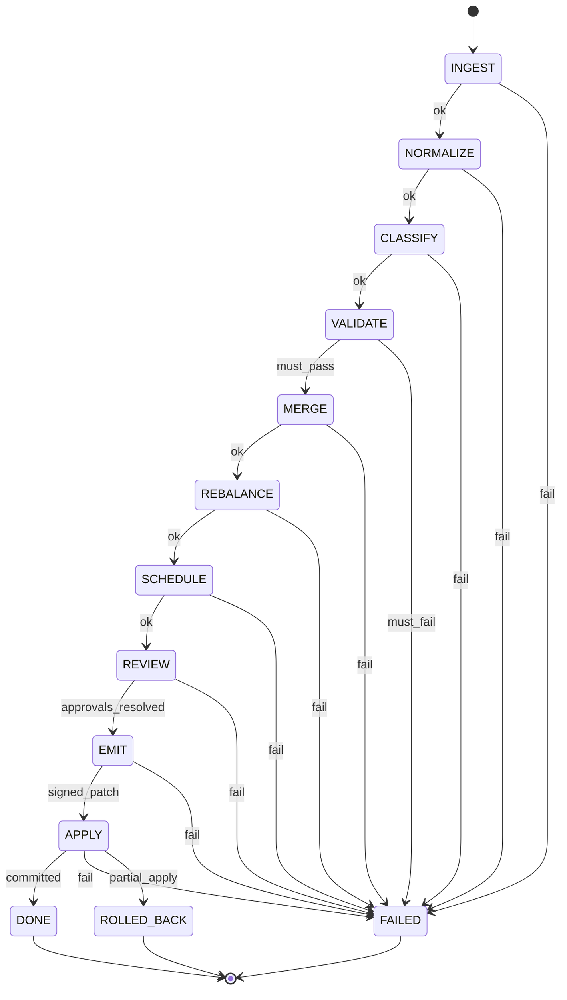

# ORCHESTRATION_SPEC.md
**Title:** Planning Compiler Orchestration Spec  
**Version:** 1.0.0  
**Status:** ACTIVE  
**Enforcement:** HARD (state transitions are validated, not inferred)

---

## 0) Mission

Define the deterministic state machine that transforms raw planning input into an auditable, schedulable plan patch.

Pipeline:

`INGEST -> NORMALIZE -> CLASSIFY -> VALIDATE -> MERGE -> REBALANCE -> SCHEDULE -> REVIEW -> EMIT -> APPLY`

No skipping states.  
No direct writes outside `APPLY`.

---

## 1) Global Invariants

1. **Deterministic Execution:**  
   Same `InputBundle + PolicyPack + Config + ModelProfile` must yield same `PlanArtifactDigest`.

2. **Single Mutation Gate:**  
   Only `APPLY` may mutate persistent roadmap state.

3. **Typed Artifacts:**  
   Every state emits one typed artifact with `schemaVersion`.

4. **Monotonic Provenance:**  
   Every transition appends one `AuditRecord`; no overwrite.

5. **Fail-Closed:**  
   Unknown state, unknown transition, or missing artifact => hard fail.

---

## 2) Artifact Contracts by State

### 2.1 InputBundle (entry artifact)
```json
{
  "schemaVersion": "v1.0",
  "inputId": "INP-20260215-001",
  "sourceRefs": ["roadmap.md", "backlog.json", "notes.txt"],
  "rawItems": [],
  "policyPackRef": "POLICY-STRICT-ENG-v1",
  "configRef": "CFG-PROD-v3",
  "requestedBy": "human:james"
}
```

### 2.2 State outputs
- INGEST -> IngestArtifact
- NORMALIZE -> NormalizedArtifact
- CLASSIFY -> ClassifiedArtifact
- VALIDATE -> ValidationArtifact
- MERGE -> MergedPlanArtifact
- REBALANCE -> RebalancedPlanArtifact
- SCHEDULE -> ScheduleArtifact
- REVIEW -> ReviewArtifact
- EMIT -> PlanPatchArtifact
- APPLY -> ApplyReceiptArtifact

All artifacts MUST include:
- schemaVersion
- runId
- state
- createdAt
- inputDigest
- outputDigest

---

## 3) Finite State Machine

### 3.1 State list (closed set)
1. INGEST
2. NORMALIZE
3. CLASSIFY
4. VALIDATE
5. MERGE
6. REBALANCE
7. SCHEDULE
8. REVIEW
9. EMIT
10. APPLY
11. DONE
12. FAILED
13. ROLLED_BACK (reachable only from APPLY failure with partial mutation risk)

---

### 3.2 Allowed transitions
- INGEST -> NORMALIZE | FAILED
- NORMALIZE -> CLASSIFY | FAILED
- CLASSIFY -> VALIDATE | FAILED
- VALIDATE -> MERGE | FAILED
- MERGE -> REBALANCE | FAILED
- REBALANCE -> SCHEDULE | FAILED
- SCHEDULE -> REVIEW | FAILED
- REVIEW -> EMIT | FAILED
- EMIT -> APPLY | FAILED
- APPLY -> DONE | FAILED | ROLLED_BACK
- FAILED -> (terminal)
- DONE -> (terminal)
- ROLLED_BACK -> (terminal)

Any other transition is invalid and MUST be rejected.

---

## 4) Entry/Exit Criteria per State

### 4.1 INGEST
Entry requires: valid InputBundle
Actions:
- parse source refs
- canonicalize encodings/newlines
- attach deterministic source ordering
- compute inputDigest
Exit requires:
- non-empty rawItems
- parse errors <= policy threshold (default: 0 for strict)
Failure reasons:
- unreadable source
- malformed input encoding
- duplicate input IDs

---

### 4.2 NORMALIZE
Entry requires: IngestArtifact
Actions:
- map raw items into canonical entities (Task/Milestone/Edge candidates)
- normalize IDs and enums
- trim/clean text fields deterministically
Exit requires:
- all entities schema-valid (or marked rejected with reason)
- no untyped entity
Failure reasons:
- invalid schema version
- unrecoverable entity parse

---

### 4.3 CLASSIFY
Entry requires: NormalizedArtifact
Actions:
- classify intent (feature/bug/refactor/ops/research)
- infer rough complexity if missing (tagged as inferred)
- tag risk + confidence
Exit requires:
- each task has class + confidence
- inference provenance recorded
Failure reasons:
- classifier unavailable beyond timeout budget
- missing mandatory classification outputs

---

### 4.4 VALIDATE
Entry requires: ClassifiedArtifact
Actions:
- run MUST/SHOULD/COULD policy checks
- run DAG precheck (self-ref, missing refs, cycle probe)
- resolve milestone existence
Exit requires:
- zero MUST violations
- warnings emitted with remediation
Failure reasons:
- MUST violation
- unresolved milestone
- self dependency / cycle

---

### 4.5 MERGE
Entry requires: ValidationArtifact with zero MUST failures
Actions:
- merge candidates with current roadmap snapshot
- detect collisions (ID/title/semantic overlap)
- create explicit merge ops (ADD, UPDATE, LINK, SPLIT)
Exit requires:
- deterministic op ordering
- no conflicting ops on same field without resolution rule
Failure reasons:
- unresolved conflicting updates
- snapshot mismatch

---

### 4.6 REBALANCE
Entry requires: MergedPlanArtifact
Actions:
- enforce capacity budgets (team, sprint, milestone)
- split oversized tasks per policy
- shift non-critical work out of overloaded windows
Exit requires:
- capacity constraints satisfied
- total scope delta recorded
Failure reasons:
- impossible capacity fit
- rebalance violates MUST rules

---

### 4.7 SCHEDULE
Entry requires: RebalancedPlanArtifact
Actions:
- build DAG
- compute topological ordering
- derive critical path + parallel lanes
- assign planned windows
Exit requires:
- acyclic graph proof
- schedule artifact with critical path report
Failure reasons:
- cycle detected
- unschedulable dependencies

---

### 4.8 REVIEW
Entry requires: ScheduleArtifact
Actions:
- produce human-readable diff + risk summary
- evaluate approval requirements:
  - critical path changed?
  - scope increased >5%?
- assign required approvers
Exit requires:
- approvalRequired boolean
- if required: approver set resolved
Failure reasons:
- unresolved approver identity
- missing risk summary

---

### 4.9 EMIT
Entry requires: ReviewArtifact
Actions:
- generate PlanPatchArtifact (ordered operations)
- generate RollbackPatchArtifact
- sign artifact envelope (agent/human signature policy)
Exit requires:
- patch + rollback patch hash-linked
- all ops reference valid entities
Failure reasons:
- unsigned patch when required
- rollback cannot be generated

---

### 4.10 APPLY
Entry requires: PlanPatchArtifact, approvals satisfied
Actions:
- optimistic concurrency check against roadmap snapshot
- apply operations atomically
- emit apply receipt
Exit requires:
- commit success + new snapshot digest
- immutable audit chain entry
Failure reasons:
- snapshot drift
- partial apply risk (must trigger rollback path)
- signature verification failure

---

## 5) Retry, Timeout, and Budget Policy

### 5.1 Retry classes
1. Deterministic/logic failures: no retry (FAILED immediately)
2. Transient infra failures: retry up to 2 times
3. External model timeout: 1 retry with same deterministic config; if still fail -> FAILED

### 5.2 Time budgets (default strict)
- INGEST: 5s
- NORMALIZE: 10s
- CLASSIFY: 20s
- VALIDATE: 5s
- MERGE: 10s
- REBALANCE: 10s
- SCHEDULE: 10s
- REVIEW: 5s
- EMIT: 5s
- APPLY: 5s

Over-budget => fail with timeout code.

---

## 6) Exit Codes
- 0 = DONE (success)
- 10 = validation failure (MUST rule violated)
- 11 = DAG integrity failure
- 12 = approval missing/invalid
- 13 = signature/trust failure
- 14 = concurrency/snapshot drift
- 15 = timeout budget exceeded
- 16 = unknown transition/state corruption
- 17 = apply partial failure (rollback attempted)
- 18 = rollback failure (critical incident)

---

## 7) Audit Requirements per Transition

Every transition MUST emit:

```json
{
  "schemaVersion": "v1.0",
  "runId": "RUN-...",
  "fromState": "NORMALIZE",
  "toState": "CLASSIFY",
  "actor": { "type": "agent", "id": "planner" },
  "timestamp": "2026-02-15T23:04:05Z",
  "inputDigest": "blake3:...",
  "outputDigest": "blake3:...",
  "decisionSummary": "Classified 42 tasks",
  "violations": [],
  "warnings": [],
  "durationMs": 1842
}
```

No audit record = invalid run.

---

## 8) Concurrency Model
- Single active APPLY per roadmap namespace.
- Parallel runs allowed through SCHEDULE, but APPLY requires snapshot match.
- Snapshot drift at APPLY returns exit code 14 and suggests rebase/re-run from MERGE.

---

## 9) Safety Modes

### 9.1 Simulation Mode
- Executes full pipeline through EMIT
- Never enters APPLY
- Produces hypothetical patch + risk report

### 9.2 Safe Mode
- Disables auto-splitting and auto-rebalance shifts
- Only deterministic validations + explicit human-confirmed ops

---

## 10) Mermaid State Diagram



---

## 11) Non-Negotiable Rejection Triggers
1. Missing schemaVersion in any artifact
2. Transition attempted not in allowed transition table
3. MUST rule violation ignored
4. Unsatisfied approval gate entering APPLY
5. Missing rollback patch at EMIT
6. Audit record omission at any state
7. Direct state mutation attempted outside APPLY

---

## 12) Implementation Notes
- Use a closed enum for states and transition map in code.
- Drive orchestration with pure functions:
  - `next(state, artifact, context) -> {state, artifact, audit}`
- Keep effectful operations (I/O, signatures, persistence) behind adapters.
- Hash algorithm should be stable + explicit (blake3 recommended).
