# PATCH_OPS_INVARIANTS.md

Version: 1.1.0
Status: HARD REJECT

> **Scope note:** This document defines invariants for the `PlanPatchArtifact`
> format — an **application-layer validation schema** used by the planning
> compiler pipeline. These are NOT git-warp primitives. git-warp's own mutation
> API (`graph.patch()`) uses six operations: `addNode`, `removeNode`, `addEdge`,
> `removeEdge`, `setProperty`, `setEdgeProperty`. The PlanPatchArtifact wraps
> higher-level domain operations (ADD_TASK, LINK_DEPENDENCY, etc.) that are
> validated here before being translated to git-warp primitives at APPLY time.

## Invariants beyond JSON Schema

1. operations.length MUST equal rollbackOperations.length.

2. rollbackOperations[i].revertsOpId MUST reference operations[(n-1)-i].opId
   (strict reverse ordering).

3. For each operation op:
   - rollback op must match op.invertibility.inverseOpType
   - rollback path must match op.invertibility.inversePath
   - rollback value must deep-equal op.invertibility.inverseValue

> **Note on rollback semantics:** These rollback operations are a validation
> artifact — they prove that the compiler *could* compute an inverse. In
> practice, git-warp patches are immutable. Corrections are made by emitting
> new compensating patches that override via LWW, not by executing rollback
> operations against a database transaction.

4. Canonical sort check:
   operations[] must already be sorted by:
   (phase, entityType, entityId, path, opId)
   If not sorted -> reject; do not auto-sort during APPLY.

5. No duplicate opId in operations[] or rollbackOperations[].

6. LINK_DEPENDENCY:
   edge.fromTaskId != edge.toTaskId
   and cycle pre-check via `graph.traverse.isReachable()`.

7. UNLINK_DEPENDENCY:
   referenced edge must exist in materialized graph.

8. MOVE_TASK_MILESTONE:
   destination milestone must exist at evaluation time.

9. DELETE_MILESTONE:
   no surviving TASK may reference that milestone post-apply.

10. UPDATE_TASK/UPDATE_MILESTONE:
    precondition.expectedHash must equal current entity hash before mutation.

11. Signature coverage:
    signature.payloadDigest must be computed over canonicalized patch body
    excluding signature object itself.

12. Content-addressed deduplication:
    git-warp patches are Git commits. Identical operations produce the same
    SHA and naturally deduplicate. No application-level idempotency key
    is strictly necessary, but `patchId` is retained for audit correlation.

13. Rationale floor:
    metadata.rationale length >= 11 and each operation.rationale length >= 11
    for non-system actors.
