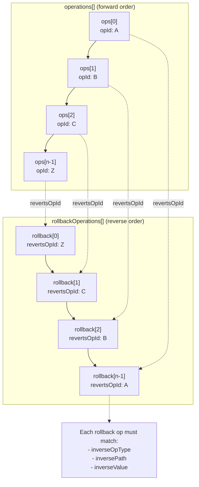

# PATCH_OPS_INVARIANTS.md

Version: 1.0.0
Status: HARD REJECT

## Invariants beyond JSON Schema

1. operations.length MUST equal rollbackOperations.length.

2. rollbackOperations[i].revertsOpId MUST reference operations[(n-1)-i].opId
   (strict reverse ordering).

3. For each operation op:
   - rollback op must match op.invertibility.inverseOpType
   - rollback path must match op.invertibility.inversePath
   - rollback value must deep-equal op.invertibility.inverseValue

4. Canonical sort check:
   operations[] must already be sorted by:
   (phase, entityType, entityId, path, opId)
   If not sorted -> reject; do not auto-sort during APPLY.

5. No duplicate opId in operations[] or rollbackOperations[].

6. LINK_DEPENDENCY:
   edge.fromTaskId != edge.toTaskId
   and edge must not already exist in target snapshot.

7. UNLINK_DEPENDENCY:
   referenced edge must exist in target snapshot.

8. MOVE_TASK_MILESTONE:
   destination milestone must exist at evaluation time.

9. DELETE_MILESTONE:
   no surviving TASK may reference that milestone post-transaction.

10. UPDATE_TASK/UPDATE_MILESTONE:
    precondition.expectedHash must equal current entity hash before mutation.

11. Signature coverage:
    signature.payloadDigest must be computed over canonicalized patch body
    excluding signature object itself.

12. Idempotency:
    patchId MUST be globally unique per namespace; second apply returns prior receipt.

13. Rationale floor:
    metadata.rationale length >= 11 and each operation.rationale length >= 11
    for non-system actors.
