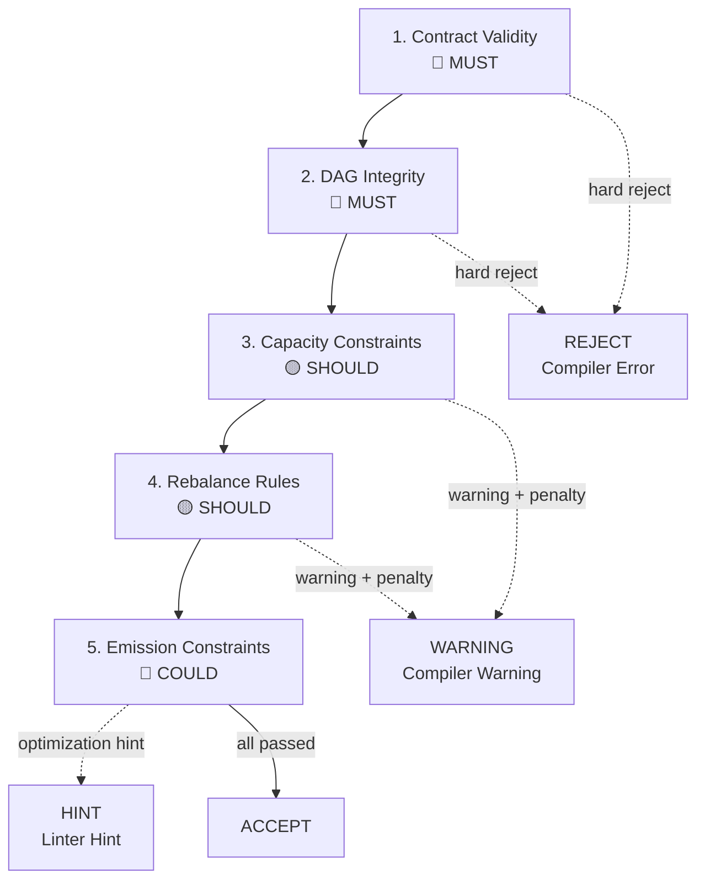

# POLICY ENGINE

## Rule Tiers
- **MUST**: hard reject on violation (Compiler Error)
- **SHOULD**: warning + penalty score (Compiler Warning)
- **COULD**: optimization hints (Linter Hint)

## Evaluation Order
1. Contract validity
2. DAG integrity
3. Capacity constraints
4. Rebalance rules
5. Emission constraints

## LEVEL 1: MUST (Compiler Errors)
1. **Schema Compliance**: Payload must validate against `Task Schema v1.0`.
2. **Milestone Existence**: `milestoneId` must exist in the active Roadmap.
3. **No Self-References**: A task cannot appear in its own `blockedBy` array.
4. **Story Format**: `userStory` must strictly follow the "As a/I want/So that" regex.

## LEVEL 2: SHOULD (Compiler Warnings)
5. **Small Batch Size**: `estimates.humanHours` SHOULD be <= 40 hours.
6. **Test Coverage**: `testPlan.failureModes` SHOULD contain at least 2 entries.
7. **Dependency Depth**: A task SHOULD NOT have a dependency chain depth > 5.

## LEVEL 3: COULD (Linter Hints)
8. **Complexity/Time Match**: If `complexity` is "XL", `humanHours` COULD be > 80.
9. **Priority Distribution**: A Milestone COULD ensure <30% of tasks are "P0".
