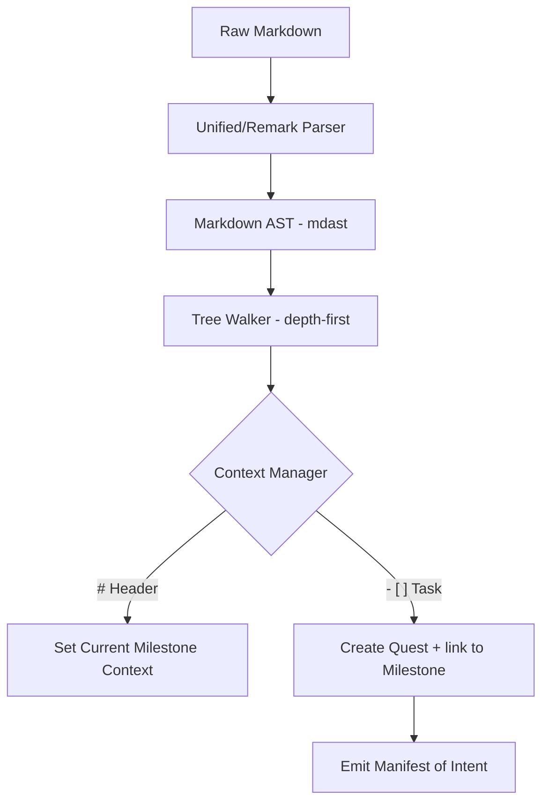

# RFC 001: AST-Driven Ingest & Semantic Hierarchy

- **Status**: PROPOSED
- **Author**: agent.claude (drafted for human.james)
- **Date**: 2026-02-17
- **Target Milestone**: 6 (WEAVER)

## 1. Abstract
Currently, the `IngestService` utilizes a line-by-line Regular Expression (Regex) to parse roadmap intent. This "String Soup" approach is position-dependent, whitespace-fragile, and inherently "hierarchy-blind." This RFC proposes a transition to an Abstract Syntax Tree (AST)-driven ingestion engine using the `unified` and `remark` ecosystems. This shift enables **Semantic Hierarchy Discovery** (automatic parent-child linking) and ensures that XYPH’s "Genealogy of Intent" is as robust as the underlying WARP graph.

## 2. Problem Statement: The "String Soup" Sin
The current implementation in `IngestService.ts` relies on a "God-Regex":
```typescript
const match = line.match(/^- \[([ xX])\]\s+([a-z]+:[A-Z0-9-]+)\s+(.+?)(?:\s+#(\d+(?:\.\d+)?))?(?:\s+@([a-z]+:[A-Z0-9-]+))?$/);
```

### 2.1 Technical Debt & Fragility
- **Positional Fragility**: Moving `#hours` before the `title` causes the line to be ignored.
- **Hierarchy Blindness**: Indentation in Markdown (denoting sub-tasks or milestone membership) is ignored. The system creates a "Flat List" and requires manual tagging (`@campaign`) to establish context.
- **Silent Failures**: While improved in `1.0.0-alpha.4`, the ingestion is still brittle to formatting noise (e.g., extra spaces or common Markdown variations).

## 3. Proposed Solution: The AST Leap
We propose replacing the line-based loop with a tree-walking parser. By parsing the entire document into an AST, we can utilize the structural properties of Markdown (headers, list nesting, and block properties) to derive graph relationships.

### 3.1 Structural Data Flow


## 4. Detailed Design

### 4.1 Hierarchical Discovery
The new engine will maintain a **Context Stack** during the tree walk. A `# Header` node pushes a new container (Milestone/Campaign) onto the stack. Subsequent list items inherit this context automatically.

**Example Input:**
```markdown
# campaign:M1 Bedrock
- [ ] task:BDK-001 Kernel #10
  - [ ] task:BDK-001a Memory Mgmt #5
```

**Resulting Graph Mutations:**
1. `upsertQuest(campaign:M1)`
2. `upsertQuest(task:BDK-001)` + `addEdge(task:BDK-001, campaign:M1, belongs-to)`
3. `upsertQuest(task:BDK-001a)` + `addEdge(task:BDK-001a, task:BDK-001, depends-on)`

### 4.2 Dependency Justification: `unified` / `remark`
- **Why?**: These are the industry standard for AST manipulation in the Node.js ecosystem. They are modular, well-tested, and support pluggable transformations.
- **Justification**: While adding `remark-parse` adds weight to `node_modules`, it removes the need for maintaining custom, fragile parsing logic in-house. It ensures XYPH is compatible with standard Markdown (CommonMark/GFM).

## 5. Market Comparison: How Others Do It

| Feature | XYPH (Proposed) | LangGraph (Checkpointers) | GitHub Issues (Tasklists) |
| :--- | :--- | :--- | :--- |
| **Ingest Format** | Semantic Markdown | JSON / State Objects | Markdown GFM |
| **Hierarchy** | **Inferred via AST Nesting** | Explicit Graph Edges | Flat List (mostly) |
| **Provenance** | Signed BLAKE3 Hashes | Centralized DB IDs | Database Primary Keys |
| **Error Handling** | Deferred Validation | Runtime Exceptions | Validation at Write-time |

**Analysis**: Most agent frameworks (like LangGraph) favor JSON for state management because it's easy for machines. XYPH’s commitment to Markdown-as-State requires **Staff-level parsing** to avoid the "Fragile Orchestrator" trap. By using an AST, XYPH becomes as readable as GitHub Issues but as powerful as a relational graph.

## 6. Pros and Cons

### Pros
- **Robustness**: Eliminates Regex character-offset bugs.
- **UX**: Agents and humans can use natural Markdown hierarchy (nesting) to express complex plans.
- **Extensibility**: Future support for Frontmatter/YAML per node becomes a simple plugin addition.

### Cons
- **Complexity**: Tree walking is more complex to implement than a flat `for-of` loop.
- **Dependencies**: Adds `unified`, `remark-parse`, and `unist-util-visit` to the production bundle.
- **Performance**: AST generation is slightly slower than Regex matching (though negligible for typical roadmap sizes).

## 7. Alternatives Considered
1. **The "Better Regex"**: Use named capture groups and multiple passes. (Rejected: still hierarchy-blind).
2. **JSON-only Ingest**: Force agents to emit JSON manifests. (Rejected: breaks the "Human-Readable Roadmap" core value).
3. **YAML Frontmatter-only**: Every task must be a YAML block. (Rejected: too verbose for quick roadmap drafting).

## 8. Implementation Strategy
1. Introduce `src/domain/services/AstIngestService.ts` alongside the existing `IngestService`.
2. Port the existing `IngestService` tests to the new service to ensure parity.
3. Update `CoordinatorService` to use `AstIngestService`.
4. Once `AstIngestService` passes all parity tests, deprecate and remove the line-based `IngestService`.

## 9. Conclusion
Transitioning to an AST-driven model is not just a refactor—it is the **Heirloom Upgrade** for XYPH. It elevates the Markdown roadmap from a "text file" to a **Structured Database of Intent**, providing the architectural rigor required for autonomous agentic orchestration.
