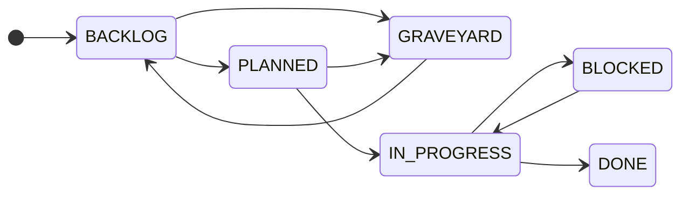
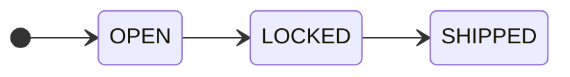

# ROADMAP PROTOCOL

## Task Lifecycle
- **BACKLOG**: Idea ingested, not yet estimated.
- **PLANNED**: Estimated, slotted into milestone.
- **IN_PROGRESS**: Claimed by a worker.
- **BLOCKED**: Blocked by an incomplete dependency.
- **DONE**: Acceptance criteria met, evidence attached.

## Milestone Transitions
- **OPEN**: Accepting new tasks.
- **LOCKED**: No new scope without approval.
- **SHIPPED**: All mandatory features DONE.

