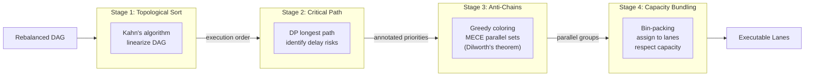

# SCHEDULING AND DAG
**Version:** 1.0.0
**Enforcement:** ALGORITHMIC VERIFICATION

## Purpose
Specifies the mathematical primitives for transforming a rebalanced DAG into executable lanes. Uses proven graph algorithms: toposort for ordering, Dijkstra for critical path, and Dilworth's theorem for anti-chains.

## Core Definitions
- **Ready Set (Frontier)**: Tasks with no incoming blocks edges from incomplete Tasks.
- **Critical Path**: Longest path (by humanHours) from root to leaf.
- **Anti-Chain**: Maximal set of parallelizable Tasks (no dependencies).
- **Lane**: Partitioned schedule respecting capacity.

## Required Algorithms
1. **Topological Sort**: Linearize DAG into execution sequence (Kahn's).
2. **Critical Path**: Identify delay risks (Dijkstra).
3. **Anti-Chain Generation**: MECE partitioning for concurrent execution (Greedy coloring).
4. **Capacity-Aware Bundling**: Assign sequences to lanes without overload (Bin-packing).

