# SCHEDULING AND DAG
**Version:** 1.1.0
**Enforcement:** ALGORITHMIC VERIFICATION

## Purpose
Specifies the mathematical primitives for transforming a rebalanced DAG into executable lanes. All graph algorithms MUST use git-warp's built-in traversal primitives (`graph.traverse.*`) — never userland implementations.

## Core Definitions
- **Ready Set (Frontier)**: Tasks with no incoming `depends-on` edges from incomplete Tasks. Computed by `computeFrontier()` in `DepAnalysis.ts`.
- **Critical Path**: Longest path (by humanHours) from root to leaf. This is a longest-path problem on a DAG, solved via DP over topological order — NOT Dijkstra (which finds shortest paths).
- **Anti-Chain**: Maximal set of parallelizable Tasks (no dependencies).
- **Lane**: Partitioned schedule respecting capacity.

## Required Algorithms

| Algorithm | git-warp Primitive | Notes |
|-----------|-------------------|-------|
| **Topological Sort** | `graph.traverse.topologicalSort(start, { dir, labelFilter })` | Kahn's algorithm with cycle detection. |
| **Critical Path** | `graph.traverse.weightedLongestPath(from, to, { weightFn })` | DP over topological order. Weight function maps to `humanHours`. |
| **Frontier Detection** | `computeFrontier()` in `DepAnalysis.ts` | Uses `graph.traverse` internally. |
| **Level Assignment** | `graph.traverse.levels(start, { dir, labelFilter })` | Returns `Map<nodeId, level>` for parallel lane assignment. |
| **Cycle Pre-check** | `graph.traverse.isReachable(from, to, { labelFilter })` | Must check before adding `depends-on` edges. |

Anti-chain generation and capacity-aware bundling are application-layer logic that operates on the results of the above traversals.

