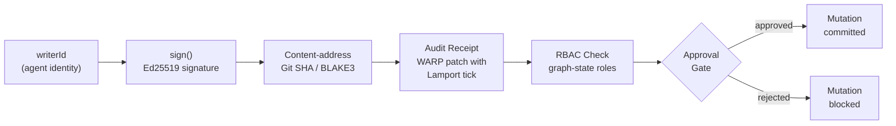

# SECURITY AND TRUST

## Identity
- Every agent has a unique `writerId`.
- Every mutation is signed by the actor's key.

## Tamper Safety
- Use Git's cryptographic SHA-1/SHA-256 for content addressing.
- WARP audit receipts provide verifiable materiality of decisions.

## Authorization
- Role-based access controlled via graph state (who possesses which skill).
- Mutation approval gate for Critical Path changes.

## Trust Pipeline

