# SECURITY AND TRUST

## Identity

- Every agent has a unique `writerId` (e.g., `agent.james`, `human.james`).
- Each writer maintains an independent patch chain under `refs/warp/<graph>/writers/<writerId>`.
- WriterId attribution is automatic — every git-warp patch carries its writer's identity.

## Cryptographic Signing

- **Guild Seals** (Ed25519) are applied to completion artifacts (Scrolls) via `GuildSealService`. These are application-layer signatures stored as node properties, not git-warp primitives.
- Regular graph mutations (`graph.patch()`) are NOT cryptographically signed. They are attributed by `writerId` and content-addressed by Git SHA.
- The `validatePatchOps` system provides an optional application-layer validation format with Ed25519 signature envelopes for high-assurance batch operations.

## Tamper Safety

- Git's content-addressing (SHA-1/SHA-256) guarantees integrity of all patches.
- WARP patches are immutable Git commits — once committed, they cannot be modified.
- `graph.patchesFor(nodeId)` provides full provenance: which patches touched any node.

## Authorization

- Domain-level authorization is enforced in actuator command handlers *before* calling `graph.patch()`. This is pre-patch validation, not a centralized gatekeeper.
- Approval gates (`approval:*` nodes) require human sign-off for critical path changes and scope increases >5%.
- git-warp itself has no built-in access control — any writer with access to the Git repository can emit patches. Policy enforcement is the application's responsibility.

## Trust Pipeline

