# XYPH Restoration & Alignment Roadmap

This roadmap outlines the systematic path to resolve the architectural debt, workflow blockers, and governance integrity gaps in the XYPH codebase.

---

## Phase 1: Workflow & UX Blockers (Immediate Focus)

These items directly impact day-to-day operations and make the cockpit/TUI/CLI feel buggy or outdated.

| Task | Target | Description | Complexity |
| :--- | :--- | :--- | :--- |
| **`task:review-tab-stale-quests`** | TUI (Review Tab) | Merged and closed quests still clutter the dashboard review tab. We will filter these out to show only active, unresolved review items. | Low |
| **`task:suggestion-visibility-fix`** | Actuator/TUI Suggestions | The `status --view suggestions` and dashboard views hide `ask-ai` jobs and certain auto-link suggestions. Fix the query logic to align with v18 node definitions. | Low |
| **`task:sync-blocks-main-thread`** | Core / TUI Sync | Syncing the WARP graph blocks the main thread, causing visible lag in the TUI. Introduce async/optimistic sync background boundaries. | Medium |

---

## Phase 2: Architectural Alignment (Bedrock Refactoring)

XYPH currently suffers from a serious boundary violation where it duplicates `git-warp` logic in `ObservedGraphProjection.ts`.

| Task | Target | Description | Complexity |
| :--- | :--- | :--- | :--- |
| **`task:snapshot-invariant-violation`** | `ObservedGraphProjection.ts` | The 3,500-line projection engine manually queries and rebuilds CRDT state structures. We will migrate these queries to use the native `git-warp` `QueryBuilder` and `createStateReader` to enforce clean layer boundaries. | High |
| **`task:snapshot-layer-audit`** | Read Boundary | Eliminate redundant denormalization layers between the raw WARP state and the XYPH domain models. | Medium |

---

## Phase 3: Operational Completeness & Governance

Clean up remaining backlog suggestions and satisfy policy criteria.

| Task | Target | Description | Complexity |
| :--- | :--- | :--- | :--- |
| **`task:status-raw-status-flag`** | CLI / Status | Add `--raw-status` flag to show unnormalized status values as required by `policy:CLITOOL`. | Low |
| **`task:status-backlog-filter`** | CLI / Status | Add backlog-only filter to status views to satisfy `policy:CLITOOL` criteria. | Low |
| **`ask-ai` Jobs** | Suggestion Queue | Process the 7 pending `ask-ai` suggestions currently waiting for agent responses. | Medium |

---

> [!NOTE]
> Deleting the stale schema:4 checkpoint and materializing a fresh schema:5 checkpoint in the previous turn resolved our immediate initialization crash. The graph is now healthy at tick 1482.
