# Optic Domain Actions: Refactoring Domain Services to Optic Purity

To enforce Xyph's architectural rule that **application code should never interact with the Xyph graph-like data structure directly**, Xyph introduces `OpticDomainActionService`. This service serves as the optic-pure substrate for executing domain actions (such as quest claims and work submissions) entirely through unmaterialized intents.

## Architectural Contract

The `OpticDomainActionService` eliminates graph materialization overhead from the hot execution path by coordinating Edict Wasm lowering and `WasmVerifiedAdmissionPort`:

### 1. `executeClaimQuest`

Translates a domain quest claim request into an Edict Core IR representation (`op: 'claimQuest'`), declaring the necessary precommit guards (`nodeStatus: READY`). It invokes `EdictWasmTargetLowererPort` to validate the footprint and budget against Xyph governance lawpacks (`xyph.governance@1`), generates a signed verifier report, and dispatches the unmaterialized intent directly to `WasmVerifiedAdmissionPort`.

### 2. `executeSubmitWork`

Executes work submission by lowering `op: 'submitWork'` Core IR with `nodeUnassignedOrSelf` precommit guards. By keeping reads on an explicit optic basis and writes as unmaterialized intents, the service achieves pure $O(1)$ admission without graph materialization.

## See also

- [Wasm Target Lowerer](wasm-target-lowerer.md)
- [Edict Integration README](README.md)
