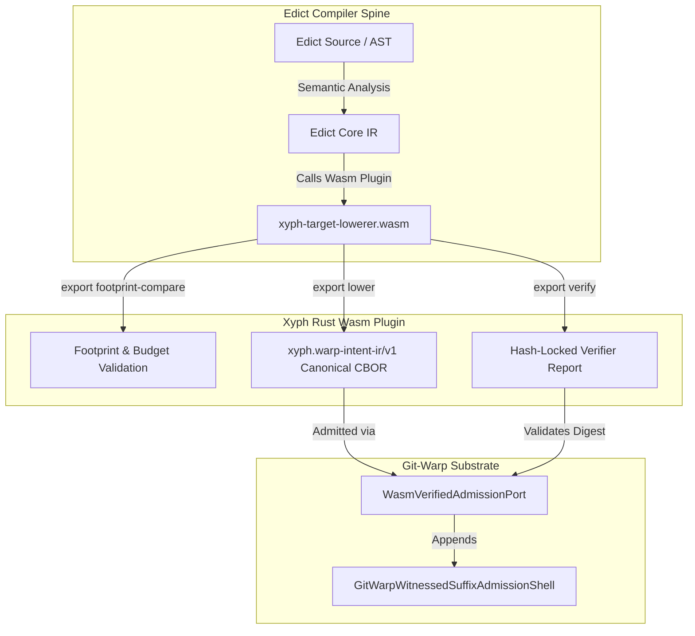

# Edict WebAssembly Target Lowerer Plugin (`xyph-target-lowerer.wasm`)

To achieve sovereign integration between Edict's compiler spine and Xyph's planning graph without hardcoding external target slices or maintaining fragile downstream code generators, Xyph implements Edict's WebAssembly target lowerer contract (`edict-target-lowerer.wit`).

## The WebAssembly Component Contract

The plugin is authored in Rust (`crates/xyph-target-lowerer`) and compiled to a WebAssembly component (`wasm32-unknown-unknown`). It directly imports Edict's `edict-target-lowerer.wit` interface definition and uses `wit-bindgen` to generate strict binding contracts for the required exports:

### 1. `export lower`

Translates Edict Core IR into `xyph.warp-intent-ir/v1`. The emitted target representation is serialized into canonical CBOR/JSON (`edict.canonical-cbor/v1`), encapsulating the exact `WarpIntentDescriptor` structure (precommit guards, nutrition labels, and suffix transforms) expected by `git-warp`.

### 2. `export footprint-compare` and `export cost-compare`

Evaluates the declared agent action budget and operational footprint against Xyph's governance lawpacks (`xyph.governance@1`). If an agent intent attempts to exceed its allocated memory budget or access ungranted optic neighborhoods, the plugin rejects lowering with stable diagnostic codes:

- `EDICT-XYPH-001`: Declared footprint exceeds governance lawpack allocation.
- `EDICT-XYPH-002`: Execution budget exceeds maximum allowable intent cost.
- `EDICT-XYPH-003`: Unresolved precommit guard obligation in target profile.

### 3. `export verify`

Produces a signed, hash-locked verifier report proving that the lowered target representation perfectly preserves the optic properties and invariants of the Edict source. The verifier report includes the SHA-256 digest of `xyph-target-lowerer.wasm`, establishing an unbreakable chain of custody for `git-warp`'s `WasmVerifiedAdmissionPort`.

## See also

- [Edict Integration README](README.md)
- [Git-Warp Alignment](../../GIT-WARP-ALIGNMENT.md)
