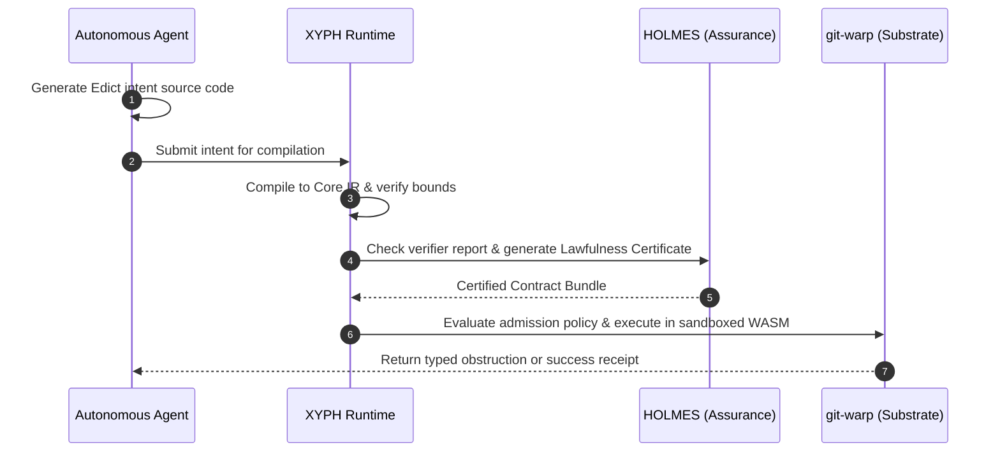

# Edict Integration: Safe Optics & The YOLO Execution Model for XYPH

This document outlines how **Edict**—the safe, statically verifiable programming language for Optics—integrates into XYPH to eliminate **FIDLAR** (ambient authority risk) and establish secure, verified agent execution.

---

## 1. The Core Architecture

Edict bridges the gap between GraphQL schema definitions and the underlying `git-warp` causal history runtime.

```text
  ┌──────────────────────────────────────────────────────────┐
  │                   GraphQL Surface                         │
  │    Describes the types (Quest, Intent, Scroll, etc.)      │
  └──────────────────────────┬───────────────────────────────┘
                             ▼
  ┌──────────────────────────────────────────────────────────┐
  │                 Edict Operations (Optics)                │
  │    Defines what intents/readings are allowed to do       │
  └──────────────────────────┬───────────────────────────────┘
                             ▼
  ┌──────────────────────────────────────────────────────────┐
  │                   Continuum Spine                        │
  │    Validates the contract bundle & checks credentials    │
  └──────────────────────────┬───────────────────────────────┘
                             ▼
  ┌──────────────────────────────────────────────────────────┐
  │             git-warp Causal History Runtime              │
  │    Admits changes and executes sandboxed operations      │
  └──────────────────────────────────────────────────────────┘
```

---

## 2. Shift I: Planning Rules as Edict Intents

Currently, XYPH's graph-mutation constraints (e.g., verifying that claiming a Quest does not introduce cycles) are written in TypeScript inside services like `IntakeService.ts` or `SubmissionService.ts`. These services run with ambient system authority.

### The Edict Approach
We must rewrite XYPH planning rules as **Edict Intents**. 

For example, the rules for claiming a Quest are defined in `xyph.governance@1`:

```graphql
package xyph.governance@1;

use shape "schemas/planning.graphql" as shape;
use target warp.dpo@1 digest "sha256:4d8..." as warp;

intent claimQuest(input: shape.ClaimQuestInput)
  returns shape.ClaimQuestReceipt | shape.ClaimQuestObstruction
  profile warp.readWrite
  budget <= shape.mediumBudget
{
  let questRef = warp.ref<shape.Quest>(input.questId);
  let quest = questRef.read() else shape.ClaimQuestObstruction.QuestMissing;

  // Enforce state machine rules
  require quest.status == "BACKLOG"
    else shape.ClaimQuestObstruction.InvalidStatus { currentStatus: quest.status };

  // Enforce assignment constraints
  let agentRef = warp.ref<shape.Agent>(input.agentId);
  let agent = agentRef.read() else shape.ClaimQuestObstruction.AgentMissing;

  // Write the claim edge
  let updatedQuest = questRef.write({
    status: "IN_PROGRESS",
    assignedTo: input.agentId
  }) else {
    conflict => shape.ClaimQuestObstruction.ClaimConflict
  };

  reveal updatedQuest;
}
```

### The Benefits
* **Static Footprint Verification**: The compiler proves that `claimQuest` *only* reads and writes the targeted `Quest` and `Agent` nodes and has no capability to delete campaigns or read secrets.
* **No Ambient Authority**: The operation cannot touch the network, access the local filesystem, or leak environment variables.

---

## 3. Shift II: The YOLO Agent Execution Model

Currently, XYPH agents run in **FIDLAR** mode: they run general TypeScript/JavaScript code, giving them ambient access to the host's files, processes, and credentials. 

### The YOLO Model in XYPH
We will implement the **YOLO (You Only Lawfully Operate)** execution lane for all autonomous agent actions:



### The Benefits
* **Isolate Prompt Injection**: If a malicious prompt injection instructs the agent to delete the codebase or download secrets, the compiled Edict program will fail static validation because the target footprint and network access are unauthorized.
* **Typed Failure Resolution**: Because all failures are returned as typed **Obstructions** rather than unhandled exceptions or arbitrary string errors, the agent can programmatically correct its inputs (e.g. basis refresh) and retry.

---

## 4. Shift III: Zero-Side-Effect TUI Readings

Currently, the TUI dashboard queries the graph using arbitrary queries that could potentially trigger unexpected mutations or state locks.

### The Edict Approach
We will express TUI queries as **Edict Readings**:
* Every dashboard panel requests a reading governed by a read-only profile (`profile warp.readOnly`).
* Because the compiler guarantees that the reading has zero write effects, the runtime can optimize execution using **holographic slicing** (reconstructing only the needed causal cones) with zero risk of concurrent locks or state corruption.
