# Architectural Evolution: Aligning XYPH with Git-WARP Primitives

> [!WARNING]
> **ROADMAP DOCUMENT — NOT PRESENT IMPLEMENTATION TRUTH**
> This document outlines the planned evolutionary direction for XYPH's integration with `git-warp`. The structural shifts proposed here (e.g. counterfactual strands, BTR-style scrolls, and target-specific optics) represent future design gravity, not present-tense implementation.

This document outlines how XYPH's design and runtime must evolve to leverage the core holographic, optic, and causal history capabilities of `git-warp`. 

Currently, XYPH treats the planning graph as a traditional database, loading monolithic state snapshots. To scale to large codebases and enable decentralized, offline-first agent coordination, we must shift to target-specific optics, speculative strands, and verifiable boundaries.

---

## 1. The Core Shifts




### Shift I: From Monolithic Materialization to Bounded Optics
* **The Problem**: Currently, `fetchSnapshot` loads the entire `GraphSnapshot` containing campaigns, quests, scrolls, and policies. As the graph grows to thousands of nodes, this causes high memory consumption and latency, especially during agent briefing loops.
* **The Vision**: We must transition to **Quest Optics**. An agent assigned to Quest `Q` does not need to see the entire graph. The agent only needs the **causal cone** `D(Q)` of the quest:
  - Its ancestry (Intent, Parent Quest)
  - Its immediate dependencies and blockers
  - Its associated requirements, criteria, and policies
* **Implementation**: Define a specialized `QuestOptic` in XYPH that calls `git-warp`'s coordinate-optic APIs directly to pull only the required subgraph.

### Shift II: Counterfactual Planning via Speculative Strands
* **The Problem**: Proposing new campaigns or tasks currently writes directly to the shared planning worldline, which can lead to planning clutter and merge conflicts when multiple agents propose different approaches.
* **The Vision**: Model planning proposals as **Strands** (counterfactual lanes).
  - When an agent proposes a project roadmap or splits a Quest, it opens a private planning Strand.
  - The agent can speculative-execute rules, verify dependencies, and simulate outcomes on this strand.
  - Once the plan is finalized and approved (satisfying the approval gates), the strand is **braided** (merged) back into the shared worldline.

### Shift III: Verifiable Verification Boundaries (Scrolls as BTRs/Wormholes)
* **The Problem**: A Completed Quest is recorded as a "Scroll" node in the graph, containing arbitrary metadata and signatures. Verifying a task requires downloading the entire repository and walking its history.
* **The Vision**: Elevate **Scrolls** to native **Boundary Transition Records (BTRs)**.
  - A Scroll becomes a cryptographically signed envelope certifying a transition boundary from `Quest: UNRESOLVED` to `Quest: RESOLVED`.
  - It specifies exact inputs (parent commits, task requirements) and outputs (code outputs, verification logs) and signs them.
  - This allows a peer agent or human operator to verify that a Quest was lawfully resolved by reading only the Scroll itself (its holographic boundary), without materializing or downloading the full repository history.

### Shift IV: P2P Agent Treaties (Continuum Integration)
* **The Problem**: XYPH currently relies on a centralized Git remote (`origin/main`) to sync agent states.
* **The Vision**: Use the **Continuum protocol** to support peer-to-peer agent collaboration.
  - Independent agents working offline or on different machines can sync directly via Continuum.
  - They exchange witnessed suffixes of their planning worldlines, build comparable slices locally, and lower them under the local admission laws.
  - This removes the centralized Git server dependency and establishes a true trust-free peer network.

---

## 2. Refactored Code Layout (Target Architecture)

To support this evolution, the XYPH architecture will shift from a monolithic adapter to specialized ports:

```text
src/
├── domain/
│   └── services/
│       ├── QuestOpticService.ts      # Bounded optic slicing for agent execution
│       ├── CounterfactualPlanning.ts  # Speculative strand management
│       └── ScrollVerifier.ts          # BTR-style cryptographic validation
└── ports/
    ├── QuestOpticPort.ts              # Port for loading targeted causal cones
    └── AgentTreatyPort.ts             # Continuum integration for P2P sync
```

---

## 3. High-Priority Action Items

1. **Phase 1: Optic-Based Briefing**
   - Replace the full `GraphSnapshot` lookup in `AgentBriefingService` with a `QuestOptic` query to load only the task's causal cone.
2. **Phase 2: Cryptographic Scroll Seals**
   - Align the `Scroll` model with `git-warp`'s `BTR` schema to ensure self-contained, verifiable execution boundaries.
3. **Phase 3: Strand-Based Triaging**
   - Refactor the actuator's `inbox promote` and `claim` commands to work on speculative Strands rather than mutating the main worldline directly.
